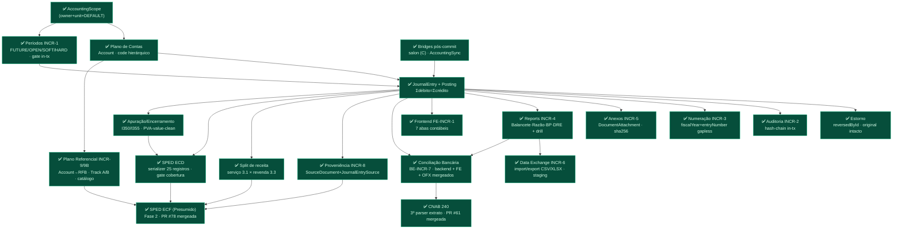

# Grafo-Mestre REAL — Módulo Contábil Luminaris

> **Fonte de verdade do roadmap contábil.** Este documento é o grafo-mestre **reconciliado com as
> decisões commitadas** do projeto — não a visão aspiracional de "sistema contábil universal".
> Onde um grafo aspiracional (o de 35 seções) diverge deste, **este vence** até que um ADR mude a
> decisão. Todo nó aqui tem um **estado** (legenda §7) e, quando relevante, o ADR/memória que o fixou.
>
> **Regra de uso (arquiteto/orquestrador):** nenhuma skill de geração roteia contra um nó marcado
> 🔴/⚫ sem **ADR em disco + sinal humano**. Nós ✅ estão fechados; nós ⏳ são o incremento corrente.
>
> Última reconciliação: **2026-07-12** · HEAD de referência: `1088e32` (INCR-7 conciliação + OFX + INCR-8
> proveniência + INCR-9/9B referencial + ECD + Apuração/Encerramento + Split de receita + **ECF Fase 2 (PR #78)**
> + **CNAB 240 (PR #61)** — TODOS mergeados em `main`).

---

## 1. Decisões TRAVADAS — os trilhos que moldam todo o resto

Estas não são "preferências": são decisões commitadas. Reabrir qualquer uma é `DECISÃO ARQUITETURAL`
(ADR + sinal humano), **não** feature comum.

| # | Decisão travada | Por quê / evidência |
|---|---|---|
| T1 | **SQLite** (WAL + busy_timeout). Sem Postgres. | `stay-on-sqlite-no-postgres`. Todo "exclusion constraint" aspiracional → **gate transacional em app + `@@unique`**. |
| T2 | **Tenancy = `AccountingScope`** (`ownerUserId` + `unitId` + ledger `DEFAULT` implícito). **Sem** torre `LegalEntity/Ledger/Establishment`. | `accounting-scope-foundation-no-multicompany`; `AccountingScope.ts:12-25`. |
| T3 | **Contabilidade é Prisma first-class.** Model + Service + Repository + Policy próprios. **Nunca** DynamicTable, **nunca** serviço Prisma injetado no motor de plugins. | Contrato §2.1 (`AC-2.1-B1..B5`); `accounting-is-first-class-prisma`. |
| T4 | **Dinheiro = centavo inteiro `Int`**, teto Int32 compartilhado (`MAX_CENTS`). Igualdade exata, sem epsilon. | `money.ts:14`; `dynamictable-money-and-uniqueness-limits`. Upgrade a `BigInt` só quando um leg real passar de ~R$ 21,47M. |
| T5 | **Estorno é lançamento novo**, nunca edição/delete destrutivo do original. Post é imutável. | `JournalEntry` `reversedById`; `accounting-increment-d1-settlement`. |
| T6 | **Gate de invariante mutável re-checado DENTRO da `runTransaction`** (TOCTOU). Todo `tx` propaga a todo write do bloco. | `authoritative-gate-inside-tx`; `tx-nao-propagado-ao-repo`. |
| T7 | **Idempotência liga em identidade do evento** (`sourceType+sourceId`, sha256 do arquivo), **nunca em `userId`**. Guarda pré-tx via repo injetado. | `JournalEntry @@unique([userId,unitId,sourceType,sourceId])`; `orchestration-service-tx-repo-smell`; `idempotency-class-fix-discipline`. |
| T8 | **Auditoria append-only hash-chain, in-tx, exceção ao `onDelete:Cascade`.** | `AuditEvent` (INCR-2); `audit-log-no-fk-cascade`. |
| T9 | **BRL-only.** Sem multi-moeda — `Posting`/`JournalEntry` não têm campo de moeda. | `AccountingScope.baseCurrencyCode:'BRL'`; grep no schema. |
| T10 | **Integração origem→ledger = bridge pós-commit explícita** por origem (fora do motor). **Não** existe rule engine dirigido por template. | `accounting-increment-c-salon-bridge` (ADR-C01); AccountingSync. |
| T11 | **Deploy single-process, SQLite local.** Scheduler in-process. Sem fila/outbox/DLQ. | `accounting-sync-b1-merged`. |
| T12 | **Governança:** `PLAN → ADR → BRIEF → impl → test → review independente → PR → merge → smoke-gate → closeout → memória`. Review por **agente separado**; smoke-migration-gate antes de dados reais. **2026-07-14:** os dois gates HELD fecharam — `RISK-INCR1-DB-001` e `SMOKE-MIGRATION-GATE-001` = **PASS** sobre dev.db real + replay populado (`SMOKE-MIGRATION-GATE-INCR1-INCR2-DEPLOY.md`); deploy da `main` = no-op comprovado. Novo risco latente nomeado: `RISK-INCR3-MIGRATION-001` (backfill do entry-numbering não é replay-safe sobre dados Prisma — não bloqueia o deploy atual). | `reviewer-independence-separate-agent`; `accounting-incr1-db-risk`; `verify-write-context-before-writing`. |

---

## 2. Estado atual — a fundação que está de pé

Cadeia de dependência **real** (só nós construídos + o corrente). Cada `INCR-N` está mergeado em `main`.

**Núcleo 1 (ledger confiável) — fechado.** Núcleo de operação/relatório/evidência/troca de dados — fechado.
Ramo compliance/SPED em `main`: proveniência (INCR-8), mapeamento referencial (INCR-9/9B), **ECD**,
**apuração/encerramento**, **split de receita**, **ECF Fase 2** e **CNAB 240** — todos mergeados (§3; não
há nó ⏳ corrente). Deploy-readiness: gates HELD de INCR-1/INCR-2 **fechados 2026-07-14**
(`SMOKE-MIGRATION-GATE-INCR1-INCR2-DEPLOY.md`). Resíduos herdados: **sign-off humano no browser**
(INCR-6 A–J, conciliação) e sign-off no PVA (ECD/Apuração).

---

## 3. Incremento corrente — nenhum em voo; ECF Fase 2 (PR #78) e CNAB 240 (PR #61) FECHADOS

> **Todo o trabalho que estava em landing entrou em `main`.** ECF Fase 2 e CNAB 240 foram mergeados em
> 2026-07-12 (Fase B serial: #78 → fold do master map #79 → CI-flake #80 → #61). Não há nó ⏳ corrente — o
> próximo incremento ainda não foi escolhido; ver §5 para os candidatos diferidos.

**Estado real (verificado no git 2026-07-12, HEAD `main` `1088e32`):**

**(a) SPED ECF (Lucro Presumido) — Fase 2 ✅ MERGEADA em `main` (PR #78, merge `70caa1c`).**
A ADR/PLAN da ECF já estava em `main` (Fase 1 ratificada, PR #68: D5 = recover-from-ECD, D4 = `TaxRegime`
transitório); a **geração do arquivo** (Fase 2) entrou pelo PR #78 (`lib/ecf.ts` + `SpedEcfGenerationService`
+ DTO + rota + `EXPORT_SPED_ECF` + Bloco S vazio). Segrega receita bruta 3.1/3.3 em linhas P200/P400; PVA
computa o tributo; C/E recuperados do ECD (Passo A de transcrição derrubou 3 pontos inferidos da ADR). Gate de
fechamento = exaustividade de receita, não referencial. Review independente = PASS. Gates no merge: tsc×2
limpo, jest accounting 505/505 + `ecf.test.ts` 16/16, openapi 105 paths. Residual: sign-off humano no PVA.

**(b) CNAB 240 (BE-INCR7-CNAB) — 3º parser de extrato, ✅ MERGEADO em `main` (PR #61, merge `1088e32`).**
`lib/cnab.ts`→`InTable` reusando `parseLines` (espelha OFX; direct-int cents, D/C sign, slice `DDMMAAAA`);
também corrige um bug do swagger-jsdoc (`: ` YAML) que dropava 17 paths do openapi. Refrescado sobre `main`
pós-ECF (merge, não rebase) — conflito em `docs.paths.ts`/`openapi.json` resolvido por união + regen (105
paths, zero perdidos), **re-review independente da resolução = PASS** (R1–R5). Residual: sign-off humano no browser.

**Regra de roteamento:** ECF e CNAB são nós ✅ fechados — o orquestrador NÃO deve re-planejar geração ECF nem
ingestão CNAB como trabalho novo.

---

## 4. Decisões REJEITADAS — não reabrir sem ADR

O grafo aspiracional propõe estes; o projeto **decidiu contra** (registrado). Se algum voltar, é `DECISÃO ARQUITETURAL`.

| Proposta aspiracional | Estado | Por quê rejeitada / vencedor |
|---|---|---|
| Torre `Workspace→LegalEntity→Establishment→Ledger` (multiempresa) | 🔴 **Rejeitada** | Vencedor: `AccountingScope` de 2 níveis. `accounting-scope-foundation-no-multicompany`. |
| PostgreSQL / exclusion constraints | 🔴 **Rejeitada** | Vencedor: SQLite tunado + gate transacional + `@@unique`. `stay-on-sqlite-no-postgres`. |
| Contabilidade como preset DynamicTable | 🔴 **Rejeitada** | Vencedor: Prisma first-class. Contrato §2.1. |
| **Motor de Regras Contábeis** (`conditionsJson`/`templateJson` gera lançamento) | 🔴 **Rejeitada (recomendação de domínio)** | Vencedor: **bridge pós-commit explícita por origem**. Um engine dirigido por template no caminho do ledger reintroduz o "motor de plugins" no ponto mais crítico (quem valida que o template balanceia? versionamento?). ADR-C01 fixou o padrão de bridge. |
| Multi-moeda (`transactionCurrencyCode`/`exchangeRate`) | 🔴 **Fora / ADR próprio** | BRL-only. Campo reservado no `AccountingScope` como slot futuro, sem implementação. |

---

## 5. Domínios DIFERIDOS — reais, mas cada um é seu próprio ADR/incremento

Ordenados por proximidade da fundação. **Nenhum** é "o próximo passo" antes do INCR-7 fechar.

| Domínio | Estado | Gate para começar |
|---|---|---|
| **SourceDocument + JournalEntrySource** (proveniência formal) | ✅ **Mergeado em `main`** (BE-INCR-8, PR #43, 2026-07-08; review independente PASS; commit de feature `a18886c`) | **ADR-INCR8** (altitude **A1 seam fino**). First-class Prisma: `SourceDocument`+`JournalEntrySource` (migração additiva, 0 ALTER), `SourceProvenanceRepository`, DTO `sourceDocument?` `.strict()`, seam na tx do `postEntry` (origem+link+audit `entry.source_recorded` átomos), import desdobra `externalReference`→`externalRef` com `sourceId` **byte-idêntico** (T7 intocada), no-cascade (sem FK User, D7). Consumidor (ECD/ECF) segue diferido. Gates: tsc×2 limpo, jest 752/752, **smoke-migration-gate PASS** (dev.db real: 15→15 entries, fingerprint de idempotência byte-idêntico, tabelas novas vazias). Brief + ADR em `docs/`. |
| **OFX** (ingestão bancária) | ✅ **Mergeado em `main`** (BE-INCR7-OFX, PR #59 `bb2f27a`, 2026-07-09; `ADR-INCR7-OFX-bank-statement.md`; review independente PASS ×2 + CI verde) | `lib/ofx.ts` normaliza `<STMTTRN>`→shape de linha; reusa `parseLines` integral; migration-free; multi-conta rejeitada; fallback de descrição para `TRNTYPE` quando falta NAME/MEMO. Supersedes ADR-INCR7 §D2 (parte OFX). Residual: sign-off humano no browser; FE aceita `.ofx` no upload (FE-OFX). |
| **Plano de Contas Referencial versionado** (mapeamento Account→código RFB + diagnóstico de cobertura) | ✅ **Mergeado em `main`** (BE-INCR-9, PR #58, 2026-07-09; review independente PASS + smoke-gate PASS) | **ADR-INCR9** (`docs/adr/ADR-INCR9-referential-chart-mapping.md`). First-class Prisma: `ReferentialMapping` (migração aditiva, tabela nova vazia), `@@unique([userId,unitId,accountId,mappingVersion])` (versões coexistem — D2), SEM `deletedAt` (hard-delete + trilha no AuditEvent — D5), `mappingVersion` string livre (D1). Write com gate in-tx (Account ativo+folha, ACC-011) + `AuditService.append` na mesma tx; read de cobertura **chart-driven** (não balance-driven — D3), espelha a shape `mappingVersion`+`unmappedAccounts` do INCR-4. `referentialCode`/`label` denormalizados, sem catálogo/FK (D6 — import do leiaute oficial diferido com o SPED). Gates: tsc×2 limpo, 441/441 accounting jest verdes (17 novos). Geração do arquivo SPED segue diferida (⚫, ADR próprio). **Track A Fase 2 — autoria em lote (✅ mergeado em `main`, PR #71, `f24177a`, 2026-07-11; review independente PASS):** `batchSet` (upsert atômico all-or-nothing de N itens numa única `runTransaction`, gate per-item + audit in-tx via helper `applySet` compartilhado com `setMapping` — D8), `copyVersion` (herança de ano `fromVersion→toVersion`, `label` re-snapshot literal — D6/D9, reusa o gate per-item; alvo existente faz upsert, nunca P2002), `authoringSkeleton` (esqueleto chart-driven = `coverage().unmappedAccounts` re-exposto p/ autoria — D5, nunca inventa código RFB — D1/D10). Rotas: `POST /referential/mappings/batch`, `POST /referential/mappings/copy`, `GET /referential/skeleton`. Allowlist de audit estendida (set/batch/copy/unset → `{accountId,referentialCode,mappingVersion}`, `label`/PII dropados). Zero migração nova. Gates: tsc limpo, suites referential+audit+openapi verdes. **Track B — catálogo oficial RFB + validação analytic-only de destino (✅ mergeado em `main`, PR #74, `3c5a33d`, 2026-07-11; review independente PASS 577/577; smoke-migration-gate PASS / deploy-cleared, doc PR #75 `110e1229`):** model `ReferentialAccount` (catálogo GLOBAL versionado por `layoutVersion`=`mappingVersion`, SEM tenancy — D4/D7, migração aditiva `CREATE TABLE` pura), import idempotente por versão (`isAnalytic` **lido da coluna, nunca inferido** — D1/I052, zero código RFB hardcoded), e o gate **D3**: destino do de-para deve **existir no catálogo E ser folha** (catálogo ausente → free-string INCR-9 preservado). **Fork 1** decidido: catálogo **único compartilhado ECD/ECF** (sem discriminador de leiaute). **Fork 2** preparado (spec B0 `BE-INCR9B-fork2-...md` + conversor `server/scripts/rfb-referential-to-catalog.mjs`; dado externo) — a validação só fica **viva** quando o contador importar o arquivo oficial "PJ em Geral" da RFB. |
| **CNAB/NF-e** (ingestão bancária/fiscal rica) | ✅ **CNAB mergeado em `main`** (BE-INCR7-CNAB, PR #61, merge `1088e32`, 2026-07-12; review independente PASS + re-review da resolução PASS) · NF-e ⚫ diferido | CNAB 240 = 3º parser de extrato: `lib/cnab.ts`→`InTable` reusando `parseLines` (espelha OFX; direct-int cents, D/C sign, slice `DDMMAAAA`); também corrigiu o bug swagger-jsdoc `: ` que dropava 17 paths do openapi. Refrescado sobre `main` pós-ECF (conflito `docs.paths.ts`/`openapi.json` resolvido por união + regen, 105 paths). Residual: sign-off humano no browser. NF-e = domínio fiscal, ADR próprio. |
| **ECD readiness** (arquivo SPED Contábil: blocos/registros) | ✅ **Mergeado em `main`** (BE-INCR-SPED-ECD, PR #62, 2026-07-10, merge `9deb928`; review independente PASS; sign-off humano no PVA = residual) | **ADR-INCR-SPED-ECD** (`docs/adr/`). Serializer puro `lib/sped.ts` (25 registros do MVP, Leiaute 9 campo-a-campo, contadores 2-passadas) + `SpedGenerationService` (coverage-gate D5 → I050/I051/I052 + 12×I150/I155 mensal com carry-forward D11 + I200/I250 via read D9 + J100/J150 via INCR-4 → job `EXPORT_SPED_ECD` + `.txt` latin1 + audit, na tx). Reuso do INCR-6 (job/artefato/download). **D1** sem migração; **D3** identidade via DTO transiente (sem `LegalEntity`). **Emenda D12/E4:** I052 movido PARA o MVP. **Residual honesto (ADR §5):** import PVA-limpo é sign-off humano. |
| **Apuração/encerramento do resultado** (I350/I355 + ECD PVA-value-clean) | ✅ **Mergeado em `main`** (BE-INCR-SPED-APURACAO, PR #63, merge `1465bae`, 2026-07-10; feature `1de120d`; 2ª review independente PASS; residual = sign-off humano no PVA) | **ADR-INCR-SPED-APURACAO** (`docs/adr/`). `ExerciseClosingService.closeExercise(year)` posta 1 encerramento real balanceado (via `PostingService.postEntry`) que zera as contas de resultado contra Lucros/Prejuízos Acumulados (`2.3.1`, nova no fixture — **zero migração**, `sourceType='closing'`). **D3** `incomeStatement` closing-aware no report compartilhado (DRE operacional); `balanceSheet` intocado (PL carrega o resultado, netResultLine auto-zera, A=P nos 2 estados). **D5** `reverseEntry` closing-aware libera a chave de idempotência (close→reopen→re-close = lançamento novo). SPED emite I350/I355 + `IND_LCTO='E'` derivado. Rota `POST /accounting/closing/exercise` (3-toques). Gates: tsc limpo, 857/857 jest verdes (18 novos), openapi 99 paths. |
| **Split de receita por natureza** (serviço × revenda — pré-requisito de dado do Bloco P da ECF-Presumido) | ✅ **Mergeado em `main`** (BE-INCR-REVENUE-SPLIT, PR #66, merge `ae8ac00`, 2026-07-10; 2 reviews independentes — 1º FAIL→corrigido `f051bc6`, 2º PASS + caça-à-classe limpa; CI verde) | **ADR-INCR-REVENUE-SPLIT** (`docs/adr/`). Rename-sibling no fixture: `3.1` "Receita de Vendas"→**"Receita de Serviços"** (code estável, guarda histórico postado — ACC-018 barra reparent) + nova `3.3 Receita de Revenda de Mercadorias`. `AccountingEvent.revenueByNature?` **aditivo** (blast radius mínimo; só o `SalonSaleFinalizedMapper` consome). Split proporcional no mapper (fronteira de dinheiro): desconto de header rateia proporcional, resíduo de arredondamento na conta de produto → `Σlinhas == totalCents`. Live bridge + reconcile emitem o mesmo breakdown de `loadSalePackageInfo` (venda re-dirigida idêntica). **Cutover, backfill zero** (assunção: 1ª ECF ≥2026). **FAIL-1 do 1º review:** `3.3` não estava no `StatementMappingFixture` → DRE a dropava silenciosamente (J150≠I355); corrigido (regra `dre.gross_rev_resale` + bump v2). Gates: tsc limpo, 472/472 accounting jest. **Follow-up:** `3.3` fica não-mapeada no diagnóstico referencial (INCR-9, chart-driven — correto) até receber código RFB antes de qualquer geração ECF. |
| **ECF readiness** (arquivo SPED Fiscal: IRPJ/CSLL) | ✅ **Mergeado em `main`** (BE-INCR-SPED-ECF Fase 2, PR #78, merge `70caa1c`, 2026-07-12; review independente PASS; residual = sign-off humano no PVA) | **ADR-INCR-SPED-ECF** + Emenda FASE 2. Regime = **Presumido**. **Passo A (transcrição do Manual Leiaute 12 + Tabelas Dinâmicas) derrubou 3 pontos INFERIDOS da FASE 1** (ratificados por humano): (1) Blocos C/E recuperados pelo PVA — não importados (sem `ecdRecibo/ecdHash`); (2) numeração do Bloco P (P200 base IRPJ/P300 calc/P400 base CSLL/P500 calc); (3) **o PVA computa a presunção+imposto** (fórmulas da tabela dinâmica) — Luminaris **só segrega receita bruta** por atividade (3.1→P200(8)/P400(4), 3.3→P200(4)/P400(2)) nas linhas `E`. `lib/ecf.ts` (serializer puro, reusa `lib/sped`) + `SpedEcfGenerationService` (read-only+job; gate de **exaustividade da receita**, não referencial — o `3.3`-sem-RFB migra p/ a ECD) + DTO `.strict` + rota 3-toques + `kind='EXPORT_SPED_ECF'` (zero migração, D7) + Bloco S vazio (S001/S990). tsc×2 limpo, jest accounting 505/505 + `ecf.test.ts` 16/16, openapi 105 paths. Residual: import PVA-clean = sign-off humano; conjunto exato de blocos vazios a confirmar no PVA. Sem `TaxRegime` persistido (D4 transiente). Detalhe: [[accounting-sped-ecf-generation]]. |
| **Torre de aprovação** (maker-checker, SoD, `submittedById`/`approvedById`/`version`/`contentHash`) | ⚫ Diferido | Model atual só tem `Draft\|Posted\|Reconciled\|Reversed`. ADR + invariantes ACC-016/017. |
| **Dimensões** (centro de custo/projeto — DimensionDefinition/Value/PostingDimension) | ⚫ Diferido | Sem precedente; YAGNI até demanda real. |
| **Contas a Pagar — AP operacional** (subrazão de despesa: `Payable`+`PayablePayment` first-class + pagamento + ledger) | ⏳ **PRE-ADR** (`docs/adr/ADR-INCR-AP-accounts-payable.md`, 2026-07-14 — par orquestrador+arquiteto; **forks F0–F6 aguardando ratificação humana**) | **ADR-INCR-AP**. First-class Prisma (2 tabelas aditivas; `@@unique([userId,unitId,supplierName,documentNumber])` com rename-on-delete `deleted:<id>`); fato gerador DUPLO por competência: `ap.payable` (D 4.x / C **`2.1.2 Fornecedores a Pagar`** — folha nova no fixture, zero migração) + `ap.payment` (D 2.1.2 / C conta-por-método), idempotência por **identidade de evento** (`sourceId=paymentId`, nunca key-freeing); gate in-tx (T6) + 4 eventos novos na allowlist do audit (T8) + SourceDocument INCR-8 (1º consumidor orgânico); ciclo por comandos (ACC-016), cancel = estorno (T5). Fork principal F0: transporte direto `postEntry` (rec. arquiteto) × port event→mapper (rec. orquestrador). FORA: parcial (modelo pronto, guard full-only), fornecedor first-class, recorrência, aprovação, estoque, FE (→ `FE-INCR-AP`). Gate p/ implementar (Task 5): **ratificação humana do ADR**; antes de deploy: smoke-migration-gate sobre base populada. |
| **Subrazões restantes** (AR formal, estoque, imobilizado, **folha**, **fiscal/tributos**) | ⚫ Diferido | Cada um é módulo ERP first-class próprio (AP saiu desta linha → nó ⏳ acima). Folha/fiscal = domínios pesados isolados. |
| **Integração inbox/outbox/DLQ** | ⚫ Diferido | Só faz sentido quando sair de single-process (T11). Bridges cobrem a escala atual. |
| **IA/analytics** (sugestão de conta/conciliação, anomalias) | ⚫ Diferido | Sobre um ledger já confiável; IA sugere, humano contabiliza. |
| **LGPD/RBAC granular** | ⚫ Parcial | Autorização no servidor já vale; mascaramento/retenção/papéis finos = incremento próprio. |

---

## 6. Mapa de reuso canônico — os blocos reais a reaproveitar

Antes de gerar "novo", reuse (Contrato §0). Confirmado por código:

| Bloco | Onde |
|---|---|
| `AccountingScope` / `accountingScopeWhere` | `features/accounting/scope/AccountingScope.ts` |
| `PostingService.postEntry` (lançar ajustes) | `features/accounting/services/PostingService.ts` |
| `AuditService.append(tx, scope, event)` | `features/accounting/services/AuditService.ts` |
| `MAX_CENTS` | `features/accounting/models/money.ts` |
| `DocumentAttachment` (anexar extrato) | `features/accounting/services/DocumentAttachmentService.ts` |
| Parser puro `parseTable` | `lib/spreadsheet` (desacoplado do model INCR-6) |
| `AccountingReportService` (as_of + groupByAccount) | INCR-4 |
| Gate de período | INCR-1 |
| Factory / rota-3-toques / DTO Zod `.strict()` / Policy | Contrato §2/§3 |

---

## 7. Régua de progresso — os 5 núcleos (do grafo aspiracional §32), % real

| Núcleo | Estado | % | Falta |
|---|---|---|---|
| **1 — Ledger confiável** | ✅ | ~95% | (nada estrutural; "permissões/aprovação" que o grafo mistura aqui são torre nova, não gap) |
| **2 — Operação real** | 🟡 | ~60% | aprovação, dimensões, busca/filtros ricos |
| **3 — Integração** | 🟡 | ~40% | ~~SourceDocument formal~~ (✅ BE-INCR-8, mergeado PR #43); inbox, outbox (só se sair de single-process) |
| **4 — Gestão** | 🟡 | ~70% | ~~fluxo de caixa~~ (✅ DFC método indireto, `report-dfc-cashflow`); ~~variação mensal~~ (✅ balancete comparativo, `report-period-comparison`); ~~Livro Diário~~ (✅ registro cronológico read-only, `report-daily-journal`); falta análise por dimensão |
| **5 — Compliance** | 🟡 | ~70% | ~~mapeamento referencial~~ (✅ BE-INCR-9, PR #58; ~~autoria em lote Track A~~ PR #71; ~~catálogo RFB + validação analytic-only Track B~~ PR #74, smoke-gate PR #75 — Fork 2/import do arquivo oficial = dado externo); ~~geração do arquivo ECD~~ (✅ BE-INCR-SPED-ECD, PR #62, merge `9deb928`); ~~apuração/encerramento (I350/I355)~~ (✅ BE-INCR-SPED-APURACAO, PR #63, merge `1465bae`; residual PVA); ~~split de receita por natureza (pré-req ECF-Presumido)~~ (✅ BE-INCR-REVENUE-SPLIT, PR #66); ~~ECF (arquivo fiscal) Fase 2~~ (✅ BE-INCR-SPED-ECF, PR #78, merge `70caa1c`; residual PVA); ~~CNAB 240~~ (✅ BE-INCR7-CNAB, PR #61, merge `1088e32`); ~~recibos/comprovantes~~ (✅ BE-RECIBOS Fase A+B, PR #84; comprovante de lançamento PDF via puppeteer, no-persist; ADR-RECIBOS-pdf-generation); falta ECF Fase 3, pacotes |

**Posição:** fundação (Núcleo 1) completa, Núcleo 2 mais da metade; ramo compliance bem avançado. Geração do arquivo ECD (BE-INCR-SPED-ECD) **mergeada** (PR #62), assim como a **apuração/encerramento** (BE-INCR-SPED-APURACAO, PR #63, residual PVA) e o **split de receita por natureza** (BE-INCR-REVENUE-SPLIT, PR #66). Os três pré-requisitos de dado da ECF (proveniência, mapeamento referencial, split de receita) estão em `main`. **ECF** (geração do arquivo fiscal, Fase 2, PR #78) e **CNAB 240** (PR #61) foram **mergeados** em `main` (2026-07-12). Três relatórios de gestão (Núcleo 4) — **DFC** (fluxo de caixa, método indireto), **balancete comparativo** (variação mensal) e **Livro Diário** (registro cronológico) — foram integrados em `main` em série (Fase B, 2026-07-12), read-only, first-class Prisma, zero migração. **Recibos/comprovantes** (comprovante de lançamento PDF, Fase A+B) **mergeado** em `main` (PR #84; residual = sign-off humano no browser + smoke-launch-gate do Chromium no deploy). Não há incremento ⏳ corrente. Candidatos diferidos (NF-e, aprovação, dimensões, subrazões, ECF Fase 3) seguem ⚫ (§5, ADR próprio campo-a-campo).

---

## 8. Legenda de estados

| Marca | Significado |
|---|---|
| ✅ | Construído e mergeado em `main` |
| ⏳ | Incremento corrente (PRE-ADR ou em execução) |
| 🔴 | Decisão **rejeitada** — reabrir exige ADR + sinal humano |
| ⚫ | Diferido — real, mas fora do escopo atual; ADR/incremento próprio |
| 🟡 | Parcial |

> **Como manter este doc:** a cada incremento fechado, promova o nó ⏳→✅ e registre o ADR/merge. Ao
> avaliar qualquer proposta nova, cheque primeiro se ela colide com §1 (travadas) ou §4 (rejeitadas) —
> se colidir, é ADR, não tarefa.
