# Grafo-Mestre REAL — Módulo Contábil Luminaris

> **Fonte de verdade do roadmap contábil.** Este documento é o grafo-mestre **reconciliado com as
> decisões commitadas** do projeto — não a visão aspiracional de "sistema contábil universal".
> Onde um grafo aspiracional (o de 35 seções) diverge deste, **este vence** até que um ADR mude a
> decisão. Todo nó aqui tem um **estado** (legenda §7) e, quando relevante, o ADR/memória que o fixou.
>
> **Regra de uso (arquiteto/orquestrador):** nenhuma skill de geração roteia contra um nó marcado
> 🔴/⚫ sem **ADR em disco + sinal humano**. Nós ✅ estão fechados; nós ⏳ são o incremento corrente.
>
> **Última reconciliação: 2026-07-23** · HEAD de referência: **`69ab527`** (inclui **PR #150** — PLAN/BRIEF
> da NF-e + emenda do ADR — e **PR #151** — fix da allowlist de auditoria + seção CMV no DRE, achados na
> primeira sessão de browser sign-off, ver §5.2). Antes disso, `2a8d18c` trouxe o **smoke-migration-gate do
> INCR-INVENTORY FECHADO / DEPLOY-CLEARED** (PR #149). O que entrou desde o fold de
> `eeb33c1` (verificado com `git log origin/main`, não com este doc): **RISK-SEC-AUTH-001 FECHADO** (#118
> `c8f0939` + deny-by-default `3db4f50` via #133 — `protectedApiPaths` **extinto**, registro de rota agora é
> **2 toques**), **INCR-COUNTERPARTY A1** (#119/#128), **INCR-DIM-COMPLETENESS B1** (#120/#124),
> **INCR-AGING** (#127 + tie-out #143), **INCR-INVENTORY** (#130 `5c04bd1`), **ADR-INCR-NFE ratificado**
> (#131), **lote de fixes do Council** (#133 `c1e408f`), **seam CRM→AR** (#137). Os três increments que o
> fold anterior listava como "merge pendente" **estão em `main`** — corrigido abaixo (§5.1 B1/B2, §7 Núcleo 2).
>
> Fold anterior (2026-07-15, HEAD `eeb33c1`) — mantido por rastreabilidade (tudo do fold de então MAIS:
> **INCR-AP Contas a Pagar + FE (#102/#106)**, **Torre de aprovação (#108)** + Emenda F3 SoD-off (#109),
> **Contas a Receber INCR-AR (#111) + FE-INCR-AR (#114)** — o par do subledger AP+AR fechado com UI —,
> **Dimensões INCR-DIM (#113)** — centro de custo/projeto, análise por dimensão do Núcleo 4 — e
> **FE-INCR-DIM (#116)** — aba Dimensões (catálogo + etiquetagem por partida leaf-only + relatórios
> balancete/DRE por dimensão) + fix de surfacing de erro de post no `JournalEntryModal` (`2e1a97f`) —
> TODOS mergeados em `main`. Com o FE de dimensões, **não resta código de nenhum incremento fechado**:
> o Bloco A da fila §5.1 é 100% gate humano/dado externo. Próximos planos priorizados: **§5.1**.

---

## 1. Decisões TRAVADAS — os trilhos que moldam todo o resto

Estas não são "preferências": são decisões commitadas. Reabrir qualquer uma é `DECISÃO ARQUITETURAL`
(ADR + sinal humano), **não** feature comum.

| # | Decisão travada | Por quê / evidência |
|---|---|---|
| T1 | **SQLite** (WAL + busy_timeout). Sem Postgres. | `stay-on-sqlite-no-postgres`. Todo "exclusion constraint" aspiracional → **gate transacional em app + `@@unique`**. |
| T2 | **Tenancy = `AccountingScope`** (`ownerUserId` + `unitId` + ledger `DEFAULT` implícito). **Sem** torre `LegalEntity/Ledger/Establishment`. | `accounting-scope-foundation-no-multicompany`; `AccountingScope.ts:12-25`. |
| T3 | **Contabilidade é Prisma first-class.** Model + Service + Repository + Policy próprios. **Nunca** DynamicTable, **nunca** serviço Prisma injetado no motor de plugins. | Contrato §2.1 (`AC-2.1-B1..B5`); `accounting-is-first-class-prisma`. |
| T4 | **Dinheiro = centavo inteiro `Int`**, teto Int32 compartilhado (`MAX_CENTS`). Igualdade exata, sem epsilon. | `money.ts:14`; `dynamictable-money-and-uniqueness-limits`. Upgrade a `BigInt` só quando um leg real passar de ~R$ 21,47M. |
| T5 | **Estorno é lançamento novo**, nunca edição/delete destrutivo do original. Post é imutável. | `JournalEntry` `reversedById`; `accounting-increment-d1-settlement`. |
| T6 | **Gate de invariante mutável re-checado DENTRO da `runTransaction`** (TOCTOU). Todo `tx` propaga a todo write do bloco. | `authoritative-gate-inside-tx`; `tx-nao-propagado-ao-repo`. |
| T7 | **Idempotência liga em identidade do evento** (`sourceType+sourceId`, sha256 do arquivo), **nunca em `userId`**. Guarda pré-tx via repo injetado. | `JournalEntry @@unique([userId,unitId,sourceType,sourceId])`; `orchestration-service-tx-repo-smell`; `idempotency-class-fix-discipline`. |
| T8 | **Auditoria append-only hash-chain, in-tx, exceção ao `onDelete:Cascade`.** | `AuditEvent` (INCR-2); `audit-log-no-fk-cascade`. |
| T9 | **BRL-only.** Sem multi-moeda — `Posting`/`JournalEntry` não têm campo de moeda. | `AccountingScope.baseCurrencyCode:'BRL'`; grep no schema. |
| T10 | **Integração origem→ledger = bridge pós-commit explícita** por origem (fora do motor). **Não** existe rule engine dirigido por template. | `accounting-increment-c-salon-bridge` (ADR-C01); AccountingSync. |
| T11 | **Deploy single-process, SQLite local.** Scheduler in-process. Sem fila/outbox/DLQ. | `accounting-sync-b1-merged`. |
| T12 | **Governança:** `PLAN → ADR → BRIEF → impl → test → review independente → PR → merge → smoke-gate → closeout → memória`. Review por **agente separado**; smoke-migration-gate antes de dados reais. **2026-07-14:** os dois gates HELD fecharam — `RISK-INCR1-DB-001` e `SMOKE-MIGRATION-GATE-001` = **PASS** sobre dev.db real + replay populado (`SMOKE-MIGRATION-GATE-INCR1-INCR2-DEPLOY.md`); deploy da `main` = no-op comprovado. `RISK-INCR3-MIGRATION-001` **FECHADO 2026-07-14**: backfill do entry-numbering tornado replay-safe sobre dados Prisma (fix `5764491`, PR #98; 3 defeitos, refutação 5/5) + smoke-gate sobre cópia do dev.db real **DEPLOY-CLEARED** (`SMOKE-MIGRATION-GATE-INCR3-POSTFIX-DEPLOY.md`, PR #99). Não há risco latente de migração aberto. | `reviewer-independence-separate-agent`; `accounting-incr1-db-risk`; `verify-write-context-before-writing`. |

---

## 2. Estado atual — a fundação que está de pé

Cadeia de dependência **real** (só nós construídos + o corrente). Cada `INCR-N` está mergeado em `main`.

```mermaid
flowchart TD
    classDef done fill:#064e3b,stroke:#10b981,color:#d1fae5;
    classDef wip fill:#78350f,stroke:#f59e0b,color:#fef3c7;

    A["✅ AccountingScope<br/>(owner+unit+DEFAULT)"]:::done
    B["✅ Plano de Contas<br/>Account · code hierárquico"]:::done
    C["✅ Períodos INCR-1<br/>FUTURE/OPEN/SOFT/HARD · gate in-tx"]:::done
    D["✅ JournalEntry + Posting<br/>Σdébito=Σcrédito"]:::done
    F["✅ Estorno<br/>reversedById · original intacto"]:::done
    G["✅ Auditoria INCR-2<br/>hash-chain in-tx"]:::done
    H["✅ Numeração INCR-3<br/>fiscalYear+entryNumber gapless"]:::done
    I["✅ Anexos INCR-5<br/>DocumentAttachment · sha256"]:::done
    R["✅ Reports INCR-4<br/>Balancete·Razão·BP·DRE + drill"]:::done
    X["✅ Data Exchange INCR-6<br/>import/export CSV/XLSX · staging"]:::done
    FE["✅ Frontend contábil<br/>16 abas (FE-INCR-1 + folds; Contas a Pagar #106, Contas a Receber #114, Dimensões #116)"]:::done
    BR["✅ Bridges pós-commit<br/>salon (C) · AccountingSync"]:::done
    T["✅ Conciliação Bancária<br/>BE-INCR-7 · backend + FE + OFX mergeados"]:::done
    SD["✅ Proveniência INCR-8<br/>SourceDocument+JournalEntrySource"]:::done
    REF["✅ Plano Referencial INCR-9/9B<br/>Account→RFB · Track A/B · catálogo"]:::done
    RS["✅ Split de receita<br/>serviço 3.1 × revenda 3.3"]:::done
    ECD["✅ SPED ECD<br/>serializer 25 registros · gate cobertura"]:::done
    AP["✅ Apuração/Encerramento<br/>I350/I355 · PVA-value-clean"]:::done
    ECF["✅ SPED ECF (Presumido)<br/>Fase 2 · PR #78 mergeada"]:::done
    CNAB["✅ CNAB 240<br/>3º parser extrato · PR #61 mergeada"]:::done
    APAY["✅ Contas a Pagar INCR-AP<br/>Payable+PayablePayment · postEntry direto"]:::done
    ARECV["✅ Contas a Receber INCR-AR<br/>Receivable+ReceivableReceipt · conta dedicada 1.1.5"]:::done
    RECI["✅ Recibos PDF<br/>comprovante de lançamento · PR #84"]:::done
    DIM["✅ Dimensões INCR-DIM<br/>centro de custo/projeto · etiqueta ortogonal · PR #113"]:::done

    A --> B --> D
    A --> C --> D
    D --> F
    D --> G
    D --> H
    D --> I
    D --> R
    R --> X
    D --> FE
    BR --> D
    R --> T
    D --> T
    D --> SD
    B --> REF
    D --> RS
    D --> ECD
    D --> AP
    AP --> ECD
    RS --> ECF
    REF --> ECF
    SD --> ECF
    ECD --> ECF
    T --> CNAB
    APAY --> D
    SD --> APAY
    ARECV --> D
    SD --> ARECV
    D --> RECI
    D --> DIM
```

**Núcleo 1 (ledger confiável) — fechado.** Núcleo de operação/relatório/evidência/troca de dados — fechado.
Ramo compliance/SPED em `main`: proveniência (INCR-8), mapeamento referencial (INCR-9/9B + FE A1a PR #89),
**ECD**, **apuração/encerramento**, **split de receita**, **ECF Fase 2** e **CNAB 240** — todos mergeados.
**INCR-AP (Contas a Pagar)** — primeira subrazão first-class — mergeado (§3; não há nó ⏳ corrente).
Deploy-readiness: gates HELD de INCR-1/INCR-2 **fechados 2026-07-14** e `RISK-INCR3-MIGRATION-001`
**fechado** (PR #98/#99, DEPLOY-CLEARED). Resíduos herdados consolidados na fila **§5.1 Bloco A** —
todos gates humanos/dado externo: sign-off no browser (INCR-6 A–J, conciliação, uploads, recibos,
Contas a Pagar) e sign-off no PVA (ECD/Apuração/ECF). FE-INCR-AP fechou (PR #106).

---

## 3. Incremento corrente — ✅ INCR-INVENTORY (estoque) MERGEADO (PR #130, 2026-07-22); próximo sequenciado = NF-e

> **INCR-INVENTORY** (§5.1 Bloco B item 12) **✅ MERGEADO em `main`** (PR #130, merge `5c04bd1`,
> 2026-07-22): backend implementado via `parallel-batch` (Fase 0 schema + Body 1 subrazão + Body 2/3
> CMV∥AP-estoque + Fase B registro), review independente PASS por corpo, tsc×2 + jest accounting 762/762
> verdes. Fix pós-review incluído no merge: **o guard exaustivo do tie-out ganhou `salon.sale.cogs`**
> (`5590a3f` — o sourceType de CMV entrou na lista de origens conhecidas do diagnóstico de tie-out).
> **Smoke-migration-gate FECHADO 2026-07-22** ([SMOKE-MIGRATION-GATE-INCR-INVENTORY](SMOKE-MIGRATION-GATE-INCR-INVENTORY.md)):
> rebuild de `payables` preserva linhas byte-a-byte + FK/índices/integridade sobre cópia do `dev.db` **real**
> semeada via Prisma (a base viva tem `payables`=0 ⇒ gate ali seria vacuoso) — **DEPLOY-CLEARED** para a
> migração. Achado latente aberto: FK `expenseAccountId` relaxou `RESTRICT`→`SET NULL` (inalcançável enquanto
> conta só tem soft-delete). **Residual = browser sign-off do DRE (seção CMV).**
> **Próximo incremento sequenciado = NF-e** ([ADR-INCR-NFE](../adr/ADR-INCR-NFE-fiscal-ingestion.md),
> ratificado 2026-07-20): o bloqueador de ordenação **F-NFE5 caiu** com o merge da ponte de compra
> AP→estoque — a impl está desbloqueada (exige sinal humano para rotear, ORCH-006).
> O restante da fila **§5.1** segue: Bloco A = resíduos/gates humanos; Bloco B = frentes novas ⚫.

**Último fechamento (verificado no git 2026-07-15, HEAD `main` `eeb33c1`):** FE-INCR-DIM (aba Dimensões,
PR #116 `1291db1`/merge `eeb33c1`) + fix de surfacing de erro no `JournalEntryModal` (`2e1a97f`). Antes dele,
na mesma janela: INCR-DIM backend (#113), FE-INCR-AR (#114), INCR-AR (#111), torre de aprovação (#108/#109).
Snapshot do INCR-AP (padrão canônico das subrazões diretas) mantido abaixo como referência:

**Último fechamento estrutural de subrazão (verificado no git 2026-07-14, HEAD `main` `b245825`):**

**INCR-AP — Contas a Pagar ✅ MERGEADO em `main`** (Fase 0 schema PR #101 `88e411e`; Fases A+B PR #102
`4a6eddb`; hardening pós-merge: reconcile re-emite `payable.payment_registered` no finalize PR #103 e
finalize PAYING→PAID como CAS atômico exactly-once nos 2 sites PR #105 `b245825`; correção de proveniência
do ADR PR #104). Primeira subrazão first-class; posta DIRETO via `PostingService.postEntry` (F0 rota a —
padrão canônico 2-tx CAS-before-post + reconcile re-drive para subrazões que postam direto). 2 reviews
independentes PASS; 1010/1010 testes; smoke-migration-gate PASS (`SMOKE-MIGRATION-GATE-INCR-AP.md`).
**FE-INCR-AP fechado no mesmo dia** (aba Contas a Pagar, PR #106 `bdd78c0` — 14ª aba do painel contábil).
Residual: browser sign-off humano (item 4 da fila §5.1).

**Regra de roteamento:** ECF, CNAB e AP são nós ✅ fechados — o orquestrador NÃO deve re-planejá-los como
trabalho novo (detalhe de cada um nas linhas do §5). Antes de "iniciar" qualquer incremento, cheque
PR-merged + `git ls-tree origin/main` (near-miss registrado: duplicata #72 construída de main stale).

---

## 4. Decisões REJEITADAS — não reabrir sem ADR

O grafo aspiracional propõe estes; o projeto **decidiu contra** (registrado). Se algum voltar, é `DECISÃO ARQUITETURAL`.

| Proposta aspiracional | Estado | Por quê rejeitada / vencedor |
|---|---|---|
| Torre `Workspace→LegalEntity→Establishment→Ledger` (multiempresa) | 🔴 **Rejeitada** | Vencedor: `AccountingScope` de 2 níveis. `accounting-scope-foundation-no-multicompany`. |
| PostgreSQL / exclusion constraints | 🔴 **Rejeitada** | Vencedor: SQLite tunado + gate transacional + `@@unique`. `stay-on-sqlite-no-postgres`. |
| Contabilidade como preset DynamicTable | 🔴 **Rejeitada** | Vencedor: Prisma first-class. Contrato §2.1. |
| **Motor de Regras Contábeis** (`conditionsJson`/`templateJson` gera lançamento) | 🔴 **Rejeitada (recomendação de domínio)** | Vencedor: **bridge pós-commit explícita por origem**. Um engine dirigido por template no caminho do ledger reintroduz o "motor de plugins" no ponto mais crítico (quem valida que o template balanceia? versionamento?). ADR-C01 fixou o padrão de bridge. |
| Multi-moeda (`transactionCurrencyCode`/`exchangeRate`) | 🔴 **Fora / ADR próprio** | BRL-only. Campo reservado no `AccountingScope` como slot futuro, sem implementação. |

---

## 5. Domínios DIFERIDOS — reais, mas cada um é seu próprio ADR/incremento

Ordenados por proximidade da fundação. **Nenhum** é "o próximo passo" antes do INCR-7 fechar.

| Domínio | Estado | Gate para começar |
|---|---|---|
| **SourceDocument + JournalEntrySource** (proveniência formal) | ✅ **Mergeado em `main`** (BE-INCR-8, PR #43, 2026-07-08; review independente PASS; commit de feature `a18886c`) | **ADR-INCR8** (altitude **A1 seam fino**). First-class Prisma: `SourceDocument`+`JournalEntrySource` (migração additiva, 0 ALTER), `SourceProvenanceRepository`, DTO `sourceDocument?` `.strict()`, seam na tx do `postEntry` (origem+link+audit `entry.source_recorded` átomos), import desdobra `externalReference`→`externalRef` com `sourceId` **byte-idêntico** (T7 intocada), no-cascade (sem FK User, D7). Consumidor (ECD/ECF) segue diferido. Gates: tsc×2 limpo, jest 752/752, **smoke-migration-gate PASS** (dev.db real: 15→15 entries, fingerprint de idempotência byte-idêntico, tabelas novas vazias). Brief + ADR em `docs/`. |
| **OFX** (ingestão bancária) | ✅ **Mergeado em `main`** (BE-INCR7-OFX, PR #59 `bb2f27a`, 2026-07-09; `ADR-INCR7-OFX-bank-statement.md`; review independente PASS ×2 + CI verde) | `lib/ofx.ts` normaliza `<STMTTRN>`→shape de linha; reusa `parseLines` integral; migration-free; multi-conta rejeitada; fallback de descrição para `TRNTYPE` quando falta NAME/MEMO. Supersedes ADR-INCR7 §D2 (parte OFX). Residual: sign-off humano no browser; FE aceita `.ofx` no upload (FE-OFX). |
| **Plano de Contas Referencial versionado** (mapeamento Account→código RFB + diagnóstico de cobertura) | ✅ **Mergeado em `main`** (BE-INCR-9, PR #58, 2026-07-09; review independente PASS + smoke-gate PASS) | **ADR-INCR9** (`docs/adr/ADR-INCR9-referential-chart-mapping.md`). First-class Prisma: `ReferentialMapping` (migração aditiva, tabela nova vazia), `@@unique([userId,unitId,accountId,mappingVersion])` (versões coexistem — D2), SEM `deletedAt` (hard-delete + trilha no AuditEvent — D5), `mappingVersion` string livre (D1). Write com gate in-tx (Account ativo+folha, ACC-011) + `AuditService.append` na mesma tx; read de cobertura **chart-driven** (não balance-driven — D3), espelha a shape `mappingVersion`+`unmappedAccounts` do INCR-4. `referentialCode`/`label` denormalizados, sem catálogo/FK (D6 — import do leiaute oficial diferido com o SPED). Gates: tsc×2 limpo, 441/441 accounting jest verdes (17 novos). Geração do arquivo SPED segue diferida (⚫, ADR próprio). **Track A Fase 2 — autoria em lote (✅ mergeado em `main`, PR #71, `f24177a`, 2026-07-11; review independente PASS):** `batchSet` (upsert atômico all-or-nothing de N itens numa única `runTransaction`, gate per-item + audit in-tx via helper `applySet` compartilhado com `setMapping` — D8), `copyVersion` (herança de ano `fromVersion→toVersion`, `label` re-snapshot literal — D6/D9, reusa o gate per-item; alvo existente faz upsert, nunca P2002), `authoringSkeleton` (esqueleto chart-driven = `coverage().unmappedAccounts` re-exposto p/ autoria — D5, nunca inventa código RFB — D1/D10). Rotas: `POST /referential/mappings/batch`, `POST /referential/mappings/copy`, `GET /referential/skeleton`. Allowlist de audit estendida (set/batch/copy/unset → `{accountId,referentialCode,mappingVersion}`, `label`/PII dropados). Zero migração nova. Gates: tsc limpo, suites referential+audit+openapi verdes. **Track B — catálogo oficial RFB + validação analytic-only de destino (✅ mergeado em `main`, PR #74, `3c5a33d`, 2026-07-11; review independente PASS 577/577; smoke-migration-gate PASS / deploy-cleared, doc PR #75 `110e1229`):** model `ReferentialAccount` (catálogo GLOBAL versionado por `layoutVersion`=`mappingVersion`, SEM tenancy — D4/D7, migração aditiva `CREATE TABLE` pura), import idempotente por versão (`isAnalytic` **lido da coluna, nunca inferido** — D1/I052, zero código RFB hardcoded), e o gate **D3**: destino do de-para deve **existir no catálogo E ser folha** (catálogo ausente → free-string INCR-9 preservado). **Fork 1** decidido: catálogo **único compartilhado ECD/ECF** (sem discriminador de leiaute). **Fork 2** preparado (spec B0 `BE-INCR9B-fork2-...md` + conversor `server/scripts/rfb-referential-to-catalog.mjs`; dado externo) — a validação só fica **viva** quando o contador importar o arquivo oficial "PJ em Geral" da RFB. |
| **CNAB/NF-e** (ingestão bancária/fiscal rica) | ✅ **CNAB mergeado em `main`** (BE-INCR7-CNAB, PR #61, merge `1088e32`, 2026-07-12; review independente PASS + re-review da resolução PASS) · NF-e ⚫ diferido | CNAB 240 = 3º parser de extrato: `lib/cnab.ts`→`InTable` reusando `parseLines` (espelha OFX; direct-int cents, D/C sign, slice `DDMMAAAA`); também corrigiu o bug swagger-jsdoc `: ` que dropava 17 paths do openapi. Refrescado sobre `main` pós-ECF (conflito `docs.paths.ts`/`openapi.json` resolvido por união + regen, 105 paths). Residual: sign-off humano no browser. NF-e = domínio fiscal, ADR próprio. |
| **ECD readiness** (arquivo SPED Contábil: blocos/registros) | ✅ **Mergeado em `main`** (BE-INCR-SPED-ECD, PR #62, 2026-07-10, merge `9deb928`; review independente PASS; sign-off humano no PVA = residual) | **ADR-INCR-SPED-ECD** (`docs/adr/`). Serializer puro `lib/sped.ts` (25 registros do MVP, Leiaute 9 campo-a-campo, contadores 2-passadas) + `SpedGenerationService` (coverage-gate D5 → I050/I051/I052 + 12×I150/I155 mensal com carry-forward D11 + I200/I250 via read D9 + J100/J150 via INCR-4 → job `EXPORT_SPED_ECD` + `.txt` latin1 + audit, na tx). Reuso do INCR-6 (job/artefato/download). **D1** sem migração; **D3** identidade via DTO transiente (sem `LegalEntity`). **Emenda D12/E4:** I052 movido PARA o MVP. **Residual honesto (ADR §5):** import PVA-limpo é sign-off humano. |
| **Apuração/encerramento do resultado** (I350/I355 + ECD PVA-value-clean) | ✅ **Mergeado em `main`** (BE-INCR-SPED-APURACAO, PR #63, merge `1465bae`, 2026-07-10; feature `1de120d`; 2ª review independente PASS; residual = sign-off humano no PVA) | **ADR-INCR-SPED-APURACAO** (`docs/adr/`). `ExerciseClosingService.closeExercise(year)` posta 1 encerramento real balanceado (via `PostingService.postEntry`) que zera as contas de resultado contra Lucros/Prejuízos Acumulados (`2.3.1`, nova no fixture — **zero migração**, `sourceType='closing'`). **D3** `incomeStatement` closing-aware no report compartilhado (DRE operacional); `balanceSheet` intocado (PL carrega o resultado, netResultLine auto-zera, A=P nos 2 estados). **D5** `reverseEntry` closing-aware libera a chave de idempotência (close→reopen→re-close = lançamento novo). SPED emite I350/I355 + `IND_LCTO='E'` derivado. Rota `POST /accounting/closing/exercise` (3-toques). Gates: tsc limpo, 857/857 jest verdes (18 novos), openapi 99 paths. |
| **Split de receita por natureza** (serviço × revenda — pré-requisito de dado do Bloco P da ECF-Presumido) | ✅ **Mergeado em `main`** (BE-INCR-REVENUE-SPLIT, PR #66, merge `ae8ac00`, 2026-07-10; 2 reviews independentes — 1º FAIL→corrigido `f051bc6`, 2º PASS + caça-à-classe limpa; CI verde) | **ADR-INCR-REVENUE-SPLIT** (`docs/adr/`). Rename-sibling no fixture: `3.1` "Receita de Vendas"→**"Receita de Serviços"** (code estável, guarda histórico postado — ACC-018 barra reparent) + nova `3.3 Receita de Revenda de Mercadorias`. `AccountingEvent.revenueByNature?` **aditivo** (blast radius mínimo; só o `SalonSaleFinalizedMapper` consome). Split proporcional no mapper (fronteira de dinheiro): desconto de header rateia proporcional, resíduo de arredondamento na conta de produto → `Σlinhas == totalCents`. Live bridge + reconcile emitem o mesmo breakdown de `loadSalePackageInfo` (venda re-dirigida idêntica). **Cutover, backfill zero** (assunção: 1ª ECF ≥2026). **FAIL-1 do 1º review:** `3.3` não estava no `StatementMappingFixture` → DRE a dropava silenciosamente (J150≠I355); corrigido (regra `dre.gross_rev_resale` + bump v2). Gates: tsc limpo, 472/472 accounting jest. **Follow-up:** `3.3` fica não-mapeada no diagnóstico referencial (INCR-9, chart-driven — correto) até receber código RFB antes de qualquer geração ECF. |
| **ECF readiness** (arquivo SPED Fiscal: IRPJ/CSLL) | ✅ **Mergeado em `main`** (BE-INCR-SPED-ECF Fase 2, PR #78, merge `70caa1c`, 2026-07-12; review independente PASS; residual = sign-off humano no PVA) | **ADR-INCR-SPED-ECF** + Emenda FASE 2. Regime = **Presumido**. **Passo A (transcrição do Manual Leiaute 12 + Tabelas Dinâmicas) derrubou 3 pontos INFERIDOS da FASE 1** (ratificados por humano): (1) Blocos C/E recuperados pelo PVA — não importados (sem `ecdRecibo/ecdHash`); (2) numeração do Bloco P (P200 base IRPJ/P300 calc/P400 base CSLL/P500 calc); (3) **o PVA computa a presunção+imposto** (fórmulas da tabela dinâmica) — Luminaris **só segrega receita bruta** por atividade (3.1→P200(8)/P400(4), 3.3→P200(4)/P400(2)) nas linhas `E`. `lib/ecf.ts` (serializer puro, reusa `lib/sped`) + `SpedEcfGenerationService` (read-only+job; gate de **exaustividade da receita**, não referencial — o `3.3`-sem-RFB migra p/ a ECD) + DTO `.strict` + rota 3-toques + `kind='EXPORT_SPED_ECF'` (zero migração, D7) + Bloco S vazio (S001/S990). tsc×2 limpo, jest accounting 505/505 + `ecf.test.ts` 16/16, openapi 105 paths. Residual: import PVA-clean = sign-off humano; conjunto exato de blocos vazios a confirmar no PVA. Sem `TaxRegime` persistido (D4 transiente). Detalhe: [[accounting-sped-ecf-generation]]. |
| **Torre de aprovação** (maker-checker, SoD, `submittedById`/`approvedById`/`version`/`contentHash`) | ✅ **Mergeado em `main`** (`docs/adr/ADR-INCR-APPROVAL-maker-checker.md`, PR #108 `1f4ff78`, 2026-07-14) + **Emenda F3 re-ratificada fork-a-fork** (§9 do ADR) | **ADR-INCR-APPROVAL**. Extensão do `JournalEntry` (migração aditiva: `submittedById`/`approvedById`/`version`/`contentHash` + `fiscalYear`/`entryNumber` **nullable** — nascem no approve, ACC-015). Ciclo por comandos `EntryApprovalService` (`createDraft`/`updateDraft`/`submit`/`approve`/`reject`, ACC-016) — **não** substitui `postEntry` direto (integrações intocadas). Estado = valor `PendingApproval` na string (fora de `LEDGER_STATUSES` ⇒ BP/DRE/SPED neutros). **SoD dinâmica DESLIGADA single-user** (Emenda F3, 2026-07-14): `policy.enforcesSegregationOfDuties = ownerUserId≠actorUserId` (hoje `false` ⇒ o único operador aprova o próprio rascunho = staging usável; endurece sozinho via membership futuro) + **CAS in-tx** sobre `(status, version, contentHash)` (ACC-023) + `contentHash` cobre partidas+data+descrição (ACC-022, fecha o risco #1). 5 eventos novos na allowlist do audit (T8). Forks F1/F2/F4/F5/F6 = defaults; F3 re-ratificado (§5/§9 do ADR). Gates: tsc limpo, **595/595 accounting jest** (após a emenda), openapi 121 paths. FORA: RBAC/alçada (⚫), FE (`FE-INCR-APPROVAL`). Residual: smoke-migration-gate + browser sign-off. |
| **Dimensões** (centro de custo/projeto — DimensionDefinition/Value/PostingDimension) | ✅ **Mergeado em `main`** (INCR-DIM, PR #113 `9a73392`, 2026-07-15; review independente PASS; **smoke-migration-gate DEPLOY-CLEARED**) | **ADR-INCR-DIM** ratificado fork-a-fork (F0→CONSTRUIR build completa; DIFERIR foi apresentado como recomendação de 1ª classe e recusado). Etiqueta **ORTOGONAL ao ledger** (metadado; não toca Σdébito=Σcrédito/período/numeração/idempotência/audit — invariante-mestre ACC-024). Catálogo **Prisma first-class** (F1): `DimensionDefinition`+`DimensionValue`(parentId/rollup)+`PostingDimension`(ponte, `@@unique([postingId,definitionId])`=ACC-025); migração **CREATE TABLE ×3, zero ALTER em `postings`** (só relação virtual). Etiqueta na **partida** (F2), **sempre opcional** (F5→NÃO reabre o Motor de Regras §4). Leitura: balancete + **DRE por dimensão** com rollup (F6). **FE mergeado** (aba Dimensões #116 `eeb33c1`: catálogo N-eixos + etiquetagem por partida leaf-only + relatórios; fix `2e1a97f` faz o `JournalEntryModal` surfaçar o erro específico de tag não-folha/eixo-duplicado via `resolveError`, não fallback genérico). Residual = browser sign-off. |
| **Contas a Pagar — AP operacional** (subrazão de despesa: `Payable`+`PayablePayment` first-class + pagamento + ledger) | ✅ **Mergeado em `main`** (Fase 0 PR #101 `88e411e`; Fases A+B PR #102 `4a6eddb`, 2026-07-14; hardening PR #103 reconcile-re-emit + PR #105 `b245825` CAS atômico exactly-once; ADR corrigido PR #104; `docs/adr/ADR-INCR-AP-accounts-payable.md`) — **2 reviews independentes PASS** (wiring FAIL→fix→PASS: tag jsdoc-openapi em prosa poluía o `openapi.json`); 1010/1010 testes + tsc×2 limpos; **smoke-migration-gate PASS** (`SMOKE-MIGRATION-GATE-INCR-AP.md`, cópia do dev.db real). **FE mergeado** (aba Contas a Pagar, PR #106 `bdd78c0`, 2026-07-14). Residual: sign-off humano no browser (item 4 da fila §5.1). | **ADR-INCR-AP**. First-class Prisma (2 tabelas aditivas; `@@unique([userId,unitId,supplierName,documentNumber])` com rename-on-delete `deleted:<id>`); fato gerador DUPLO por competência: `ap.payable` (D 4.x / C **`2.1.2 Fornecedores a Pagar`** — folha nova no fixture, zero migração) + `ap.payment` (D 2.1.2 / C conta-por-método), idempotência por **identidade de evento** (`sourceId=paymentId`, nunca key-freeing); gate in-tx (T6) + 4 eventos novos na allowlist do audit (T8) + SourceDocument INCR-8 (1º consumidor orgânico); ciclo por comandos (ACC-016), cancel = estorno (T5). **F0 ratificado → rota (a): `PayableService` chama `PostingService.postEntry` direto** (sem port/mapper/bridge; golden ref `ExerciseClosingService`). F1→(c) supplierRef DynamicTable; F2→(b) `PayablePayment` full-only; F3→(a) sem recorrência; F4→(b) anexo via SourceDocument; F5→NÃO semear 4.x; F6→(a) cancel=estorno auto. FORA: fornecedor first-class, recorrência, aprovação, estoque, FE (→ `FE-INCR-AP`). Antes de deploy: smoke-migration-gate sobre base populada. |
| **Subrazões restantes** (estoque, imobilizado, **folha**, **fiscal/tributos**) | ✅ **Estoque mergeado (PR #130, `5c04bd1`, 2026-07-22)**; resto ⚫ Diferido | Cada um é módulo ERP first-class próprio (AP → nó ✅; **AR → ✅ mergeado** INCR-AR PR #111, [ADR-INCR-AR](../adr/ADR-INCR-AR-accounts-receivable.md); o par do subledger está fechado). **Estoque = [ADR-INCR-INVENTORY](../adr/ADR-INCR-INVENTORY-stock-subledger.md) ✅ MERGEADO (PR #130, §5.1 item 12)** — inventário perpétuo + CMV + ponte de compra AP; guard exaustivo do tie-out ganhou `salon.sale.cogs` (`5590a3f`). **Merge desbloqueou o NF-e (F-NFE5)** — próximo incremento sequenciado. Imobilizado/folha/fiscal = domínios pesados isolados, cada um seu ADR (imobilizado = `ADR-INCR-FIXED-ASSETS`, próximo fiscal = `ADR-INCR-NFE`). |
| **Seam CRM → Contas a Receber** (recebível-órfão N4a do Council v2) | ✅ **Implementado 2026-07-20** ([ADR-CRM-AR-SEAM](../adr/ADR-CRM-AR-SEAM.md)) | Oportunidade `Won` deixou de postar direto `D 1.1.2 / C 3.1` (mapper aposentado) e passa a criar `Receivable` no subrazão AR via `CrmReceivableBridge` (reconhecimento `D 1.1.5 / C 3.1`; settlement = recebimento humano na aba AR — o fato de pagamento que o CRM não tem). Chave `documentNumber=CRM-<oppId>`, zero migração/rota nova; guards de idempotência: entrada legada `crm.opportunity.won` intocada + lookup tombstone-aware (cancelamento humano nunca ressuscitado). 1.1.2 volta a ser exclusiva do ciclo do salão (+ população CRM legada fechada, coberta pelo tie-out). Teto: uma natureza de receita por receivable (sempre 3.1); `dueDate`=data do ganho. |
| **Integração inbox/outbox/DLQ** | ⚫ Diferido | Só faz sentido quando sair de single-process (T11). Bridges cobrem a escala atual. |
| **IA/analytics** (sugestão de conta/conciliação, anomalias) | ⚫ Diferido | Sobre um ledger já confiável; IA sugere, humano contabiliza. |
| **LGPD/RBAC granular** | ⚫ Parcial | Autorização no servidor já vale; mascaramento/retenção/papéis finos = incremento próprio. |

---

## 5.1 Fila de prioridade — próximos planos (reconciliada 2026-07-14, ratificada pelo humano)

> Critério declarado (o mapa não pré-elege ordem — esta fila sim): **1)** fechar resíduos de trabalho já
> pago antes de abrir frente nova, **2)** proximidade da fundação (ordem do próprio §5), **3)** valor
> operacional visível por unidade de risco. O orquestrador roteia pelo topo da fila; itens do Bloco B
> continuam ⚫ — **cada um exige ADR + sinal humano antes de qualquer código** (ORCH-006).

### Bloco A — resíduos sobre trabalho já mergeado (fechar primeiro; custo baixo, valor imediato)

| # | Item | Tipo | Por quê nesta posição |
|---|---|---|---|
| 1 | ~~`FE-INCR-AP` — UI de Contas a Pagar~~ | FE increment | ✅ **Mergeado 2026-07-14** (PR #106 `bdd78c0`, durante este mesmo fold): aba Contas a Pagar (14ª do painel) + `accountsPayable.service` + i18n pt/en + testes. Resíduo remanescente = browser sign-off → item 4. |
| 2 | ~~Fold de higiene do master map (ORCH-007)~~ | docs | ✅ **Feito neste fold** (2026-07-14): cabeçalho re-referenciado a `b245825`, AP/Recibos no mermaid §2, `RISK-INCR3-MIGRATION-001` marcado fechado, esta fila registrada. |
| 3 | **Sign-off humano no PVA** — ECD, Apuração, ECF | gate humano | Único jeito de provar os 3 SPEDs "de verdade"; bloqueia declarar Núcleo 5 fechado. Depende do humano (importar no validador oficial). |
| 4 | **Sign-offs de browser pendentes** — INCR-6 A–J, conciliação, OFX/CNAB upload, recibos, i18n, Compliance A1a, **Contas a Pagar (FE-INCR-AP)**, **Contas a Receber (FE-INCR-AR)**, **Dimensões (FE-INCR-DIM)** | gate humano | **VARREDURA DE AGENTE FEITA 2026-07-23** sobre o `dev.db` real (cópia byte-idêntica, build de produção) — **achou e corrigiu 2 bugs reais de runtime, PR #151 mergeado (ver §5.2)**. Confirmado ao vivo (500→200): AP (ciclo criar→pagar), AR (criar→receber), Dimensões (eixo+valor+relatório), Conciliação (import de extrato + auto-match), Contrapartes, toggle de dimensão obrigatória, DRE com seção CMV, BP/DFC/Comparativo/Livro Diário/Compliance/Import-Export — **zero erro de console**. **Resíduo humano restante:** (a) o olho humano final de carimbo; (b) **upload de extrato POR CLIQUE** (OFX/CNAB) — o painel do agente não sobe arquivo, só o backend foi exercitado via fetch autenticado; (c) recibos PDF (puppeteer). Continua sendo o maior gargalo não-executado, mas agora **de-riscado** — as telas param de quebrar. |
| 5 | **Chromium smoke-launch-gate no deploy** (recibos/puppeteer) | gate de deploy | Só relevante no próximo deploy real; não bloqueia dev. |
| 6 | **Import do arquivo oficial RFB "PJ em Geral"** (Fork 2 referencial) | dado externo | Ativa a validação analytic-only já preparada (conversor `rfb-referential-to-catalog.mjs` pronto). Espera o contador — não é trabalho de código. |

### Bloco B — frentes novas ⚫ (ordem de abertura; cada uma começa por ADR + ratificação humana)

| # | Item | Por quê nesta posição |
|---|---|---|
| 7 | ~~**Torre de aprovação** (maker-checker, SoD)~~ | ✅ **Mergeada 2026-07-14** (ADR-INCR-APPROVAL, PR #108; `EntryApprovalService`, extensão do `JournalEntry`) + **Emenda F3 re-ratificada fork-a-fork** (SoD **desligada single-user** → staging usável; `enforcesSegregationOfDuties = owner≠actor`, endurece via membership). Fecha o gap de aprovação do Núcleo 2. ACC-016/017 (enforcement condicional) + novos ACC-022/023. Resíduo = smoke-migration-gate + browser sign-off + FE (`FE-INCR-APPROVAL`). **AR (item 8) é agora o próximo código.** |
| 8 | ~~**AR formal** (Contas a Receber como subrazão first-class)~~ | ✅ **Mergeado 2026-07-15** (INCR-AR, PR #111 `87ab95b`; `ReceivableService` + `Receivable`/`ReceivableReceipt`; review independente PASS A–H; 633/633 jest; **smoke-migration-gate DEPLOY-CLEARED**). Espelho invertido do AP. **F7→(a) conta de controle dedicada `1.1.5 Clientes a Receber`** (o salão usa `1.1.2`; dedicada dá tie-out subledger↔razão); F0→(a) postEntry direto; F1→(c) cliente DynamicTable ref; F2→(b) `ReceivableReceipt` full-only; F4→(b) anexo via SourceDocument; F6→(a) cancel=estorno. Fronteira: AR-formal = faturas avulsas (não vendas do salão). **FE-INCR-AR implementado** (aba "Contas a Receber", 15ª do painel — clone invertido do FE-INCR-AP: dropdown `nature=Revenue`, endpoint `/receive`, status `RECEIVING/RECEIVED`; review independente PASS 9/9 com linha colada + `next build` verde + i18n pt==en 614; branch `claude/fe-incr-ar`). Resíduo = browser sign-off. |
| 9 | ~~**Dimensões** (centro de custo/projeto)~~ | ✅ **Mergeado 2026-07-15** (INCR-DIM backend PR #113 `9a73392` + **FE-INCR-DIM PR #116 `eeb33c1`**; ADR ratificado fork-a-fork + backend completo na mesma sessão; 1114/1114 jest; review indep. PASS ×2; smoke-gate DEPLOY-CLEARED). Fecha a "análise por dimensão" que faltava ao Núcleo 4. F0→CONSTRUIR (DIFERIR/YAGNI recusado pelo humano). Etiqueta ortogonal ao ledger (ACC-024); catálogo Prisma N-eixos + ponte zero-ALTER; F5→opcional (não reabre §4). **FE = aba Dimensões (16ª): catálogo + etiquetagem por partida leaf-only + relatórios balancete/DRE por dimensão** (fix `2e1a97f` surfaça o erro específico de tag não-folha via `resolveError`). Resíduo = browser sign-off. |
| **B1** | ~~**INCR-COUNTERPARTY (A1)** — contraparte Fornecedor/Cliente first-class + FK nas linhas AP/AR~~ | ✅ **MERGEADO em `main`** (backend PR #119 `2437b6f` @ `81093dc`; **FE PR #128 `e651c4a`** — aba Contrapartes + seleção nos modais AP/AR; o draft #123 foi superado por #128). Review indep. PASS nas duas metades; tsc limpo, jest 1135/1135; gates SEC-A1-1..5 verificados; backfill idempotente dedupe por `userId+unitId+name`, zero FK cross-scope. Verificado em disco: `model Counterparty` no `schema.prisma` de `origin/main`; re-escopo do `counterpartyId` no service ([PayableService.ts:125-129](../../server/src/features/accounting/services/PayableService.ts:125), SEC-A1-1). Destravou o aging (F3). **Residual: NOT NULL da FK num 2º migration + browser sign-off.** |
| **B2** | ~~**INCR-DIM-COMPLETENESS (B1)** — etiqueta obrigatória por classe de conta (flag `requiresDimension` + gate compartilhado) + bucket "(Não alocado)"~~ | ✅ **MERGEADO em `main`** (backend PR #120 `2b5b837` @ `f3313b6`; **FE PR #124 `53441a4`** — toggle "exige dimensão" por conta-folha + bucket "(Não alocado)"). EMENDA `ADR-INCR-DIM` F5, NÃO reintroduz §4. Gate no **choke-point dos 3 escritores** (postEntry + approve hard-gate in-tx; reverse copia tags/isento — review confirmou **não é bypass**, espelho é sinal-invertido net-zero). Migração = `ALTER TABLE ADD COLUMN` puro. Verificado em disco: `requiresDimension` no `schema.prisma` de `origin/main`. **Residual: browser sign-off.** |
| **B3** | ~~**INCR-AGING (A1-F3)** — aging/posição por contraparte AP+AR (read-only)~~ | ✅ **MERGEADO em `main`** (PR #127 `32b059c` + **tie-out PR #143 `75e63bd`**). `AgingReportService` first-class, exposto pela rota de accounting (verificado: `AgingReportService.ts` + wiring em `routes/accounting.ts`/`accountingController.ts` de `origin/main`). Dependia do B1 (contraparte first-class). **Residual: browser sign-off.** |
| 10 | **ECF Fase 3** | Só faz sentido após o sign-off PVA da Fase 2 (item 3) provar a base. |
| 11 | **NF-e** (ingestão fiscal) — [ADR-INCR-NFE](../adr/ADR-INCR-NFE-fiscal-ingestion.md) **RATIFICADO fork-a-fork 2026-07-20** (PR #131) | Re-priorizado pelo dono 2026-07-20: **próximo incremento sequenciado logo APÓS o estoque (INCR-INVENTORY)** — deixa de ser "diferido sem ordem". Ingestão (parser puro `lib/nfe.ts`) que pré-preenche a `Payable`/entrada de estoque (compra) e cruza com a venda de salão (venda) — NÃO subrazão fiscal novo. F-NFE1→(b) COMPRA+VENDA; **DESBLOQUEADO 2026-07-22 — F-NFE5 caiu com o merge do PR #130 (ponte AP→estoque em `main`)**; é o próximo incremento sequenciado (impl ainda exige sinal humano, ORCH-006). Domínio fiscal campo-a-campo (lição I052); valor condicionado a operação real emitindo NF. **Fold 2026-07-22: PLAN/BRIEF ABERTO** ([BE-INCR-NFE-impl-plan.md](BE-INCR-NFE-impl-plan.md), PR #150) + **EMENDA do ADR §9 com 2 forks NOVOS ratificados** — achados lendo código, ausentes do desenho original: **F-NFE7→(a)** nota multi-item = 1 `Payable` (passivo total) + N `StockMovement` (`sourceId=payableId`; a `Payable` tem UM slot de SKU e chave `@@unique(supplierName,documentNumber)` ⇒ N payables colidem em P2002) — emenda `ADR-INCR-INVENTORY §D3(b)`, custo 1 `ADD COLUMN`; **F-NFE8→(a)** `saleId` explícito do operador (o XML **não carrega** o `saleId`, a âncora que o D2b assumia não existia). **Bloqueador de decisão: nenhum. Gate restante = dado externo** (transcrição do leiaute MOC/XSD + NF-e real anonimizada como fixture). |
| 12 | ~~**Estoque** (subrazão de inventário perpétuo + CMV)~~ · Imobilizado | ✅ **Estoque MERGEADO 2026-07-22** (PR #130, merge `5c04bd1`; review indep. PASS Body 1 + Body 2/3; tsc×2 + jest accounting **762/762** verdes). [ADR-INCR-INVENTORY](../adr/ADR-INCR-INVENTORY-stock-subledger.md) ratificado fork-a-fork 2026-07-20; perna A Prisma first-class (`InventoryItem`+`StockMovement`, custo médio móvel em centavos, conta de controle dedicada `1.1.6 Estoques`/`4.2 CMV`, tie-out Σ==saldo(1.1.6)); CMV via bridge de venda (`SalonSaleCogsMapper`) + ponte de compra AP→estoque (F-INV3(b)); DRE ganha seção `costOfGoodsSold`; **guard exaustivo do tie-out ganhou `salon.sale.cogs`** (`5590a3f`). **Merge desbloqueia o NF-e (item 11, F-NFE5).** **Smoke-migration-gate ✅ FECHADO 2026-07-22 ([relatório](SMOKE-MIGRATION-GATE-INCR-INVENTORY.md)) — rebuild de `payables` preserva linha/FK/índice sobre cópia do dev.db real semeada via Prisma; DEPLOY-CLEARED. Residual: browser sign-off (seção CMV do DRE, FE diferido) + risco latente FK `expenseAccountId` RESTRICT→SET NULL.** **Imobilizado segue ⚫ diferido — ADR próprio (`ADR-INCR-FIXED-ASSETS`).** |
| 13 | **Folha** (subrazão) | O mais pesado dos diferidos (domínio legal denso); só com demanda explícita. |
| 14 | **LGPD/RBAC granular** | Parcial (autorização de servidor já vale); mascaramento/retenção viram incremento quando houver dado real de terceiros. |
| 15 | **IA/analytics** (sugestão de conta/conciliação) | O mapa fixa: "sobre um ledger já confiável; IA sugere, humano contabiliza" — última camada. |
| 16 | **Inbox/outbox/DLQ** | Condicionado a sair de single-process (T11) — hoje é não-objetivo por decisão travada. |

**Decisões de integridade RATIFICADAS (fork-a-fork 2026-07-15) — dois novos increments de Núcleo 2:**
levantadas pelo debate de personas, aterradas no código, ratificadas por sinal humano (ADRs em disco,
impl. NÃO iniciada — seguem PLAN→BRIEF→impl→review→smoke-migration-gate):
- **INCR-COUNTERPARTY** — [ADR](../adr/ADR-INCR-COUNTERPARTY-first-class.md) **F-CP1→A1**: promover
  Fornecedor/Cliente a `Counterparty` **Prisma first-class + FK** nas linhas AP/AR (o dono escolheu integridade
  máxima sobre a recomendação A2 do par). Fecha o aging-por-contraparte como invariante. Migração toca
  `payables`/`receivables` (FK nullable + backfill). **Pré-requisito do aging (F3).**
- **INCR-DIM-COMPLETENESS** — [ADR](../adr/ADR-INCR-DIM-COMPLETENESS-mandatory-axis.md) **F-DC0→B1**:
  etiqueta **obrigatória por classe de conta** (flag `requiresDimension` por `Account` + gate no `postEntry`),
  **incluindo** o bucket "(Não alocado)" (B0) para as contas ainda opcionais. **EMENDA `ADR-INCR-DIM` F5**
  (opcional→condicionalmente obrigatório). **NÃO reintroduz o §4** — é gate de validação (rejeita), não motor
  que gera lançamento. Migração toca `accounts` (add flag) + `postEntry`.

**✅ RISK-SEC-AUTH-001 — FECHADO 2026-07-22 (verificado em disco, não no doc).** O fix mergeou em `main`
(**PR #118 `c8f0939`**) e foi **substituído por deny-by-default** (`3db4f50`, via **PR #133 `c1e408f`**):
`middleware/auth.ts` hoje tem **allowlist pública** (`publicApiRoutes`) + `adminOnlyApiPaths`, normalização
que espelha o Express (case-fold, trailing slash, sem percent-decode) e **fold HEAD→GET**. Consequências que
o resto deste mapa precisa refletir: **`protectedApiPaths` está EXTINTO** (`git grep` = 0 em `origin/main`)
⇒ **registro de rota = 2 toques** (import + `router.use`); rota nova **nasce protegida**, e o reflexo
permanente inverte — o risco agora é esquecer de **abrir** uma rota que deveria ser pública, não de esquecer
de protegê-la. PRs #129 e #135 seguem ABERTAS mas o fix de código já está em `main` (#129 é sobreposta;
#135 carrega a atualização de governança do 3→2 toques). Histórico da auditoria mantido abaixo.

**Registro histórico (auditoria de segurança 2026-07-15, VERIFICADO em código à época; fix em
`claude/sec-hardening-auth`, head `57f9ed3` = fix `326aaad` + endurecimento de testes do review).** Review independente (agente separado,
re-derivou o exploit pela diff) = **PASS-COM-RESSALVAS não-bloqueantes**: crítico fechado por 2 camadas (strip
incondicional de identidade + match no `req.path` decodificado), sem bypass remanescente (dupla-codificação,
`..`, cobertura dos 7 headers — tudo checado), zero regressão, 4 follow-ups corretos. Ressalva de deployment:
o import RFB admin-only pressupõe existir conta ADMIN no ambiente-alvo.
**Bypass de autenticação + impersonação de tenant na borda HTTP** — não é bug do código contábil (a
disciplina de escopo dos repos/services é sólida: todo `findById`/read/update passa `accountingScopeWhere`),
mas **os increments contábeis estacionaram os endpoints de altíssimo valor** (`/api/accounting`,
`/api/payables`, `/api/receivables`, `/api/dimensions`, `/api/entry-approvals`) atrás dele.
- **Causa:** `middleware/auth.ts:37,45` casa o prefixo protegido com `req.originalUrl.startsWith('/api/accounting')`
  **case-sensitive**; o Express roteia **case-insensitive** (`case sensitive routing` não setado, `server.ts:50`);
  a identidade vem de headers `x-user-*` (`lib/authUtils.ts:12-21`) que só são sobrescritos pelo token **dentro**
  do ramo protegido e **não são stripados** em ingresso.
- **Exploração (VERIFICADO em código):** `POST /api/ACCOUNTING/post` (maiúsculo) **sem JWT** + headers
  `x-user-id/x-user-username/x-user-role` forjados → `startsWith` falha → `next()` sem auth → rota casa
  case-insensitive → controller age como a vítima. Escrita/leitura irrestrita nos livros de **qualquer** tenant
  (postar/estornar, apagar conta, pagar AP, aprovar AR, gerar SPED). Atinge **todos** os prefixos protegidos.
- **Fix IMPLEMENTADO (`326aaad`, defense-in-depth):** (1) **strip incondicional dos headers `x-user-*` de
  entrada** antes do auth (mata o spoof de identidade mesmo em path não-casado — controle autoritativo); (2)
  match do prefixo no **`req.path` decodificado + lowercase** (fecha caixa E o percent-encode `/api/%61ccounting`;
  também exclui a query string). Correção na plataforma (`middleware/auth.ts`), não no código contábil. 4 testes
  de regressão (path maiúsculo, percent-encode, strip de header, token sobrescreve spoof) verdes.
- **Gate:** ~~antes de qualquer deploy real (T11), o risco só fecha quando `claude/sec-hardening-auth` for
  revisado + mergeado~~ → **CUMPRIDO** (#118 mergeada; deny-by-default `3db4f50` via #133). Reflexo
  permanente **atualizado**: com allowlist, rota nova já nasce protegida — o que exige confirmação agora é
  toda rota que precise ser **pública** (entra em `publicApiRoutes`) e todo rule keyed por método (o Express
  deriva **HEAD de GET**).

**Achados de segurança adicionais (auditoria 2026-07-15) — FIX IMPLEMENTADO em `326aaad` (mesma branch):**
- **ALTA · catálogo RFB global gravável por qualquer tenant** → **corrigido:** import do catálogo agora
  **admin-only** (`referentialCatalogController`, read segue aberto).
- **MÉDIA · CSV formula-injection no export** → **corrigido:** `serializeTable` prefixa `'` em células
  iniciadas por `= + @` (e `-` que não seja número puro — dinheiro negativo intacto).
- **MÉDIA · zip-bomb XLSX no import** → **mitigado:** teto de células (2M) no `parseTable` antes de montar
  a matriz. **Resíduo honesto:** cap de descompressão em tempo de load (streaming reader) diferido.
- **BAIXA · `validateMagicBytes` não aplicado** → **corrigido:** magic-bytes agora exigido nos imports
  data-exchange/reconciliation/catálogo, mas **só para tipos declarados binários** (XLSX/office/PDF), para não
  rejeitar OFX/CNAB/CSV enviados como octet-stream.
- **DEFENDIDO (valor de descarte):** IDOR em reads/writes por id (scope em todo repo), injeção SQL (zero raw
  interpolado), SSRF/RCE no puppeteer (`receiptHtml.ts:30-37` escapa; template self-contained), mass-assignment
  (userId/status/approvedById nunca vêm do body).

**Riscos latentes (migração):** ~~`RISK-INCR3-MIGRATION-001`~~ **FECHADO 2026-07-14** (fix replay-safe PR #98 +
smoke-gate DEPLOY-CLEARED PR #99 — ver T12). Nenhum risco de migração aberto; o reflexo permanece:
toda migração que tocar `journal_entries` re-roda o smoke-migration-gate sobre cópia do dev.db real.

**Leitura em 2 linhas (atualizada no fold de 2026-07-22):** **o Bloco B de código ratificado DRENOU** — B1
(contraparte), B2 (dimensão obrigatória), B3 (aging), estoque (#130) e o seam CRM→AR (#137) estão em `main`,
e `RISK-SEC-AUTH-001` fechou; o **único código sequenciado** é a **NF-e**, cujo plano está aberto (PR #150) e
cujo gate restante é **dado externo** (leiaute oficial + XML real), não decisão. **O gargalo permanece o
mesmo de sempre e nenhum código o move:** sign-off no PVA + sign-offs de browser + nunca-deployado — Bloco A
inteiro. Leitura anterior (2026-07-15) mantida abaixo por rastreabilidade.

---

## 5.2 Bugs achados na varredura de browser sign-off (2026-07-23) — PR #151 MERGEADO

> A primeira sessão de browser sign-off (item 4 do Bloco A) rodou o app real (build de produção, `dev.db`
> real semeado, cópia byte-idêntica) e **não foi vacuosa**: achou **2 bugs de runtime que travavam increments
> já mergeados**, corrigidos e re-confirmados 500→200 ao vivo. Lição de método: **os testes que mockam o
> colaborador não exercem o caminho real** — foi preciso o app de pé para ver. Correções em [PR #151](
> https://github.com/web3br1/luminaristest/pull/151) (`69ab527`), sem migração.

| # | Severidade | Bug | Causa-raiz (verificada em disco) | Impacto | Correção |
|---|---|---|---|---|---|
| **BUG-1** | 🔴 CRÍTICO | **13 eventTypes de auditoria fora da allowlist → 500 + rollback** em toda escrita que os emitisse | `canonicalizeAuditPayload` **lança** para eventType desconhecido (`auditCanonical.ts`), e `AuditService.append` roda **DENTRO da tx** — o evento não-listado não degrada, derruba a operação. Emitidos por service mas ausentes da allowlist: `counterparty.created/.archived`, `account.requires_dimension_changed`, 8× `reconciliation.*`, `sped.ecd_generated/.ecf_generated` | **INCR-COUNTERPARTY, INCR-DIM-COMPLETENESS e a conciliação bancária inteira inutilizáveis em runtime** (toda 1ª escrita 500). SPED falharia **no fim do fluxo do PVA**. Passou por review indep. + 1135 testes porque os testes de service **mockam** o `AuditService` — a allowlist nunca é exercida no caminho real (classe "gate prova o texto, não o app", [[gate-eval-prova-o-texto-nao-o-app]]) | 13 entradas na allowlist (disciplina de PII mantida: `name` de contraparte dropado como o `supplierName` do AP) + **teste de classe** `auditAllowlistCoverage.test.ts` que varre a fonte, resolve constantes E ternários e cruza emitido-vs-allowlist. O próprio teste pegou **2 que o grep manual perdeu** (`line_ignored/_unignored`, ternário): eram **13, não 11** |
| **BUG-2** | 🟡 MÉDIO | **DRE descartava a seção `costOfGoodsSold` que a API devolve** | O tipo FE `IncomeStatementReport` não tinha `costOfGoodsSold` (por isso passava no `tsc` mudo), e `IncomeStatementPanel` só renderizava grossRevenue/revenueDeductions/expenses | Com CMV lançado (toda venda de salão com produto o gera via bridge INVENTORY), o net cairia pelo custo mas a **seção de −X ficaria invisível** → resultado líquido não bate com as seções exibidas | Campo no tipo + seção no render (posição contábil correta entre deduções e despesas) + paridade i18n pt/en + teste de regressão. Verificado ao vivo: `D 4.2 / C 1.1.6 = 250,00` → seção "(−) CMV · 4.2 · −R$ 250,00" aparece, net fecha |

**Prova de ponta a ponta (não só HTTP 200):** após o fix, no `dev.db` os eventos antes-quebrados estão
**persistidos** na trilha de auditoria — `counterparty.created`, `account.requires_dimension_changed`,
`receivable.created/receipt_registered`, `dimension.definition_created/value_created`,
`reconciliation.statement_imported`. Zero erro de console em toda a varredura (2 metades).

**Reflexo permanente (novo):** todo eventType novo passado a `AuditService.append` DEVE entrar na allowlist do
`auditCanonical.ts` na mesma mudança — o `auditAllowlistCoverage.test.ts` agora falha o CI se esquecer. Não
confie em suíte verde que mocka o `AuditService` para provar um caminho de escrita: exercer no app real.

**Leitura anterior (2026-07-15 pós-debate + ratificação):** itens 7/8/9 fechados (par AP+AR +
Dimensões com UI). **Direção ratificada pelo dono = 3 tracks em paralelo:** (T1) **drenar os gates humanos**
do Bloco A (sign-off PVA de um ECD primeiro — de-risca ECD+ECF+Apuração juntos; + browser sign-offs) — **esses
são do humano, não do agente**; (T2) **código de Núcleo 2 já ratificado e ortogonal ao gate fiscal** =
**INCR-COUNTERPARTY (A1)** + **INCR-DIM-COMPLETENESS (B1)** (fila B1/B2 acima) + N2 busca/filtros; (T3) abrir
uma frente ⚫ do Bloco B (item 10 ECF F3 depende do PVA — só depois; NF-e/Folha via ADR). O gargalo real segue
sendo **validação humana**, mas os dois increments de integridade dão trabalho de código legítimo que **não**
espera o PVA. Cada frente nova ⚫ continua exigindo ADR + ratificação.

---

## 6. Mapa de reuso canônico — os blocos reais a reaproveitar

Antes de gerar "novo", reuse (Contrato §0). Confirmado por código:

| Bloco | Onde |
|---|---|
| `AccountingScope` / `accountingScopeWhere` | `features/accounting/scope/AccountingScope.ts` |
| `PostingService.postEntry` (lançar ajustes) | `features/accounting/services/PostingService.ts` |
| `AuditService.append(tx, scope, event)` | `features/accounting/services/AuditService.ts` |
| `MAX_CENTS` | `features/accounting/models/money.ts` |
| `DocumentAttachment` (anexar extrato) | `features/accounting/services/DocumentAttachmentService.ts` |
| Parser puro `parseTable` | `lib/spreadsheet` (desacoplado do model INCR-6) |
| `AccountingReportService` (as_of + groupByAccount) | INCR-4 |
| Gate de período | INCR-1 |
| Factory / rota-3-toques / DTO Zod `.strict()` / Policy | Contrato §2/§3 |

---

## 7. Régua de progresso — os 5 núcleos (do grafo aspiracional §32), % real

| Núcleo | Estado | % | Falta |
|---|---|---|---|
| **1 — Ledger confiável** | ✅ | ~95% | (nada estrutural; "permissões/aprovação" que o grafo mistura aqui são torre nova, não gap) |
| **2 — Operação real** | 🟡 | ~90% | ~~subrazão AP~~ (✅ INCR-AP, PR #102 + FE #106); ~~aprovação~~ (✅ torre maker-checker/SoD, PR #108 + Emenda F3 SoD-off single-user); ~~subrazão AR~~ (✅ INCR-AR, PR #111 — par do subledger fechado); ~~dimensões~~ (✅ INCR-DIM, PR #113 `9a73392` — centro de custo/projeto, etiqueta ortogonal + DRE por dimensão + **FE #116**); ~~falta busca/filtros ricos~~ (parcial); ~~contraparte first-class~~ (✅ INCR-COUNTERPARTY A1, PR #119/#128); ~~etiqueta obrigatória por conta~~ (✅ INCR-DIM-COMPLETENESS B1, emenda F5, PR #120/#124); ~~aging por contraparte~~ (✅ INCR-AGING A1-F3, PR #127 + tie-out #143). **Fold 2026-07-22: os 3 increments que este mapa listava como "merge pendente" ESTÃO em `main`** — % sobe de ~80% para **~90%**; resta busca/filtros ricos nos subledgers + FE da torre de aprovação (`FE-INCR-APPROVAL`). |
| **3 — Integração** | 🟡 | ~40% | ~~SourceDocument formal~~ (✅ BE-INCR-8, mergeado PR #43); inbox, outbox (só se sair de single-process) |
| **4 — Gestão** | 🟡 | ~85% | ~~fluxo de caixa~~ (✅ DFC método indireto, `report-dfc-cashflow`); ~~variação mensal~~ (✅ balancete comparativo, `report-period-comparison`); ~~Livro Diário~~ (✅ registro cronológico read-only, `report-daily-journal`); ~~análise por dimensão~~ (✅ INCR-DIM backend PR #113 + **FE #116** — balancete + DRE recortados por centro de custo/projeto, rollup por parentId; caveat de completude: reconciliação Σ-por-dimensão == DRE total só é garantida se o eixo for obrigatório nas contas etiquetáveis — hoje opcional, ver ADR-B candidato §5.1) |
| **5 — Compliance** | 🟡 | ~70% | ~~mapeamento referencial~~ (✅ BE-INCR-9, PR #58; ~~autoria em lote Track A~~ PR #71; ~~catálogo RFB + validação analytic-only Track B~~ PR #74, smoke-gate PR #75 — Fork 2/import do arquivo oficial = dado externo); ~~geração do arquivo ECD~~ (✅ BE-INCR-SPED-ECD, PR #62, merge `9deb928`); ~~apuração/encerramento (I350/I355)~~ (✅ BE-INCR-SPED-APURACAO, PR #63, merge `1465bae`; residual PVA); ~~split de receita por natureza (pré-req ECF-Presumido)~~ (✅ BE-INCR-REVENUE-SPLIT, PR #66); ~~ECF (arquivo fiscal) Fase 2~~ (✅ BE-INCR-SPED-ECF, PR #78, merge `70caa1c`; residual PVA); ~~CNAB 240~~ (✅ BE-INCR7-CNAB, PR #61, merge `1088e32`); ~~recibos/comprovantes~~ (✅ BE-RECIBOS Fase A+B, PR #84; comprovante de lançamento PDF via puppeteer, no-persist; ADR-RECIBOS-pdf-generation); ~~FE do referencial~~ (✅ A1a aba Compliance, PR #89 `b88f628`); falta ECF Fase 3 (pós sign-off PVA), pacotes; **gate humano dominante: sign-off PVA dos 3 SPEDs** (item 3 da fila §5.1) |

**Posição:** fundação (Núcleo 1) completa, Núcleo 2 mais da metade; ramo compliance bem avançado. Geração do arquivo ECD (BE-INCR-SPED-ECD) **mergeada** (PR #62), assim como a **apuração/encerramento** (BE-INCR-SPED-APURACAO, PR #63, residual PVA) e o **split de receita por natureza** (BE-INCR-REVENUE-SPLIT, PR #66). Os três pré-requisitos de dado da ECF (proveniência, mapeamento referencial, split de receita) estão em `main`. **ECF** (geração do arquivo fiscal, Fase 2, PR #78) e **CNAB 240** (PR #61) foram **mergeados** em `main` (2026-07-12). Três relatórios de gestão (Núcleo 4) — **DFC** (fluxo de caixa, método indireto), **balancete comparativo** (variação mensal) e **Livro Diário** (registro cronológico) — foram integrados em `main` em série (Fase B, 2026-07-12), read-only, first-class Prisma, zero migração. **Recibos/comprovantes** (comprovante de lançamento PDF, Fase A+B) **mergeado** em `main` (PR #84; residual = sign-off humano no browser + smoke-launch-gate do Chromium no deploy). **INCR-AP (Contas a Pagar)** — primeira subrazão first-class, padrão canônico p/ AR — **mergeado** (PR #102 + hardening #103/#105) **com FE** (aba Contas a Pagar, PR #106). Não há incremento ⏳ corrente. Os próximos passos estão **priorizados na fila §5.1**: no Bloco A não resta código — só gates humanos (PVA + browser sign-offs) e dado externo (arquivo RFB); Bloco B ordena as frentes novas ⚫ (aprovação → AR → dimensões…), cada uma via ADR + ratificação humana.

---

## 8. Legenda de estados

| Marca | Significado |
|---|---|
| ✅ | Construído e mergeado em `main` |
| ⏳ | Incremento corrente (PRE-ADR ou em execução) |
| 🔴 | Decisão **rejeitada** — reabrir exige ADR + sinal humano |
| ⚫ | Diferido — real, mas fora do escopo atual; ADR/incremento próprio |
| 🟡 | Parcial |

> **Como manter este doc:** a cada incremento fechado, promova o nó ⏳→✅ e registre o ADR/merge. Ao
> avaliar qualquer proposta nova, cheque primeiro se ela colide com §1 (travadas) ou §4 (rejeitadas) —
> se colidir, é ADR, não tarefa.
