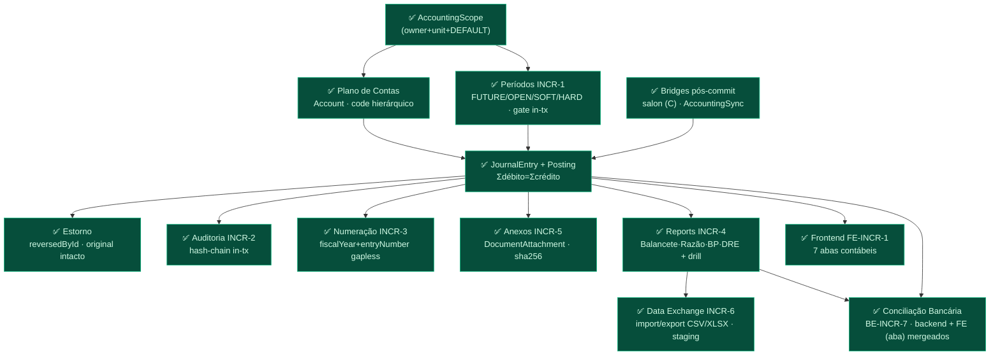

# Grafo-Mestre REAL — Módulo Contábil Luminaris

> **Fonte de verdade do roadmap contábil.** Este documento é o grafo-mestre **reconciliado com as
> decisões commitadas** do projeto — não a visão aspiracional de "sistema contábil universal".
> Onde um grafo aspiracional (o de 35 seções) diverge deste, **este vence** até que um ADR mude a
> decisão. Todo nó aqui tem um **estado** (legenda §7) e, quando relevante, o ADR/memória que o fixou.
>
> **Regra de uso (arquiteto/orquestrador):** nenhuma skill de geração roteia contra um nó marcado
> 🔴/⚫ sem **ADR em disco + sinal humano**. Nós ✅ estão fechados; nós ⏳ são o incremento corrente.
>
> Última reconciliação: **2026-07-03** · HEAD de referência: `761b358` (INCR-6 fechado, brief INCR-7 mergeado).

---

## 1. Decisões TRAVADAS — os trilhos que moldam todo o resto

Estas não são "preferências": são decisões commitadas. Reabrir qualquer uma é `DECISÃO ARQUITETURAL`
(ADR + sinal humano), **não** feature comum.

| # | Decisão travada | Por quê / evidência |
|---|---|---|
| T1 | **SQLite** (WAL + busy_timeout). Sem Postgres. | `stay-on-sqlite-no-postgres`. Todo "exclusion constraint" aspiracional → **gate transacional em app + `@@unique`**. |
| T2 | **Tenancy = `AccountingScope`** (`ownerUserId` + `unitId` + ledger `DEFAULT` implícito). **Sem** torre `LegalEntity/Ledger/Establishment`. | `accounting-scope-foundation-no-multicompany`; `AccountingScope.ts:12-25`. |
| T3 | **Contabilidade é Prisma first-class.** Model + Service + Repository + Policy próprios. **Nunca** DynamicTable, **nunca** serviço Prisma injetado no motor de plugins. | Contrato §2.1 (`AC-2.1-B1..B5`); `accounting-is-first-class-prisma`. |
| T4 | **Dinheiro = centavo inteiro `Int`**, teto Int32 compartilhado (`MAX_CENTS`). Igualdade exata, sem epsilon. | `money.ts:14`; `dynamictable-money-and-uniqueness-limits`. Upgrade a `BigInt` só quando um leg real passar de ~R$ 21,47M. |
| T5 | **Estorno é lançamento novo**, nunca edição/delete destrutivo do original. Post é imutável. | `JournalEntry` `reversedById`; `accounting-increment-d1-settlement`. |
| T6 | **Gate de invariante mutável re-checado DENTRO da `runTransaction`** (TOCTOU). Todo `tx` propaga a todo write do bloco. | `authoritative-gate-inside-tx`; `tx-nao-propagado-ao-repo`. |
| T7 | **Idempotência liga em identidade do evento** (`sourceType+sourceId`, sha256 do arquivo), **nunca em `userId`**. Guarda pré-tx via repo injetado. | `JournalEntry @@unique([userId,unitId,sourceType,sourceId])`; `orchestration-service-tx-repo-smell`; `idempotency-class-fix-discipline`. |
| T8 | **Auditoria append-only hash-chain, in-tx, exceção ao `onDelete:Cascade`.** | `AuditEvent` (INCR-2); `audit-log-no-fk-cascade`. |
| T9 | **BRL-only.** Sem multi-moeda — `Posting`/`JournalEntry` não têm campo de moeda. | `AccountingScope.baseCurrencyCode:'BRL'`; grep no schema. |
| T10 | **Integração origem→ledger = bridge pós-commit explícita** por origem (fora do motor). **Não** existe rule engine dirigido por template. | `accounting-increment-c-salon-bridge` (ADR-C01); AccountingSync. |
| T11 | **Deploy single-process, SQLite local.** Scheduler in-process. Sem fila/outbox/DLQ. | `accounting-sync-b1-merged`. |
| T12 | **Governança:** `PLAN → ADR → BRIEF → impl → test → review independente → PR → merge → smoke-gate → closeout → memória`. Review por **agente separado**; smoke-migration-gate antes de dados reais. | `reviewer-independence-separate-agent`; `accounting-incr1-db-risk`; `verify-write-context-before-writing`. |

---

## 2. Estado atual — a fundação que está de pé

Cadeia de dependência **real** (só nós construídos + o corrente). Cada `INCR-N` está mergeado em `main`.



**Núcleo 1 (ledger confiável) — fechado.** Núcleo de operação/relatório/evidência/troca de dados — fechado.
Único resíduo do trilho anterior (A–J do INCR-6): **sign-off humano no browser**.

---

## 3. Incremento corrente — Conciliação Bancária (BE-INCR-7)

**Estado:** ✅ **Backend implementado** (2026-07-03, PRs #32–#37 + rotas): models+migração (smoke-gate PASS,
`SMOKE-MIGRATION-GATE-BE-INCR7.md`), repository, policy+DTOs, emenda INCR4-A (class-fix `LEDGER_STATUSES` +
`getLiabilityCents` do job), `ReconciliationService` (import sha256-idempotente, auto-match D6, manual N↔1,
unmatch soft + flip-back, pendências §4.5), emenda INCR4-B, rotas `/api/accounting/reconciliation/*` + OpenAPI.
Cada PR com review independente (worktree isolado) — 2 FAILs corrigidos e re-aprovados no processo.
Smoke-gate de deploy sobre backup do `dev.db` **real** também PASS (2026-07-03,
`SMOKE-MIGRATION-GATE-BE-INCR7-DEPLOY.md`) — migração aplicada limpa sobre dados vivos, dev.db original
comprovadamente intocado (md5+mtime), 408/408 testes accounting verdes, `tsc` limpo.
**FE ✅ mergeado em `main`** (aba `conciliacao` no `AccountingView.tsx` → `ReconciliationPanel` +
`ReconciliationMatchModal`; stack FE-INCR-7 #57 + unmatch read-shape #56, 2026-07-09 — verificado no git
2026-07-10: componentes existem e a aba está wired). **Pendente:** só sign-off humano em browser.
Emendas pós-ratificação no ADR §3: sha256 liberado no soft-delete (`deleted:<id>`) · nota derivação D5
stale-on-new-bank-account (aceito no MVP).

**Escopo travado (MVP enxuto — 3 entidades):**

```
BankStatement          cabeçalho · glAccountId (âncora na conta-banco, D4) · sha256 (idempotência re-import)
BankStatementLine      linha · amountCents Int SINALIZADO (MAX_CENTS) · status UNMATCHED|MATCHED|IGNORED
ReconciliationMatch    vínculo linha↔posting (D3) · unmatch soft (D7) · @@unique(statementLineId,postingId)
```

**7 decisões ratificadas:** D1 models próprios + reusa só `parseTable` (não novo ImportKind) · D2 CSV/XLSX only ·
D3 linha↔posting, N:M estrutural mas **1 match ativo por posting** no MVP (fecha double-link in-tx) · D4 âncora
no `Account` existente · **D5 `JournalEntry.status=Reconciled` NO MVP** (opção B): flip derivado/reversível/
auditado `Posted↔Reconciled` quando todos os postings de conta-banco casam — **exige emenda INCR4-A**
(`LEDGER_STATUSES` passa a incluir `Reconciled`, senão some do BP/DRE) + INCR4-B (estorno exige unmatch antes) ·
D6 janela ±3d, auto-match só no candidato único (abstém no empate = idempotente) · D7 unmatch soft, flipa
`Reconciled→Posted`, auditado.

**Regra-dura:** conciliar **não muda valor de ledger** — motor escreve nos vínculos + flipa `JournalEntry.status`
(marcador reversível); nenhum `Posting`/débito/crédito muda. Ajuste real = novo lançamento via
`PostingService.postEntry` (gated por período).

**Desambiguação:** ≠ `AccountingSync "reconcile"` (job CRM Won→lançamento, já existe em `features/accounting/sync/`).

---

## 4. Decisões REJEITADAS — não reabrir sem ADR

O grafo aspiracional propõe estes; o projeto **decidiu contra** (registrado). Se algum voltar, é `DECISÃO ARQUITETURAL`.

| Proposta aspiracional | Estado | Por quê rejeitada / vencedor |
|---|---|---|
| Torre `Workspace→LegalEntity→Establishment→Ledger` (multiempresa) | 🔴 **Rejeitada** | Vencedor: `AccountingScope` de 2 níveis. `accounting-scope-foundation-no-multicompany`. |
| PostgreSQL / exclusion constraints | 🔴 **Rejeitada** | Vencedor: SQLite tunado + gate transacional + `@@unique`. `stay-on-sqlite-no-postgres`. |
| Contabilidade como preset DynamicTable | 🔴 **Rejeitada** | Vencedor: Prisma first-class. Contrato §2.1. |
| **Motor de Regras Contábeis** (`conditionsJson`/`templateJson` gera lançamento) | 🔴 **Rejeitada (recomendação de domínio)** | Vencedor: **bridge pós-commit explícita por origem**. Um engine dirigido por template no caminho do ledger reintroduz o "motor de plugins" no ponto mais crítico (quem valida que o template balanceia? versionamento?). ADR-C01 fixou o padrão de bridge. |
| Multi-moeda (`transactionCurrencyCode`/`exchangeRate`) | 🔴 **Fora / ADR próprio** | BRL-only. Campo reservado no `AccountingScope` como slot futuro, sem implementação. |

---

## 5. Domínios DIFERIDOS — reais, mas cada um é seu próprio ADR/incremento

Ordenados por proximidade da fundação. **Nenhum** é "o próximo passo" antes do INCR-7 fechar.

| Domínio | Estado | Gate para começar |
|---|---|---|
| **SourceDocument + JournalEntrySource** (proveniência formal) | ✅ **Mergeado em `main`** (BE-INCR-8, PR #43, 2026-07-08; review independente PASS; commit de feature `a18886c`) | **ADR-INCR8** (altitude **A1 seam fino**). First-class Prisma: `SourceDocument`+`JournalEntrySource` (migração additiva, 0 ALTER), `SourceProvenanceRepository`, DTO `sourceDocument?` `.strict()`, seam na tx do `postEntry` (origem+link+audit `entry.source_recorded` átomos), import desdobra `externalReference`→`externalRef` com `sourceId` **byte-idêntico** (T7 intocada), no-cascade (sem FK User, D7). Consumidor (ECD/ECF) segue diferido. Gates: tsc×2 limpo, jest 752/752, **smoke-migration-gate PASS** (dev.db real: 15→15 entries, fingerprint de idempotência byte-idêntico, tabelas novas vazias). Brief + ADR em `docs/`. |
| **OFX** (ingestão bancária) | ✅ **Mergeado em `main`** (BE-INCR7-OFX, PR #59 `bb2f27a`, 2026-07-09; `ADR-INCR7-OFX-bank-statement.md`; review independente PASS ×2 + CI verde) | `lib/ofx.ts` normaliza `<STMTTRN>`→shape de linha; reusa `parseLines` integral; migration-free; multi-conta rejeitada; fallback de descrição para `TRNTYPE` quando falta NAME/MEMO. Supersedes ADR-INCR7 §D2 (parte OFX). Residual: sign-off humano no browser; FE aceita `.ofx` no upload (FE-OFX). |
| **Plano de Contas Referencial versionado** (mapeamento Account→código RFB + diagnóstico de cobertura) | ✅ **Mergeado em `main`** (BE-INCR-9, PR #58, 2026-07-09; review independente PASS + smoke-gate PASS) | **ADR-INCR9** (`docs/adr/ADR-INCR9-referential-chart-mapping.md`). First-class Prisma: `ReferentialMapping` (migração aditiva, tabela nova vazia), `@@unique([userId,unitId,accountId,mappingVersion])` (versões coexistem — D2), SEM `deletedAt` (hard-delete + trilha no AuditEvent — D5), `mappingVersion` string livre (D1). Write com gate in-tx (Account ativo+folha, ACC-011) + `AuditService.append` na mesma tx; read de cobertura **chart-driven** (não balance-driven — D3), espelha a shape `mappingVersion`+`unmappedAccounts` do INCR-4. `referentialCode`/`label` denormalizados, sem catálogo/FK (D6 — import do leiaute oficial diferido com o SPED). Gates: tsc×2 limpo, 441/441 accounting jest verdes (17 novos). Geração do arquivo SPED segue diferida (⚫, ADR próprio). **Track A Fase 2 — autoria em lote (branch `worktree-agent-a29d2323903acb7aa`, committed, ainda NÃO revisado/mergeado):** `batchSet` (upsert atômico all-or-nothing de N itens numa única `runTransaction`, gate per-item + audit in-tx via helper `applySet` compartilhado com `setMapping` — D8), `copyVersion` (herança de ano `fromVersion→toVersion`, `label` re-snapshot literal — D6/D9, reusa o gate per-item; alvo existente faz upsert, nunca P2002), `authoringSkeleton` (esqueleto chart-driven = `coverage().unmappedAccounts` re-exposto p/ autoria — D5, nunca inventa código RFB — D1/D10). Rotas: `POST /referential/mappings/batch`, `POST /referential/mappings/copy`, `GET /referential/skeleton`. Allowlist de audit estendida (set/batch/copy/unset → `{accountId,referentialCode,mappingVersion}`, `label`/PII dropados). Zero migração nova. Catálogo/join oficial = Track B (fora de escopo). Gates: tsc limpo, suites referential+audit+openapi verdes. |
| **CNAB/NF-e** (ingestão bancária/fiscal rica) | ⚫ Diferido | ADR próprio. CNAB = posicional por banco (subprojeto); NF-e = domínio fiscal. |
| **ECD readiness** (arquivo SPED Contábil: blocos/registros) | ✅ **Mergeado em `main`** (BE-INCR-SPED-ECD, PR #62, 2026-07-10, merge `9deb928`; review independente PASS; sign-off humano no PVA = residual) | **ADR-INCR-SPED-ECD** (`docs/adr/`). Serializer puro `lib/sped.ts` (25 registros do MVP, Leiaute 9 campo-a-campo, contadores 2-passadas) + `SpedGenerationService` (coverage-gate D5 → I050/I051/I052 + 12×I150/I155 mensal com carry-forward D11 + I200/I250 via read D9 + J100/J150 via INCR-4 → job `EXPORT_SPED_ECD` + `.txt` latin1 + audit, na tx). Reuso do INCR-6 (job/artefato/download). **D1** sem migração; **D3** identidade via DTO transiente (sem `LegalEntity`). **Emenda D12/E4:** I052 movido PARA o MVP. **Residual honesto (ADR §5):** import PVA-limpo é sign-off humano. |
| **Apuração/encerramento do resultado** (I350/I355 + ECD PVA-value-clean) | ✅ **Mergeado em `main`** (BE-INCR-SPED-APURACAO, PR #63, merge `1465bae`, 2026-07-10; feature `1de120d`; 2ª review independente PASS; residual = sign-off humano no PVA) | **ADR-INCR-SPED-APURACAO** (`docs/adr/`). `ExerciseClosingService.closeExercise(year)` posta 1 encerramento real balanceado (via `PostingService.postEntry`) que zera as contas de resultado contra Lucros/Prejuízos Acumulados (`2.3.1`, nova no fixture — **zero migração**, `sourceType='closing'`). **D3** `incomeStatement` closing-aware no report compartilhado (DRE operacional); `balanceSheet` intocado (PL carrega o resultado, netResultLine auto-zera, A=P nos 2 estados). **D5** `reverseEntry` closing-aware libera a chave de idempotência (close→reopen→re-close = lançamento novo). SPED emite I350/I355 + `IND_LCTO='E'` derivado. Rota `POST /accounting/closing/exercise` (3-toques). Gates: tsc limpo, 857/857 jest verdes (18 novos), openapi 99 paths. |
| **Split de receita por natureza** (serviço × revenda — pré-requisito de dado do Bloco P da ECF-Presumido) | ✅ **Mergeado em `main`** (BE-INCR-REVENUE-SPLIT, PR #66, merge `ae8ac00`, 2026-07-10; 2 reviews independentes — 1º FAIL→corrigido `f051bc6`, 2º PASS + caça-à-classe limpa; CI verde) | **ADR-INCR-REVENUE-SPLIT** (`docs/adr/`). Rename-sibling no fixture: `3.1` "Receita de Vendas"→**"Receita de Serviços"** (code estável, guarda histórico postado — ACC-018 barra reparent) + nova `3.3 Receita de Revenda de Mercadorias`. `AccountingEvent.revenueByNature?` **aditivo** (blast radius mínimo; só o `SalonSaleFinalizedMapper` consome). Split proporcional no mapper (fronteira de dinheiro): desconto de header rateia proporcional, resíduo de arredondamento na conta de produto → `Σlinhas == totalCents`. Live bridge + reconcile emitem o mesmo breakdown de `loadSalePackageInfo` (venda re-dirigida idêntica). **Cutover, backfill zero** (assunção: 1ª ECF ≥2026). **FAIL-1 do 1º review:** `3.3` não estava no `StatementMappingFixture` → DRE a dropava silenciosamente (J150≠I355); corrigido (regra `dre.gross_rev_resale` + bump v2). Gates: tsc limpo, 472/472 accounting jest. **Follow-up:** `3.3` fica não-mapeada no diagnóstico referencial (INCR-9, chart-driven — correto) até receber código RFB antes de qualquer geração ECF. |
| **ECF readiness** (arquivo SPED Fiscal: IRPJ/CSLL) | ⚫ Diferido | ADR próprio, campo-a-campo (lição I052/PR #62). Regime de partida = **Presumido** (SN é isento de ECF; Real é raro). Base receita-driven (não o lucro líquido do encerramento). Pré-requisitos de dado: proveniência (INCR-8 ✅), mapeamento referencial (INCR-9 ✅), **split de receita por natureza** (✅ acima, PR #66). Novos agregados: `TaxRegime` (Presumido não tem LALUR/Parte B). |
| **Torre de aprovação** (maker-checker, SoD, `submittedById`/`approvedById`/`version`/`contentHash`) | ⚫ Diferido | Model atual só tem `Draft\|Posted\|Reconciled\|Reversed`. ADR + invariantes ACC-016/017. |
| **Dimensões** (centro de custo/projeto — DimensionDefinition/Value/PostingDimension) | ⚫ Diferido | Sem precedente; YAGNI até demanda real. |
| **Subrazões** (AR, AP, estoque, imobilizado, **folha**, **fiscal/tributos**) | ⚫ Diferido | Cada um é módulo ERP first-class próprio. Folha/fiscal = domínios pesados isolados. |
| **Integração inbox/outbox/DLQ** | ⚫ Diferido | Só faz sentido quando sair de single-process (T11). Bridges cobrem a escala atual. |
| **IA/analytics** (sugestão de conta/conciliação, anomalias) | ⚫ Diferido | Sobre um ledger já confiável; IA sugere, humano contabiliza. |
| **LGPD/RBAC granular** | ⚫ Parcial | Autorização no servidor já vale; mascaramento/retenção/papéis finos = incremento próprio. |

---

## 6. Mapa de reuso canônico — os blocos reais a reaproveitar

Antes de gerar "novo", reuse (Contrato §0). Confirmado por código:

| Bloco | Onde |
|---|---|
| `AccountingScope` / `accountingScopeWhere` | `features/accounting/scope/AccountingScope.ts` |
| `PostingService.postEntry` (lançar ajustes) | `features/accounting/services/PostingService.ts` |
| `AuditService.append(tx, scope, event)` | `features/accounting/services/AuditService.ts` |
| `MAX_CENTS` | `features/accounting/models/money.ts` |
| `DocumentAttachment` (anexar extrato) | `features/accounting/services/DocumentAttachmentService.ts` |
| Parser puro `parseTable` | `lib/spreadsheet` (desacoplado do model INCR-6) |
| `AccountingReportService` (as_of + groupByAccount) | INCR-4 |
| Gate de período | INCR-1 |
| Factory / rota-3-toques / DTO Zod `.strict()` / Policy | Contrato §2/§3 |

---

## 7. Régua de progresso — os 5 núcleos (do grafo aspiracional §32), % real

| Núcleo | Estado | % | Falta |
|---|---|---|---|
| **1 — Ledger confiável** | ✅ | ~95% | (nada estrutural; "permissões/aprovação" que o grafo mistura aqui são torre nova, não gap) |
| **2 — Operação real** | 🟡 | ~60% | aprovação, dimensões, busca/filtros ricos |
| **3 — Integração** | 🟡 | ~40% | ~~SourceDocument formal~~ (✅ BE-INCR-8, mergeado PR #43); inbox, outbox (só se sair de single-process) |
| **4 — Gestão** | 🟡 | ~50% | fluxo de caixa, análise por dimensão, variação mensal |
| **5 — Compliance** | 🟡 | ~35% | ~~mapeamento referencial~~ (✅ BE-INCR-9, PR #58); ~~geração do arquivo ECD~~ (✅ BE-INCR-SPED-ECD, PR #62, merge `9deb928`); ~~apuração/encerramento (I350/I355)~~ (✅ BE-INCR-SPED-APURACAO, PR #63, merge `1465bae`; residual PVA); ~~split de receita por natureza (pré-req ECF-Presumido)~~ (✅ BE-INCR-REVENUE-SPLIT, PR #66); falta ECF, pacotes, recibos |

**Posição:** fundação (Núcleo 1) completa, Núcleo 2 mais da metade; ramos de expansão à frente. Geração do arquivo ECD (BE-INCR-SPED-ECD) **mergeada** (PR #62), assim como a **apuração/encerramento** (BE-INCR-SPED-APURACAO, PR #63, residual PVA) e o **split de receita por natureza** (BE-INCR-REVENUE-SPLIT, PR #66). Os três pré-requisitos de dado da ECF (proveniência, mapeamento referencial, split de receita) estão em `main`. **ECF** (geração do arquivo fiscal) e demais candidatos seguem ⚫ diferidos (§5, ADR próprio campo-a-campo).

---

## 8. Legenda de estados

| Marca | Significado |
|---|---|
| ✅ | Construído e mergeado em `main` |
| ⏳ | Incremento corrente (PRE-ADR ou em execução) |
| 🔴 | Decisão **rejeitada** — reabrir exige ADR + sinal humano |
| ⚫ | Diferido — real, mas fora do escopo atual; ADR/incremento próprio |
| 🟡 | Parcial |

> **Como manter este doc:** a cada incremento fechado, promova o nó ⏳→✅ e registre o ADR/merge. Ao
> avaliar qualquer proposta nova, cheque primeiro se ela colide com §1 (travadas) ou §4 (rejeitadas) —
> se colidir, é ADR, não tarefa.
