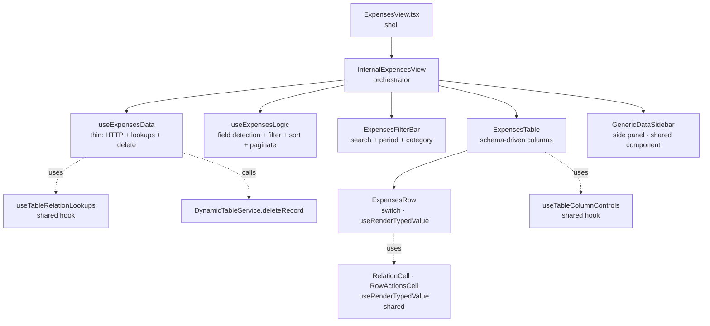
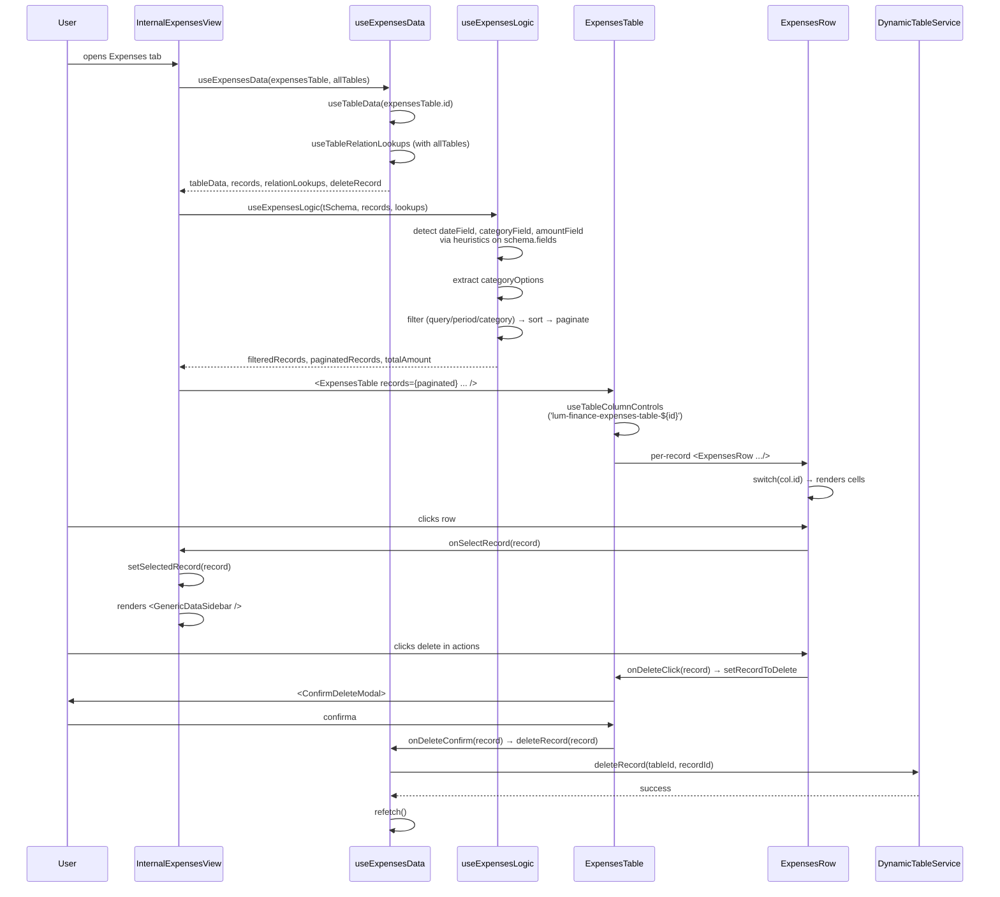

# Expenses Sub-View

> Single-table view de despesas com schema-driven columns. **Spoke** do hub-and-spoke da Finance ([← voltar ao README](./README.md)).

**Status:** ✅ Production-ready · 100% Gold Standard
**Pattern:** Variant A (single-table) com `GenericDataSidebar` para detalhes
**Domain:** Expense Management

---

## 1. Overview

A Expenses sub-view é estruturalmente similar a `ServicesView` (Variant A single-table), mas com **diferenças sutis críticas**:

- **Detalhes via `GenericDataSidebar`** em vez de inline-edit — preserva uniformidade com categorias "sem view dedicada"
- **Field detection automática** — descobre `dateField`, `categoryField`, `amountField` no schema por heurística em vez de hardcoded
- **`ExpenseRecord` é nested (`{ id, data: ExpenseData }`)** — diferente do flat-record de Sales, mais alinhado com Products/Services
- **Soft-delete delegado ao data hook** — `deleteRecord` exposto via callback, HTTP no `useExpensesData`

Decisões-chave:

- **Field heuristics em vez de assumir nomes:** O schema pode ter `date` ou `paymentDate`, `amount` ou `valor`. O hook detecta automaticamente — código resiliente a schemas legados.
- **Logic recebe `relationLookups`:** `sortRecords` precisa resolver labels de relação para ordenar por nome (não por ID). Lookups vêm do data hook.
- **`InternalExpensesView` orquestra, `ExpensesView` é shell:** Separação consistente com Products/Services — facilita reuso em widgets.

---

## 2. Architecture



**Responsibility separation:**

| Layer | File | Pode fazer | NÃO pode fazer |
|---|---|---|---|
| Shell | `views/ExpensesView.tsx` | Compor data + logic, renderizar Internal | UI · HTTP |
| Orchestrator | `views/InternalExpensesView.tsx` | UI tree, sidebar state, filter persistence, boundary casts | HTTP, lógica de filtro |
| Data | `hooks/expenses/useExpensesData.ts` | 1 useTableData, relation lookups, deleteRecord | Filtragem, UI |
| Logic | `hooks/expenses/useExpensesLogic.ts` | Field detection, filter/sort/paginate, stats | HTTP, mutations |
| Table | `components/expenses/ExpensesTable.tsx` | Column system, sort, customize panel, delete modal | Cell content |
| Row | `components/expenses/ExpensesRow.tsx` | Cell rendering schema-driven | HTTP |

---

## 3. File Map

| File | LOC | Responsibility |
|---|---|---|
| `views/ExpensesView.tsx` | ~60 | Shell — data + logic → Internal |
| `views/InternalExpensesView.tsx` | ~160 | Orchestrator com `selectedRecord` state e `handleCloseSidebar` |
| `hooks/expenses/useExpensesData.ts` | ~32 | Thin: `useTableData` + `useTableRelationLookups` + `deleteRecord` em `useCallback` |
| `hooks/expenses/useExpensesLogic.ts` | ~165 | Field detection (`dateField`, `categoryField`, `amountField`) · 4 handlers em `useCallback` · `sortRecords` · `totalAmount` reducer |
| `components/expenses/ExpensesFilterBar.tsx` | ~145 | Search + sort + period chips + category select + stats |
| `components/expenses/ExpensesTable.tsx` | ~245 | Schema-driven columns + `STRUCTURAL`-less (todos os fields são data columns) + sort + delete modal |
| `components/expenses/ExpensesRow.tsx` | ~160 | Switch: `isPlanned`, `paymentStatus`, `status`, `category`, `actions`, default schema-driven |
| `components/expenses/index.ts` | ~5 | Barrel parcial — só `ExpensesFilterBar` (intencional: Table/Row imported direct) |
| `types/expenses.types.ts` | ~30 | `ExpenseData` (com index signature) · `ExpenseRecord = { id, data: ExpenseData }` |

**Total: ~1000 LOC** — menor que Sales (~2000), maior que Services (~1015 ≈ similar).

---

## 4. Data Flow



**Pontos-chave:**

- **Field detection é fragmentada por concern:** O `useExpensesLogic` detecta 3 campos especiais (`dateField`, `categoryField`, `amountField`) via heurística no schema. Resiliente a schemas com naming inconsistente (`date | paymentDate`, `amount | valor`).
- **`categoryOptions` vem do schema, não dos records:** Diferente de Services que extrai dos records. Razão: despesas têm enums declarativos no schema (não livres).
- **`sortRecords` recebe `relationLookups`:** Ordenar por campo de relação ordena pelo **label resolvido**, não pelo ID. Implementação delegada ao shared `SortSelect`.
- **`paginatedRecords` é castado para `ExpenseRecord[]`** em `InternalExpensesView` — boundary cast intencional e documentado (logic usa `DynamicRecord[]`, view precisa do tipo de domínio).

---

## 5. Public API

```tsx
import { ExpensesView } from '@/features/dashboard/category-views/finance/views/ExpensesView';

<ExpensesView
  expensesTable={discoveredTable}      // IDynamicTable — vem do useFinanceData
  allTables={allDynamicTables}          // IDynamicTable[] — para relation lookups
  isWidgetMode={false}
  isFilterOpenOverride={undefined}
  refreshKey={0}
/>
```

**Props:**

| Prop | Type | Default | Description |
|---|---|---|---|
| `expensesTable` | `IDynamicTable` | required | Tabela de despesas (descoberta pelo `useFinanceData` no parent) |
| `allTables` | `IDynamicTable[]` | optional | Necessário para `useTableRelationLookups` resolver `defaultDisplayField` sem HTTP extra |
| `isWidgetMode` | `boolean` | `false` | Modo widget |
| `isFilterOpenOverride` | `boolean \| undefined` | `undefined` | Sobrescreve `useFilterPersistence('finance-expenses')` |
| `refreshKey` | `number` | — | Incrementado pelo FinanceView quando uma despesa é criada via FAB externo |

**Diferença vs Sales:**
Aqui `expensesTable` é passada **diretamente** como prop, já descoberta. Em Sales, `tables` (array completo) é passado e o hook descobre internamente. Razão: o FAB de criação de despesa (`FloatingActionButton`) vive no header do FinanceView e precisa do schema da tabela — já que vai precisar dele, faz sentido passar a tabela inteira em vez do array.

---

## 6. State Ownership

| State | Lives in | Mutated by |
|---|---|---|
| `query` (search) | `useExpensesLogic` | `setQuery` (handler) |
| `periodFilter` | `useExpensesLogic` | `setPeriodFilter` |
| `categoryFilter` | `useExpensesLogic` | `setCategoryFilter` |
| `sortConfig` | `useExpensesLogic` | `setSortConfig` (handler resetting page) |
| `currentPage` | `useExpensesLogic` | `setCurrentPage` |
| `selectedRecord` (sidebar) | `InternalExpensesView` | row click |
| `isFilterOpen` | `useFilterPersistence('finance-expenses')` | localStorage |
| `columns/widths/order` | `useTableColumnControls` | `'lum-finance-expenses-table-${tableData?.id}'` |
| `recordToDelete` | `ExpensesTable` | row delete click |
| `isDeleting / deleteError` | `ExpensesTable` | confirm modal flow |
| `isMenuOpen` (customize) | `ExpensesTable` | customize button |

---

## 7. Gold Standard Patterns Applied

Referências cruzadas com o skill `category-view-standard`:

| Skill section | Aplicação | Onde |
|---|---|---|
| §3 Responsibility separation | Layers separados, zero HTTP em UI | `useExpensesData.ts:17-20` (delete em useCallback) |
| §4.1 STRUCTURAL + dataColumns | **Pattern simplificado:** todos os campos do schema viram colunas (sem `STRUCTURAL` set). Cases especiais ficam no Row | `ExpensesTable.tsx:62-93` |
| §4.4 storageKey único | `'lum-finance-expenses-table-${tableData?.id \|\| "default"}'` | `ExpensesTable.tsx:108` |
| §4.4 CustomizeColumnsPanel via portal | Portal target `finance-actions-portal` (compartilhado com Sales no header da Finance) | `ExpensesTable.tsx:51, 150-163` |
| §5 default: case schema-driven | Generic path com `RelationCell` ou `useRenderTypedValue` | `ExpensesRow.tsx:121-141` |
| §6 RelationCell + RowActionsCell | Importados de `shared/components/` | `ExpensesRow.tsx:8-9` |
| §7 useRenderTypedValue (não direto) | Currency/locale-aware com `numberFormat` map | `ExpensesRow.tsx:7, 45-57, 136-138` |
| §8 Pagination reset via useCallback | 4 handlers com `setCurrentPage(1)` inline | `useExpensesLogic.ts:74-96` |
| §9 isWidgetMode propagado | View → Internal → Table → Row | Todos os layers |
| §10 Soft delete via ConfirmDeleteModal | HTTP em `useExpensesData.deleteRecord` | `ExpensesTable.tsx:131-146, 230-238` |
| Module-level `ITEMS_PER_PAGE` | `const ITEMS_PER_PAGE = 25` no topo do hook logic | `useExpensesLogic.ts:14` |
| `isTableSchema` guard | Antes de acessar `schema.fields` | `useExpensesLogic.ts:45` |
| `catch (err: unknown)` + `instanceof Error` | Delete flow | `ExpensesTable.tsx:140-145` |
| `import type` consistente | Todos os identificadores type-only separados | Após Stage 2-B |

**Diferenças intencionais vs Products/Services:**

- **Sem `STRUCTURAL` set:** Em Products/Services, `STRUCTURAL` filtra campos que têm rendering customizado para evitar duplicação no `default:` case. Em Expenses, o `ExpensesTable.tsx:65` filtra apenas os meta-fields (`id`, `tenantDbId`, `createdAt`, `updatedAt`) — todos os outros são colunas data-driven com cases especiais no Row para `isPlanned`/`paymentStatus`/`status`/`category`. O `colId === fieldName` em 100% dos casos elimina a necessidade de `COL_TO_FIELD`.
- **`SortSelect` em vez de header sort:** Filter bar tem `<SortSelect>` para escolher campo e direção. Os headers também são clicáveis. Coexistem.

---

## 8. Design Decisions

### Por que field detection automática em vez de assumir nomes hardcoded?

Despesas em sistemas legados podem ter:
- `date` ou `paymentDate` ou `dueDate`
- `amount` ou `valor` ou `total`
- `category` ou `categoryId` ou `expenseType`

Hardcoded force migração de schema. Heurística (`useExpensesLogic.ts:52-62`) detecta automaticamente o primeiro field que combina. Trade-off: comportamento depende do schema, mas raramente surpreende.

### Por que `categoryOptions` vem do schema, não dos records?

Em despesas, a categoria é tipicamente um **enum declarativo** no schema (com opções "Aluguel", "Salários", "Marketing"). Mostrar apenas opções "em uso" esconderia categorias válidas ainda sem registros — que é exatamente onde o usuário quer começar a filtrar/criar.

`useExpensesLogic.ts:64-69` lê `field.options` direto.

### Por que `paginatedRecords` é castado para `ExpenseRecord[]`?

O logic hook é genérico (recebe `DynamicRecord[]`, retorna `DynamicRecord[]`). A view trabalha com o tipo de domínio (`ExpenseRecord`). Cast intencional documentado:

```typescript
// InternalExpensesView.tsx:65-68
// Boundary cast — useExpensesLogic returns DynamicRecord[] (generic logic layer);
// ExpensesTable renders domain-specific fields. DynamicRecord and ExpenseRecord
// are structurally identical ({ id, data }), so this downcast is safe.
const paginatedExpenses = paginatedRecords as ExpenseRecord[];
```

Alternativa rejeitada: tornar `useExpensesLogic` genérico com type parameter `<T extends DynamicRecord>`. Adicionaria complexidade no hook sem ganho prático.

### Por que `GenericDataSidebar` em vez de `SaleDetailPanel`-style custom?

Despesas não têm ações de domínio especiais (não tem "finalize"/"pay"/"cancel" como Sales). É só "ver detalhes + editar". `GenericDataSidebar` cobre exatamente esse caso e é **compartilhado com todas as categorias sem view dedicada**.

Custom panel só faria sentido se houvesse comportamento específico (ex: aprovação multi-etapa). Não é o caso.

### Por que `index.ts` é parcial (só exporta `ExpensesFilterBar`)?

`ExpensesTable` e `ExpensesRow` são importados **diretamente** pelos seus consumers (`InternalExpensesView`) via path completo. Forçar tudo no barrel adicionaria overhead de import sem ganho:
- `ExpensesTable` só é usado em 1 lugar
- `ExpensesRow` só é usado dentro do `ExpensesTable`

Barrel parcial documenta o que é "API pública" do módulo (`ExpensesFilterBar` é o único componente "leaf" reusável).

### Por que `ExpenseRecord` usa nested `{ id, data }` enquanto `SaleRecord` é flat?

Documentado em [SHARED.md → Normalizers](./SHARED.md#3-utils--normalizers). Resumo: Sales tem campos estruturados conhecidos (autocomplete-friendly em flat), Expenses tem schemas variáveis (genérico nested funciona melhor).

Aceitamos a inconsistência intencional dentro do mesmo módulo.

---

## 9. Extension Recipes

### "Adicionar um campo novo ao schema"

**Você não precisa fazer nada.** O campo aparece automaticamente como coluna data-driven. Cases customizados se aplicam:
- Field `type: 'number'` com `numberFormat: 'currency'` → formatado como moeda
- Field `type: 'relation'` → renderizado via `RelationCell`
- Field `type: 'boolean'` → mostra "Sim/Não"

### "Adicionar um case especial de rendering (ex: 'priority' com badge)"

1. Adicione o `colId` no switch de `ExpensesRow.tsx:89-119`
2. Adicione a heuristic visual (border center/right) em `ExpensesRow.tsx:83-84`

Não precisa de `STRUCTURAL` set — o switch case "captura" antes do `default:`.

### "Suportar despesas recorrentes"

Hoje despesa = 1 record. Para recorrentes:
1. Adicionar campo `isRecurring: boolean` + `recurrencePattern: string` no schema
2. Backend cria N registros derivados ou usa view computada
3. UI ganha um badge "Recorrente" no Row (caso "isRecurring")

### "Adicionar filtro por status de pagamento"

Já tem suporte parcial via `paymentStatus` field. Para tornar filtro explícito:
1. `useExpensesLogic.ts:33-37` — `const [paymentStatusFilter, setPaymentStatusFilter] = useState('all')`
2. L74-96 — handler com `setCurrentPage(1)`
3. L100-124 — adicionar filtro à pipeline
4. `ExpensesFilterBar.tsx` — adicionar `<FilterGroup>` com options vindas do schema

### "Mudar para soft-delete com flag em vez de DELETE HTTP"

`useExpensesData.ts:17-20` — substituir `deleteRecord` por `updateRecord` com `{ deletedAt: new Date() }`. Backend e UI ajustam:
- Backend: filtra `deletedAt IS NULL` por padrão
- UI: nada precisa mudar (já filtra implicitamente pelo backend)

### "Adicionar export para CSV/Excel"

Não existe hoje. Sugestão:
1. Adicionar botão no `ExpensesFilterBar` (lado dos stats)
2. Criar `useExpensesExport(filteredRecords)` hook que gera CSV via `papaparse`
3. Reusar para outras views via shared hook em `category-views/shared/hooks/`

---

## 10. Known Limitations & Tech Debt

- **Field detection por heurística** — Schemas exóticos podem ter o "wrong field" detectado como amountField. Ex: se houver `expectedAmount` antes de `amount`, o primeiro vence. Mitigação: prefer field with `numberFormat: 'currency'`. Pendente refinamento.
- **`categoryOptions` é só de field `type: 'select'`** — Despesas com categoria via `type: 'relation'` (FK para tabela de categorias) **não funcionam** no filtro de categoria. Aceito (hoje categories são enums fixos). Se mudar, ajustar `useExpensesLogic.ts:64-69`.
- **`GenericDataSidebar` é fora da finance** — Tem débito técnico conhecido (5+ `any` no componente compartilhado). Não bloqueia Expenses. Pendente refactor sistêmico.
- **Sem suporte a edição em massa** — Inativar várias despesas exige clicar uma por uma. Pattern de bulk actions sugerido em [SALES.md → §9 "Adicionar uma ação em massa"](./SALES.md#9-extension-recipes).
- **`SortSelect` no FilterBar redundante com header sort** — Coexistem (UX permite ambos). Pode confundir usuários. Decisão produto.
- **Sem testes unitários** — `useExpensesLogic` (puro) é o candidato natural.

---

## 11. Related

- **Hub:** [README.md](./README.md) — overview do Finance
- **Sibling spokes:** [SALES.md](./SALES.md) · [SHARED.md](./SHARED.md)
- **Skill:** [`category-view-standard`](../../../../../.claude/skills/category-view-standard) — variant A (single-table)
- **Compared to:** [`services/`](../../services/) — sibling Variant A na outra category-view
- **Shared types:** `../types/expenses.types.ts`, `../types/common.types.ts`
- **Shared hooks:** `useTableRelationLookups`, `useTableColumnControls`, `useFilterPersistence`, `useRenderTypedValue`
- **Shared components:** `GenericDataSidebar`, `RelationCell`, `RowActionsCell`, `CustomizeColumnsPanel`, `ConfirmDeleteModal`, `FilterBar`, `FilterGroup`, `SortSelect`, `StandardPagination`

---

_Última atualização: 2026-05-22 · Mantido junto com o código. Se alterar arquitetura do Expenses, atualize este spoke na mesma PR._
