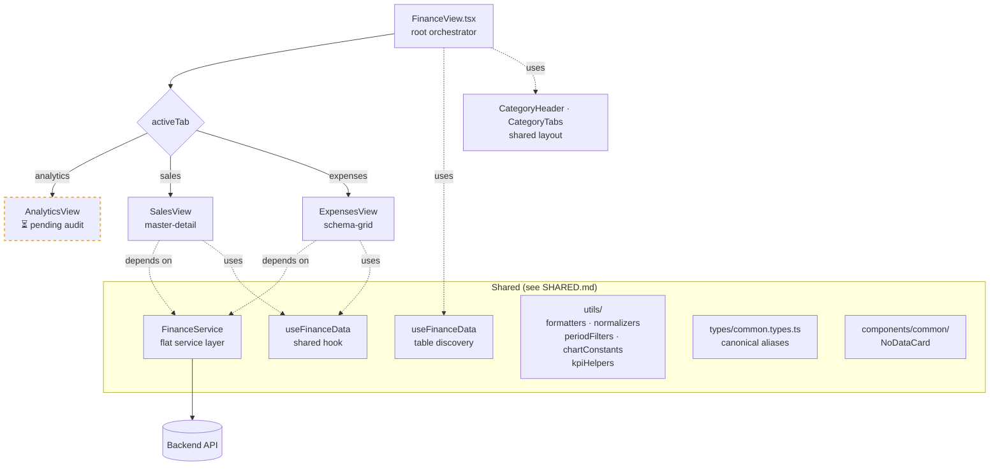
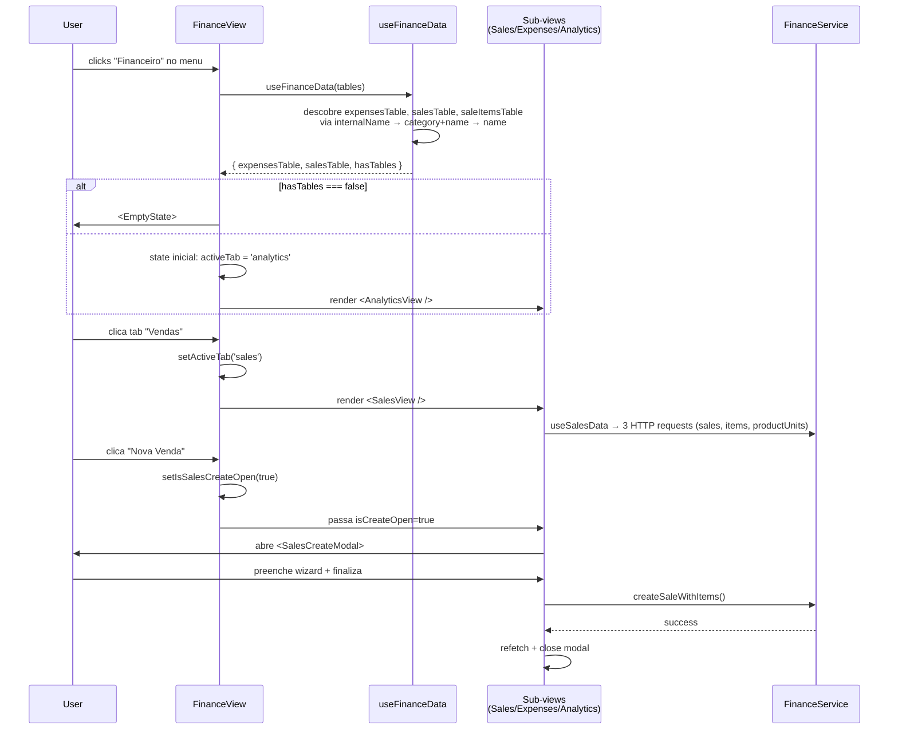

# FinanceView

> Módulo financeiro completo com 3 sub-views (Sales · Expenses · Analytics) compartilhando infraestrutura. **Maior view do dashboard** — documentada em hub-and-spoke.

**Status:** ✅ Production-ready (exceto Analytics)
**Pattern:** Tabbed orchestrator com sub-views heterogêneas
**Domain:** Finance / Accounting

---

## 📚 Documentação — Onde está cada coisa

Esta view é grande demais para um único README. Use os links abaixo conforme sua necessidade:

| Documento | Conteúdo | Quando ler |
|---|---|---|
| **[README.md](./README.md)** *(você está aqui)* | Overview · arquitetura macro · navegação | Primeira vez no Finance, ou para entender como as peças se conectam |
| **[SALES.md](./SALES.md)** | Sales sub-view · master-detail · wizard modal | Mexendo em vendas, criação, items, payment |
| **[EXPENSES.md](./EXPENSES.md)** | Expenses sub-view · flat-record pattern | Mexendo em despesas, soft-delete, schema-driven columns |
| **[SHARED.md](./SHARED.md)** | FinanceService · types · utils · common | Tocando código que afeta múltiplos sub-views |
| **ANALYTICS.md** ⏳ | Pendente — aguarda auditoria do grupo | Em construção |

---

## 1. Overview

A FinanceView é o **maior módulo do dashboard**. Diferentemente de Products/Services/People que são views auto-contidas, Finance é um **orquestrador de 3 sub-views**:

- **Sales** (Vendas) — master-detail com tabela + painel de detalhes + wizard modal de 2 abas
- **Expenses** (Despesas) — single-table com schema-driven columns + GenericDataSidebar
- **Analytics** (Análises) — KPIs + charts + dashboards (auditoria pendente)

Decisões-chave que moldam toda a arquitetura:

- **Tabs no nível root, não nested:** O `FinanceView.tsx` decide qual sub-view renderizar via state local. Cada sub-view é **independente** — pode ser usada isoladamente (ex: widgets) ou em conjunto.
- **Shared infrastructure no nível da feature:** `services/FinanceService.ts`, `hooks/shared/useFinanceData.ts`, `types/common.types.ts`, `utils/` — tudo compartilhado pelos 3 sub-views. **Não é "global"** — é específico do domínio Finance.
- **Cada sub-view tem padrão próprio:** Sales usa master-detail, Expenses usa schema-grid, Analytics usa cards/charts. **Não tentamos forçar um único padrão** — cada domínio tem seu paradigma natural.

---

## 2. Top-Level Architecture



**Camadas:**

| Layer | Responsabilidade | Arquivos |
|---|---|---|
| Root | Tab orchestration, table discovery, widget mode | `FinanceView.tsx` |
| Sub-views | Cada uma com sua arquitetura completa (data → logic → UI) | `views/{Sales,Expenses,Analytics}View.tsx` + internal |
| Shared | Service layer, types canônicos, utils, common components | `services/`, `hooks/shared/`, `types/`, `utils/`, `components/common/` |

---

## 3. File Map by Group

Total: **~66 arquivos · ~5000+ LOC** distribuídos em 4 grupos.

### 🟦 Root + Shared (16 arquivos · ~600 LOC) — ver [SHARED.md](./SHARED.md)

| File | LOC | Concern |
|---|---|---|
| `FinanceView.tsx` | ~185 | Root orchestrator (tabs + widget mode) |
| `services/FinanceService.ts` | ~115 | Flat service layer (createSaleWithItems, updateSale, fetchChartData, etc.) |
| `hooks/shared/useFinanceData.ts` | ~40 | Discovery de expenses, sales, saleItems tables |
| `types/common.types.ts` | ~70 | Canonical aliases (SchemaField, TableSchema, DynamicRecord, PeriodFilter) |
| `utils/normalizers.ts` | ~70 | Flat-record pattern (`normalizeRows<T>`) |
| `utils/formatters.ts` | ~95 | Pure pt-BR/BRL formatting |
| `utils/periodFilters.ts` | ~30 | `isInPeriod` para filtros temporais |
| `utils/kpiHelpers.ts` | ~260 | KPI formatting + grouping (analytics domain) |
| `utils/chartConstants.ts` | ~25 | CHART_COLORS palette |
| `components/common/NoDataCard.tsx` | ~190 | Empty state fallback para charts |
| 6 barrels | ~5 each | Re-exports |

### 🟩 Sales (14 arquivos · ~2000 LOC) — ver [SALES.md](./SALES.md)

| File | LOC | Concern |
|---|---|---|
| `views/SalesView.tsx` | ~185 | Master-detail orchestrator |
| `hooks/sales/useSalesData.ts` | ~130 | 3 tables + analytics + stock index + updateSale |
| `hooks/sales/useSalesLogic.ts` | ~120 | Filter/sort/paginate |
| `hooks/sales/useSalesWizard.ts` | ~280 | Wizard state com stateRef pattern |
| `components/sales/SalesFilterBar.tsx` | ~125 | Filtros (search/status/period) |
| `components/sales/SalesTable.tsx` | ~270 | Tabela list-style + StatusBadge/PaymentBadge |
| `components/sales/SaleDetailPanel.tsx` | ~250 | Painel lateral de detalhes |
| `components/sales/SalesCreateModal.tsx` | ~510 | Wizard modal 2 tabs |
| `components/sales/create/SaleItemsManager.tsx` | ~290 | Tabela de items dentro do wizard |
| `components/sales/create/inputs.tsx` | ~195 | QuantityInput · CurrencyInput · PaymentTermChips |
| `components/sales/create/types.ts` | ~25 | Boundary types do wizard |
| `types/sales.types.ts` | ~135 | SaleData · SaleItemData · SalesWizardState · SalesAnalytics |
| 2 barrels | ~10 | Re-exports |

### 🟧 Expenses (9 arquivos · ~700 LOC) — ver [EXPENSES.md](./EXPENSES.md)

| File | LOC | Concern |
|---|---|---|
| `views/ExpensesView.tsx` | ~60 | Shell |
| `views/InternalExpensesView.tsx` | ~160 | Orchestrator |
| `hooks/expenses/useExpensesData.ts` | ~32 | Thin data hook (HTTP + lookups + delete) |
| `hooks/expenses/useExpensesLogic.ts` | ~165 | Field detection + filter/sort/paginate |
| `components/expenses/ExpensesFilterBar.tsx` | ~145 | Filtros (search/period/category) |
| `components/expenses/ExpensesTable.tsx` | ~245 | Schema-driven columns |
| `components/expenses/ExpensesRow.tsx` | ~160 | Cell rendering com `useRenderTypedValue` |
| `components/expenses/index.ts` | ~5 | Barrel parcial (só FilterBar) |
| `types/expenses.types.ts` | ~30 | ExpenseData · ExpenseRecord |

### 🟥 Analytics (~27 arquivos · ~1700 LOC) — ⏳ **Pending audit**

| Subgrupo | Arquivos |
|---|---|
| `views/AnalyticsView.tsx` | 1 |
| `hooks/analytics/` | 4 (data, salesAnalytics, drillDown, widgetAnalytics) |
| `components/analytics/dashboard/` | 11 (cards, charts, drawers, KpiInfoFooter, Sparkline) |
| `components/analytics/kpi/` | 3 |
| `components/analytics/charts/` | 4 (ChartRenderer, BarLineArea, PieDonut, Speedometer) |
| `types/analytics.types.ts` | 1 |
| Barrels | ~3 |

---

## 4. The 3-Minute Tour

Como o usuário interage com o Finance, do click no menu até a tela renderizada:



---

## 5. Shared Infrastructure Cheat Sheet

| Precisa de... | Vai em... |
|---|---|
| Disparar HTTP para sales/expenses | `FinanceService.X()` — nunca chame `DynamicTableService` direto |
| Descobrir tabelas (expensesTable, salesTable) | `useFinanceData(tables)` |
| Formatar valor monetário em chart (sem Context) | `formatBRL(value)` |
| Formatar em componente React | `useFormatCurrency()` ou `useRenderTypedValue()` |
| Filtrar por período (this_month, last_3_months, etc.) | `isInPeriod(date, period)` |
| Type aliases canônicos | `import type { ... } from '../types/common.types'` |
| Cores de chart | `import { CHART_COLORS } from '../utils/chartConstants'` |
| KPI groups por processor | `getKpiGroups(processor)` |
| Empty state contextual em chart | `<NoDataCard chart={...} />` |
| Normalizar records (Sales/Expenses pattern) | `normalizeRows<T>(records)` |

**Detalhes completos:** [SHARED.md](./SHARED.md)

---

## 6. Cross-Cutting Decisions

### Por que tabs em vez de rotas separadas?

Sales, Expenses e Analytics **compartilham contexto** (mesma tabela de discovery, mesmas tabelas de relação). Rotas separadas obrigariam re-fetch de tudo ao navegar. Tabs permitem cache + transição instantânea.

Trade-off aceito: URL não reflete a tab ativa (não é shareable). Aceito porque uso real é "abrir Finance e explorar".

### Por que cada sub-view tem seu próprio data hook em vez de um único `useFinanceData`?

Cada sub-view fetcha **dados diferentes**:
- Sales: sales + saleItems + productUnits + relations
- Expenses: 1 tabela + relations
- Analytics: chart data via endpoints customizados

Unificar geraria um hook gigante com flags do tipo `if (forSales)`. Separação por concern é mais clara e cada hook fica focado.

`useFinanceData` (singular, shared) faz apenas **descoberta de tabelas** — não fetch de records.

### Por que Sales usa flat-record (`SaleData & { id }`) e Expenses usa nested (`{ id, data: ExpenseData }`)?

**Razão histórica + domain fit:**
- Sales tem dados altamente estruturados (status, paymentStatus, items, etc.) — o flat record facilita autocomplete e checks
- Expenses tem schemas mais variáveis por instalação (categorias, planejamento, etc.) — o nested permite tipagem genérica via `Record<string, unknown>`

Documentado em [SHARED.md → Normalizers](./SHARED.md#normalizers).

### Por que `FinanceService` é uma classe com métodos estáticos?

Padrão "Flat Service Architecture" do skill `frontend-architecture-standard`. Razões:
- Imports stable (`import { FinanceService } from ...; FinanceService.updateSale(...)`)
- IDE-friendly (autocomplete na classe)
- Sem instanciação acidental
- Mock simples em testes

---

## 7. Where to Find What

```
📁 Pretendo modificar...
├── A criação de uma venda                → SALES.md → §9 "Extension Recipes"
├── Os filtros de despesas               → EXPENSES.md → §9
├── A formatação de moeda no sistema     → SHARED.md → §3 formatters.ts
├── Os tipos canônicos (TableSchema)     → SHARED.md → §3 common.types.ts
├── O orquestrador raiz (tabs)           → README.md §2 + FinanceView.tsx
├── Os KPIs / gráficos                   → ⏳ ANALYTICS.md (pendente)
└── Adicionar uma 4ª tab                  → FinanceView.tsx + criar SUB.md
```

---

## 8. Status & Roadmap

| Sub-view | Audit | Docs | Production-ready |
|---|---|---|---|
| Root (`FinanceView.tsx`) | ✅ | ✅ (este README) | ✅ |
| Shared infrastructure | ✅ | ✅ ([SHARED.md](./SHARED.md)) | ✅ |
| Sales | ✅ | ✅ ([SALES.md](./SALES.md)) | ✅ |
| Expenses | ✅ | ✅ ([EXPENSES.md](./EXPENSES.md)) | ✅ |
| Analytics | ❌ | ⏳ ANALYTICS.md (próxima sessão) | ⚠️ Funciona, mas não auditado |

---

## 9. Related

- **Skill:** [`category-view-standard`](../../../../../.claude/skills/category-view-standard) — padrões teóricos
- **Sibling category-views:** [`products/`](../products/) · [`services/`](../services/) · [`people/`](../people/)
- **Skill secundário:** [`frontend-architecture-standard`](../../../../../.claude/skills/frontend-architecture-standard) — Flat Service Architecture (aplicada em `FinanceService`)

---

_Última atualização: 2026-05-22 · Hub mantido junto com os spokes. Se alterar arquitetura macro, atualize este README na mesma PR._
