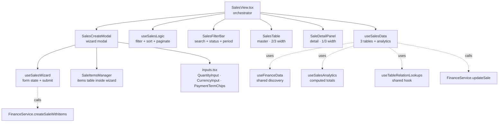
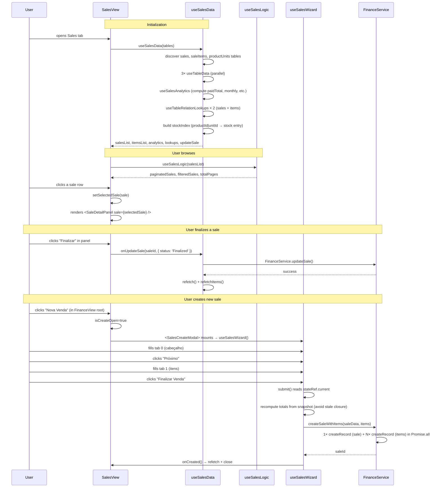

# Sales Sub-View

> Master-detail view de vendas com wizard modal de 2 abas para criação. **Spoke** do hub-and-spoke da Finance ([← voltar ao README](./README.md)).

**Status:** ✅ Production-ready · 100% Gold Standard
**Pattern:** Master-detail (table + side panel) + Wizard modal
**Domain:** Sales / Order Management

---

## 1. Overview

A Sales sub-view é **intencionalmente diferente** dos category-views convencionais (Products/Services). Onde Products usa inline-edit grid + sub-rows, Sales usa **master-detail + wizard**:

- **Master:** Tabela list-style com 2/3 da largura (data, cliente, status, pagamento, totais, ações)
- **Detail:** Painel lateral com 1/3 da largura mostrando todos os campos da venda selecionada
- **Wizard:** Modal de 2 abas (Cabeçalho + Itens) para criar nova venda

Decisões-chave que moldam tudo aqui:

- **Sales tem cardinalidade `pedido × itens`:** Cada venda agrega N items (produtos ou serviços). Modelagem master-detail é natural.
- **Flat record pattern:** `SaleRecord = SaleData & { id: string }` — diferente do Products/Services que usam `{ id, data: ... }`. Razão histórica + ergonomia em autocomplete.
- **Wizard tem state próprio:** `useSalesWizard` encapsula tudo do form. Usa **stateRef pattern** para garantir submit com snapshot atualizado sem stale closures.
- **Schema-aware mas com fields canônicos:** Sales tem campos fixos importantes (date, status, paymentStatus, etc.) hardcoded no JSX. Campos extras do schema aparecem dinamicamente no `SaleDetailPanel`.

---

## 2. Architecture



**Responsibility separation:**

| Layer | File | Pode fazer | NÃO pode fazer |
|---|---|---|---|
| Orchestrator | `views/SalesView.tsx` | Compor hooks, gerenciar `selectedSale` e modal open state | HTTP, lógica de domínio |
| Data | `hooks/sales/useSalesData.ts` | 3 useTableData, relation lookups, analytics, stock index, updateSale | Filtragem, UI state |
| Logic | `hooks/sales/useSalesLogic.ts` | Pure: filter, sort, paginate | HTTP, mutations |
| Wizard | `hooks/sales/useSalesWizard.ts` | Form state, validation, submit (via FinanceService) | Renderização |
| Table | `components/sales/SalesTable.tsx` | List rendering, badges, actions inline | Edição inline (delega ao panel/modal) |
| Detail | `components/sales/SaleDetailPanel.tsx` | Mostrar campos da venda + actions | HTTP (recebe `onUpdateSale` callback) |
| Modal | `components/sales/SalesCreateModal.tsx` | UI do wizard, navegação entre tabs | State do form (delega ao hook) |
| Items mgr | `components/sales/create/SaleItemsManager.tsx` | Tabela de items, add/remove | State (recebe handlers) |

---

## 3. File Map

| File | LOC | Responsibility |
|---|---|---|
| `views/SalesView.tsx` | ~185 | Orchestrator: data + logic + view layout |
| `hooks/sales/useSalesData.ts` | ~130 | 3 tables (sales, saleItems, productUnits) + relation lookups + analytics + updateSale |
| `hooks/sales/useSalesLogic.ts` | ~120 | Filter (query/status/period) + sort by date desc + paginate |
| `hooks/sales/useSalesWizard.ts` | ~280 | Form state com `stateRef` pattern · 11 setters em `useCallback` · subtotal/totalAmount/canSubmit memoizados · submit que recompute totais do snapshot |
| `components/sales/SalesFilterBar.tsx` | ~125 | Horizontal filter bar com period chips |
| `components/sales/SalesTable.tsx` | ~270 | List-style table · `StatusBadge` · `PaymentBadge` · 4 actions inline (view/finalize/cancel/pay) |
| `components/sales/SaleDetailPanel.tsx` | ~250 | Side panel · header com actions · grid de campos · items list · campos extras schema-driven |
| `components/sales/SalesCreateModal.tsx` | ~510 | Modal com 2 tabs · header/itens · sections (info, cliente, pagamento, observações) · validação |
| `components/sales/create/SaleItemsManager.tsx` | ~290 | Tabela de items · stock badge · RelationSelector para product/service/employee |
| `components/sales/create/inputs.tsx` | ~195 | `QuantityInput` (stepper) · `CurrencyInput` (parseBRL on blur) · `PaymentTermChips` (presets + custom) |
| `components/sales/create/types.ts` | ~25 | Boundary types: `SaleItemsVariant`, `StockIndexEntry`, `SalesCreateModalProps` |
| `types/sales.types.ts` | ~135 | `SaleData`, `SaleItemData`, `NewSaleItem`, `SalesWizardState`, `SalesAnalytics`, `RelationMaps` |
| `components/sales/index.ts` | 12 | Barrel · re-exports `SalesTable`, `SaleDetailPanel`, `SalesFilterBar`, `SalesCreateModal` + `create/*` |
| `components/sales/create/index.ts` | 3 | Barrel parcial · `SaleItemsManager`, `inputs`, `types` |

**Total: ~2000 LOC** — sub-view mais densa da Finance.

---

## 4. Data Flow



**Pontos-chave:**
- **3 HTTP requests em paralelo** (sales/items/productUnits) via `useTableData`.
- **`stockIndex`** é construído em `useSalesData` — flat map `${productId}|${unitId}` → `{ stock, reserved, salePrice }`. Lookup O(1) durante o wizard.
- **`useSalesWizard` usa `stateRef.current`** dentro de `submit()` porque o setter `setState(prev => ...)` é assíncrono. Sem o ref, totals podem ser stale.
- **Update flow centralizado:** `updateSale` vive em `useSalesData`, recebido por `SalesTable` e `SaleDetailPanel`. **HTTP único, dois callers.**

---

## 5. Public API

```tsx
import { SalesView } from '@/features/dashboard/category-views/finance/views/SalesView';

<SalesView
  tables={allDynamicTables}            // IDynamicTable[]
  isWidgetMode={false}                  // boolean
  isFilterOpenOverride={undefined}      // boolean | undefined — sobrescreve persistência
  refreshKey={0}                         // number — incrementar para forçar refetch
  isCreateOpen={false}                  // boolean — controlado pelo FinanceView root
  onCloseCreate={() => {}}              // () => void
/>
```

**Props:**

| Prop | Type | Default | Description |
|---|---|---|---|
| `tables` | `IDynamicTable[]` | required | Lista completa de tabelas |
| `isWidgetMode` | `boolean` | `false` | Modo widget |
| `isFilterOpenOverride` | `boolean \| undefined` | `undefined` | Se definido, sobrescreve `useFilterPersistence('finance-sales')` |
| `refreshKey` | `number` | — | Incrementado pelo FinanceView após criação externa — dispara refetch |
| `isCreateOpen` | `boolean` | `false` | Controla abertura do `SalesCreateModal` (controlled by parent) |
| `onCloseCreate` | `() => void` | — | Callback de fechamento do modal |

**Por que `isCreateOpen` é controlado pelo FinanceView?**

O botão "Nova Venda" vive no header global do FinanceView (próximo ao FAB de Expenses). Para evitar passar refs ou contexto, o estado de "modal aberto" mora no FinanceView e é propagado para baixo via props.

---

## 6. State Ownership

| State | Lives in | Mutated by |
|---|---|---|
| `query` (search) | `useSalesLogic` | `setQuery` (handler com page reset) |
| `statusFilter` | `useSalesLogic` | `setStatusFilter` |
| `periodFilter` (all/this_month/etc.) | `useSalesLogic` | `setPeriodFilter` |
| `currentPage` | `useSalesLogic` | `setCurrentPage` |
| `selectedSale` | `SalesView` | row click |
| `isFilterOpen` | `useFilterPersistence('finance-sales')` | localStorage |
| `updating` (sale ID being updated) | `useSalesData` | `updateSale` flow |
| `wizardState` (form data) | `useSalesWizard` | 11 setters + addItem/removeItem/updateItem |
| `isSubmitting` (wizard) | `useSalesWizard` (dentro de `wizardState`) | `submit()` flow |
| `activeTab` (wizard) | `SalesCreateModal` | tab buttons |
| `submitError` (wizard) | `SalesCreateModal` | submit catch |
| `isCreateOpen` | `FinanceView` (parent) | botão "Nova Venda" |

**Decisão arquitetural — wizard com `stateRef`:**

O `submit()` é chamado dentro de `handleSubmit` no modal. Se ele lesse `state` direto, **teria stale closure** (o último setState pode não ter aplicado ainda). Em vez disso:

```typescript
const stateRef = useRef(state);
stateRef.current = state; // atualiza a cada render

const submit = useCallback(async (...) => {
    const s = stateRef.current; // sempre fresh
    const sub = s.items.reduce(...);
    // ...
}, []); // deps vazias intencionalmente
```

Documentado em `useSalesWizard.ts:84-86, 245`.

---

## 7. Gold Standard Patterns Applied

Referências cruzadas com o skill `category-view-standard`:

| Skill section | Aplicação | Onde |
|---|---|---|
| §3 Responsibility separation | Layers separados, zero HTTP em UI | `useSalesData.ts:95-110` (updateSale) |
| §7 useRenderTypedValue (não direto) | Currency/locale-aware nos campos extras do schema | `SaleDetailPanel.tsx:48, 191-197` |
| §8 Pagination reset via useCallback | 3 handlers com `setCurrentPage(1)` inline | `useSalesLogic.ts:39-52` |
| §9 isWidgetMode propagado | View → Table (esconde coluna actions) | `SalesView.tsx:135` + `SalesTable.tsx:71-77, 113-117` |
| §10 Soft delete + status changes via confirmation modal | `useConfirmModal()` em Table e Panel | `SalesTable.tsx:80, 207-258` |
| `useTableRelationLookups` | Resolve FK names (customers, products, services, units) | `useSalesData.ts:81-90` |
| `isTableSchema` guard | Schema access seguro | `SaleDetailPanel.tsx:174` · `SalesCreateModal.tsx:41, 124, 129` |
| `catch (err: unknown)` + `instanceof Error` | Wizard submit + Modal catch | `useSalesWizard.ts:240-244` · `SalesCreateModal.tsx:185-190` |
| Module-level constants | `LABEL_CLASS`, `FIELD_CLASS`, `SECTION_CARD_CLASS`, `STATUS_COLORS`, `PAYMENT_COLORS`, `PRESETS` | Em vários arquivos |
| `import type` consistente | Todos os identificadores type-only separados | Após Stage 3 |
| Zero `as any` | Type narrowing via `isTableSchema` e casts tipados | Verificado |

**Padrões intencionalmente diferentes:**

- **Não usa `useTableColumnControls`** — Sales tem 7 colunas fixas (date, customer, status, payment, subtotal, total, actions) que não vêm do schema. Resize/customize seria UX overhead sem ganho. Documentado como exceção intencional.
- **Não usa `STRUCTURAL` + `dataColumns`** — Pela mesma razão acima.

---

## 8. Design Decisions

### Por que master-detail em vez do padrão grid de Products?

Pedidos não são "items independentes" como produtos — são **transações compostas** (pedido = cabeçalho + items). Inline-edit grid não captura essa relação. Master-detail expõe naturalmente:
- **Master:** lista de pedidos (fácil escanear por data, status, total)
- **Detail:** drill-down em um pedido específico (vê items, executa ações)

### Por que flat-record (`SaleRecord = SaleData & { id }`) em vez de `{ id, data: SaleData }`?

**Razões pragmáticas:**
1. **Autocomplete melhor:** `sale.status` em vez de `sale.data.status`. Menos digitação, menos erros.
2. **Backwards compatibility:** quando Sales foi implementado, esse padrão já existia. Migrar para nested exigiria refactor profundo sem ganho funcional.
3. **`normalizeRows<T>()`** existe exatamente para hoistear `data.*` para o nível root.

Trade-off aceito: inconsistência com Expenses (que usa nested). Documentado em [SHARED.md → Normalizers](./SHARED.md#3-utils--normalizers).

### Por que `useSalesWizard` usa `stateRef` em vez de deps no `useCallback`?

O submit precisa do estado **atual** no momento da chamada, não no momento da criação da closure. Alternativas consideradas:

| Opção | Problema |
|---|---|
| Deps `[state]` no useCallback | Recria submit a cada keystroke → handlers downstream re-renderizam |
| Passar `state` como argumento | Modal teria que conhecer a estrutura do state |
| `useRef` (escolhido) | Submit é callback estável, mas lê estado atualizado |

Esse pattern é **idiomático em React** para "snapshot reading inside callbacks". Documentado com eslint-disable explícito.

### Por que `SalesCreateModal` detecta `schemaVariant` (products/services/mixed)?

O schema da tabela `saleItems` pode ter:
- Só `productId` (vendas de produtos)
- Só `serviceId` (vendas de serviços)
- Ambos (mixed — depende do contexto)

Detectar runtime permite:
1. Esconder o seletor de tipo quando o schema é fixo
2. Filtrar o `SaleItemsManager` para mostrar apenas a coluna relevante
3. Lock automático do `wizardState.variant` quando não-mixed

`detectSchemaVariant()` em `SalesCreateModal.tsx:40-46`.

### Por que `SaleDetailPanel` reimplementa "actions" em vez de usar `RowActionsCell`?

`RowActionsCell` é "editar + inativar". Sales tem 3 actions:
- **Finalizar** — muda status para `Finalized`
- **Cancelar** — muda status para `Cancelled`
- **Pagar** — muda `paymentStatus` para `Paid`

Nenhuma é "editar registro" no sentido convencional — são **transições de estado de domínio**. Reusar `RowActionsCell` exigiria custom action props que poluiriam a interface. Mantemos buttons inline no panel.

### Por que `SalesTable.tsx` re-exporta `SaleRecord`?

```typescript
// SalesTable.tsx L31:
export type { SaleRecord };
```

Para que consumers de `components/sales` possam importar tipos sem ter que descer em `types/sales.types.ts`. Conveniência de DX.

---

## 9. Extension Recipes

### "Adicionar um novo status de venda (ex: 'Refunded')"

1. Backend: adicionar à enum da tabela `sales.status`
2. `SalesFilterBar.tsx:66-72` — adicionar `<option value="Refunded">`
3. `SalesTable.tsx:15-20` — adicionar entrada em `STATUS_COLORS`
4. (opcional) `SaleDetailPanel.tsx` — adicionar botão de action se houver transição customizada

### "Adicionar um campo customizado na venda (ex: 'salesChannel')"

**Você não precisa fazer nada no código.** Adicione o campo no schema da tabela `sales`. Ele aparece automaticamente:
- **No detail panel:** `SaleDetailPanel.tsx:174-201` renderiza campos extras schema-driven via `useRenderTypedValue`
- **No wizard:** não aparece automaticamente (wizard é hand-coded). Se quiser exposição no form, adicionar manualmente em `SalesCreateModal.tsx`.

### "Adicionar um filtro novo (ex: por vendedor)"

1. `useSalesLogic.ts:30-37` — adicionar `const [sellerFilter, setSellerFilter] = useState('all')`
2. `useSalesLogic.ts:39-52` — adicionar handler `handleSellerChange` com `setCurrentPage(1)` inline
3. `useSalesLogic.ts:55-85` — adicionar filtro à pipeline `filteredSales`
4. Retornar `sellerFilter`, `setSellerFilter` (com handler)
5. `SalesView.tsx:54-68` — destrutura novos
6. `SalesFilterBar.tsx` — adicionar `<FilterGroup>` correspondente

### "Suportar criação de venda com desconto percentual em vez de fixo"

Hoje `useSalesWizard.ts:124` aceita `discountAmount: number`. Para percentual:
1. Adicionar `discountType: 'fixed' | 'percent'` ao `SalesWizardState`
2. `totalAmount` calc (L177-180): aplicar conforme tipo
3. UI: `SaleItemsManager.tsx:264-274` — adicionar toggle entre fixo/percent

### "Bloquear pagamento se venda está cancelada"

Já está implementado! `SalesTable.tsx:152` e `SaleDetailPanel.tsx:115-129` checam `!isCancelled` antes de mostrar o botão "Pagar".

### "Adicionar comissão por venda"

`useSalesWizard.ts:138-148` (`addItem`): `NewSaleItem` já tem campo `commission?: number`. Falta UI exposure:
1. Adicionar coluna "Comissão" em `SaleItemsManager.tsx`
2. Adicionar `CurrencyInput` que chama `onUpdateItem(item.id, { commission: val })`
3. Backend: garantir que `SaleItemData` aceita o campo no schema

---

## 10. Known Limitations & Tech Debt

- **Wizard não suporta edição** — só cria. Editar uma venda existente abre `RowActionsCell` modal (genérico) → não tem o wizard de 2 tabs. Aceito (UX de wizard só faz sentido na criação inicial).
- **`SalesCreateModal` é específico de Sales** — Não generalizável para outras views (cada wizard tem semântica própria).
- **`useSalesData` faz 3 HTTP requests sequencialmente no mount** — `useTableData × 3` em paralelo é OK, mas a cadeia de useTableRelationLookups adiciona latência. Aceito (não bloqueia render — apenas marca `isLoading`).
- **`stockIndex` é recalculado a cada mudança de `rawProductUnits`** — para 1000+ unidades pode ser lento. Atualmente OK (escala atual).
- **Sem testes unitários** — `useSalesLogic` (puro) e `useSalesWizard` (state machine) são candidatos óbvios. Pendente.
- **Wizard não persiste em rascunho local** — fechar modal antes de submeter perde tudo. Aceito (UX de "preencher e desistir" raramente acontece).

---

## 11. Related

- **Hub:** [README.md](./README.md) — overview do Finance
- **Sibling spokes:** [EXPENSES.md](./EXPENSES.md) · [SHARED.md](./SHARED.md)
- **Skill:** [`category-view-standard`](../../../../../.claude/skills/category-view-standard) — note que Sales se desvia intencionalmente do padrão (master-detail)
- **Skill secundário:** [`frontend-architecture-standard`](../../../../../.claude/skills/frontend-architecture-standard) — `FinanceService.createSaleWithItems` é exemplo canônico
- **Shared types:** `../types/sales.types.ts`, `../types/common.types.ts`
- **Shared hooks:** `useTableRelationLookups`, `useFinanceData`, `useFilterPersistence`
- **Shared components:** `RelationSelector`, `useConfirmModal`, `StandardPagination`, `FilterBar`, `FilterGroup`

---

_Última atualização: 2026-05-22 · Mantido junto com o código. Se alterar arquitetura do Sales, atualize este spoke na mesma PR._
