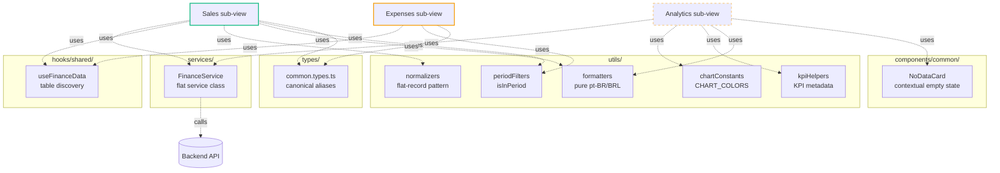

# Finance · Shared Infrastructure

> Service layer · types canônicos · utils puras · common components compartilhados entre Sales, Expenses e Analytics. **Spoke** do hub-and-spoke da Finance ([← voltar ao README](./README.md)).

**Status:** ✅ Production-ready · 100% Gold Standard
**Scope:** Infrastructure interna da Finance — NÃO é global
**Files:** 16 arquivos · ~600 LOC

---

## 1. Overview

Este documento cobre a **infraestrutura compartilhada da Finance** — código que é usado por 2 ou 3 sub-views simultaneamente. Diferente de utilities globais (`dashboard/shared/`), este código é **específico do domínio Finance** e não deve ser usado fora dele.

A organização segue 6 grupos de concern:

1. **`services/`** — `FinanceService` (Flat Service Architecture)
2. **`hooks/shared/`** — `useFinanceData` (table discovery)
3. **`utils/`** — formatters, normalizers, periodFilters, chartConstants, kpiHelpers
4. **`types/`** — `common.types.ts` (canonical aliases)
5. **`components/common/`** — `NoDataCard`
6. **Barrels** — re-exports para conveniência

Decisões-chave:

- **Tudo é específico de Finance.** Se algo for útil para outras categorias, deve ser promovido a `dashboard/shared/`. Resistir à tentação de "extrair preventivamente".
- **Canonical aliases em `common.types.ts`** — `SchemaField = ISchemaField`, `TableSchema = ITableSchema`, `DynamicRecord = IDynamicTableData`. Zero re-declaração — apenas alias para os tipos canônicos do `dynamic-tables.client.ts`.
- **`FinanceService` segue Flat Service Architecture** — classe com métodos estáticos, nunca instanciada.

---

## 2. Architecture



---

## 3. File Map by Concern

### `services/FinanceService.ts` (~115 LOC)

**Flat Service Architecture** — classe com métodos estáticos, espelha exatamente os endpoints do backend financeiro. Single source of truth para HTTP da Finance.

```typescript
class FinanceService {
    // Sales mutations
    static createSaleWithItems(salesTableId, saleItemsTableId, saleData, items): Promise<string>
    static updateSale(salesTableId, saleId, saleData, successMessage?): Promise<...>

    // Analytics queries
    static fetchChartData(chartKey, datePreset, presetKey?, extraParams?): Promise<...>
    static discoverKPIs(tableId, datePreset): Promise<...>
    static getDrillDownData(queryParams): Promise<...>

    // Generic
    static getFinanceRecords(tableId): Promise<...>
    static getCustomData(url): Promise<...>
}
```

**Padrão crítico — `createSaleWithItems`:**

```typescript
// 1. Create the Sale record
const saleResponse = await DynamicTableService.createRecord(salesTableId, { data: saleData });
const saleId = saleResponse?.data?.id ?? saleResponse?.id;

if (!saleId) throw new Error('Failed to create sale: No ID returned');

// 2. Create Sale Items in parallel
const itemPromises = items.map(item => DynamicTableService.createRecord(saleItemsTableId, { ... }));
await Promise.all(itemPromises);

return saleId;
```

Não usa transação backend — assume que items órfãos são aceitáveis caso o array falhe parcialmente. Aceito (rare edge case).

**Quando usar `FinanceService` vs `DynamicTableService`:**

| Cenário | Use... |
|---|---|
| Lógica de domínio Finance (criar venda com items) | `FinanceService` |
| Update genérico de record de uma tabela Finance | `FinanceService.updateSale` (com successMessage) |
| Fetch genérico de tabela qualquer | `DynamicTableService` direto |
| Endpoints customizados de analytics | `FinanceService.fetchChartData/discoverKPIs/etc.` |

---

### `hooks/shared/useFinanceData.ts` (~40 LOC)

**Apenas descoberta de tabelas.** Não fetcha records — isso é responsabilidade dos data hooks específicos de cada sub-view.

```typescript
function useFinanceData(tables: IDynamicTable[]) {
    // useMemo único — uma iteração por [tables] change
    const { expensesTable, salesTable, saleItemsTable } = useMemo(() => ({
        expensesTable: tables.find(t =>
            t.internalName === 'expenses' ||
            (t.category === 'finance' && /^expenses?$/i.test(t.name)) ||
            t.name.toLowerCase().includes('despesa')
        ) ?? null,
        salesTable: /* similar pattern */,
        saleItemsTable: /* similar pattern */,
    }), [tables]);

    return { expensesTable, salesTable, saleItemsTable, hasTables: ... };
}
```

**Heurística de discovery em 3 níveis** (prioridade decrescente):
1. `internalName === 'expenses' | 'sales' | 'saleItems'` — match exato (preset moderno)
2. `category === 'finance'` + regex no nome (preset legado)
3. Substring no nome em pt-BR (`despesa`, `venda`, `item`) — fallback ampla

Permite consumir presets heterogêneos sem migração.

---

### `utils/` (~480 LOC total)

#### `normalizers.ts` (~70 LOC)

**Pattern flat-record para Sales/Expenses.** Hoisteia `data.field` para o nível root do objeto.

```typescript
export function normalizeRows<T>(rows: unknown[]): Array<T & { id: string }> {
    return rows.map(row => {
        const extracted = extractRowData<T>(row);
        return { ...extracted, id: extracted.id || row.id || '' } as T & { id: string };
    });
}
```

**Decisão arquitetural — por que existe?**

API retorna `{ id, data: {...fields} }`. Para Sales (que usa `SaleRecord = SaleData & { id }`), precisamos flatten. Esse hoist evita `record.data.status` espalhado pelo código de Sales — fica `record.status` direto.

**Quando NÃO usar:**
- Expenses usa `ExpenseRecord = { id, data: ExpenseData }` (nested) — não chama `normalizeRows`
- Generic tables também ficam nested

Documentado no próprio arquivo (`normalizers.ts:3-13`).

#### `formatters.ts` (~95 LOC)

**Pure utility functions** para formatting em contextos onde React hooks não são disponíveis (charts, KPI processors, server-side).

```typescript
export function formatBRL(value?: number): string
export function formatBRLCompact(value?: number): string  // "R$ 1.5K", "R$ 2.3M"
export function calcPercent(value, total): number
export function formatDateBR(date): string                 // pt-BR locale
export function formatDateTimeBR(date): string
export function parseBRL(input: string): number           // reverse de formatBRL
export function formatPercent(value): string
export function parsePercent(input): number
```

**Limitação documentada:** Locale hardcoded `pt-BR`, currency hardcoded `BRL`. Para currency dinâmica em componentes React, **use `useRenderTypedValue` ou `useFormatCurrency`** do `dashboard/shared/`. Esses utilities são para casos onde hooks não funcionam.

#### `periodFilters.ts` (~30 LOC)

**Filtro temporal compartilhado entre `useSalesLogic` e `useExpensesLogic`:**

```typescript
export type PeriodFilter = 'all' | 'this_month' | 'last_month' | 'last_3_months' | 'this_year';

export function isInPeriod(dateValue: unknown, period: PeriodFilter): boolean
```

Pure function — recebe um valor desconhecido, faz parse, classifica. Trata dates inválidas gracefully (retorna `false` em vez de throw).

#### `chartConstants.ts` (~25 LOC)

**CHART_COLORS palette** com `as const` para TypeScript narrowing:

```typescript
export const CHART_COLORS = {
    primary: ['#3b82f6', '#8b5cf6', ...],   // 12 cores vibrantes
    soft:    ['#93c5fd', '#c4b5fd', ...],   // 12 cores soft
    negative: '#ef4444',  // vermelho (perdas)
    positive: '#10b981',  // verde (ganhos)
    neutral:  '#6b7280',  // cinza
    gradient: { start: '#3b82f6', end: '#10b981' },
} as const;

export const CHART_MARGINS = { top: 10, right: 20, left: 0, bottom: 24 } as const;
```

#### `kpiHelpers.ts` (~260 LOC)

**Domain analytics utilities** — usado primariamente pela Analytics sub-view (auditoria pendente). Inclui:

- `formatKpiValue(value, format, currency, customFormatter)` — formatação por tipo (`currency | percent | number`)
- `formatCompactNumber(value)` — abbreviation com K/M/B
- `getKpiGroups(processor)` — retorna agrupamentos baseados em `metricAnalysis` do backend
- `filterKpisByGroup(groupId, items, metricAnalysis)` — filtra KPIs por agrupamento
- `getKpiVisualMeta(name, value, format, displayMode)` — calcula trend/color/card classes
- `getPreferredChartType(kpiName, format, metricChartTypes)` — sugere tipo de chart
- `shouldShowAsChart(kpiName, metricDisplay)` — flag para "renderizar como chart cheio vs card"
- `isExpandableKpi(kpiName, displayMode, metricHybrid)` — KPI tem modo expandido?

**Constants module-level:** `KPI_GROUPS_BY_PROCESSOR` (groupings predefinidos para `revenueKpis/costKpis/profitKpis/cashflowKpis`).

---

### `types/common.types.ts` (~70 LOC)

**Canonical aliases pattern.** Em vez de redeclarar interfaces, esta camada **aliasa** os tipos canônicos de `dynamic-tables.client.ts`:

```typescript
import type { ISchemaField, ITableSchema, IDynamicTableData } from '../../../components/shared/dynamic-tables.client';

/** Canonical alias → ISchemaField */
export type SchemaField = ISchemaField;

/** Canonical alias → ITableSchema */
export type TableSchema = ITableSchema;

/** Canonical alias → IDynamicTableData */
export type DynamicRecord = IDynamicTableData;
```

**Por que aliasar em vez de re-exportar direto?**

1. **Nomenclatura local consistente** — Em Finance, "SchemaField" é mais natural que "ISchemaField"
2. **Refactor-safe** — Se um dia precisarmos divergir do canonical, basta mudar o alias (em vez de reescrever todos os imports)
3. **DX** — Consumers fazem `import type { TableSchema } from '../types/common.types'` sem precisar saber a estrutura interna do `dynamic-tables.client`

**Tipos domain-specific:**

```typescript
export interface ProductUnitData { ... }      // stock data
export type PeriodFilter = 'all' | 'this_month' | ...   // filtro temporal
export interface ApiListResponse<T> { ... }   // response padrão
export interface ApiErrorResponse { ... }     // erro padrão
```

---

### `components/common/NoDataCard.tsx` (~190 LOC)

**Contextual empty state** para charts da Analytics. Recebe um `chart` config e gera mensagem específica baseada no `processor`:

```typescript
<NoDataCard chart={chartConfig} />
```

**Função core — `getEmptyStateInfo(processor, params)`:**

Retorna `{ explanation, details[] }` baseado no tipo de processor:
- `aggregatePipeline` → mostra filtros aplicados
- `statusComparison/statusDistribution` → mostra status excluídos
- `temporalAggregation` → mostra campos e período
- `formulaCalculation/multiTableCalculation` → mostra fórmula e mapping
- `revenueKpis/costKpis/profitKpis/cashflowKpis` → mensagem KPI-específica
- `profitByDimension` → mostra dimensão

**Implementação Gold Standard:** Após auditoria de hoje, removidos 6 `as any` via type narrowing. Cada `case` envolto em `{}` para scope dos `const`.

---

### Barrels (6 arquivos · ~30 LOC total)

- `hooks/index.ts` — re-exports de todos os hooks (shared, sales, expenses, analytics)
- `types/index.ts` — re-exports de todos os types
- `utils/index.ts` — re-exports de todas as utilities
- `views/index.ts` — `AnalyticsView`, `SalesView`, `ExpensesView`
- `components/index.ts` — analytics + sales + expenses
- `components/common/index.ts` — só `NoDataCard`

---

## 4. State Ownership

**A camada shared não tem state.** Por design:
- `FinanceService` é classe estática (zero state)
- `useFinanceData` retorna um objeto memoizado (sem `useState`)
- Utils são pure functions
- Types não têm runtime
- `NoDataCard` é componente puro (props in → JSX out)

Único hook com state aqui é o de descoberta — mas memoizado, então a "stateless feel" se mantém.

---

## 5. Gold Standard Patterns Applied

| Pattern | Aplicação | Onde |
|---|---|---|
| Flat Service Architecture | `FinanceService` é classe com static methods | `services/FinanceService.ts` |
| Canonical type aliases | Zero re-declaração de tipos compartilhados | `types/common.types.ts:11-32` |
| Pure utilities | Sem React hooks, deterministic | `utils/{formatters,periodFilters,normalizers,kpiHelpers,chartConstants}` |
| Module-level constants | `KPI_GROUPS_BY_PROCESSOR`, `CHART_COLORS`, `CHART_MARGINS` | `utils/kpiHelpers.ts:69-100` + `chartConstants.ts` |
| Type narrowing em vez de `as any` | `NoDataCard` pós-refactor — `params.X as { ... } \| undefined` | `components/common/NoDataCard.tsx:28-37` |
| `import type` consistente | Todos os identificadores type-only separados | Verificado |
| `as const` para constants | `CHART_COLORS`, `CHART_MARGINS` | `chartConstants.ts:23, 25` |
| `import` lazy de tipos | Inline `import('...')` removido — substituído por top-level `import type` | Post-audit |
| Graceful error handling | `formatBRL` retorna 'R$ 0,00' para invalid · `isInPeriod` retorna `false` | Vários |

---

## 6. Design Decisions

### Por que `FinanceService` em vez de hooks?

Hooks têm overhead de Rules of Hooks + re-renders. Para chamadas one-shot (criar venda, fetch chart data) que **não fazem parte do render lifecycle**, classe estática é mais limpa:

```typescript
// ✅ Em event handler:
await FinanceService.createSaleWithItems(...);

// ❌ Não faz sentido hookificar:
// const { create } = useCreateSaleHook(...); // overhead sem ganho
```

Hooks são para **fetching que faz parte do render** (`useTableData`). Mutations e custom queries vão pela service layer.

### Por que `common.types.ts` aliasa em vez de re-exportar?

```typescript
// Re-export direto (rejeitado):
export type { ISchemaField as SchemaField } from '...';

// Alias (escolhido):
import type { ISchemaField } from '...';
export type SchemaField = ISchemaField;
```

**Diferença sutil:** o alias é "estruturalmente idêntico" e pode divergir no futuro sem quebrar consumers. O re-export `as` é apenas renaming.

Trade-off: alias adiciona 1 indireção (TS olha o tipo via dois "passos"). Em prática zero impacto (compile-time).

### Por que `kpiHelpers.ts` está em `utils/` em vez de `analytics/`?

`kpiHelpers` é **usado primariamente pela Analytics**, mas:
1. Não depende de React (pure functions)
2. Não fetcha dados
3. Outros lugares (futuro: relatórios, exports) podem consumir
4. Manter junto com outros utils mantém a Finance shared layer coesa

Trade-off aceito. Se Analytics for refatorada para ser standalone, considerar mover.

### Por que `useFinanceData` faz só discovery e não fetch?

Cada sub-view tem **necessidades distintas de fetch**:
- Sales precisa de 3 tabelas + relations + analytics
- Expenses precisa de 1 tabela + relations
- Analytics não precisa de tabelas — usa endpoints customizados

Unificar geraria um hook gigante com flags. Discovery (mapeamento name→IDynamicTable) é **a única coisa em comum**.

### Por que `NoDataCard` está em `components/common/` em vez de `components/analytics/`?

Hoje só Analytics consome. Mas:
1. Padrão "empty state contextual" pode ser útil em qualquer lugar
2. Mover requer trocar imports em ~10 charts
3. Promover prematuramente para `dashboard/shared/` adicionaria fricção (precisaria conhecer o tipo `ChartPreset`)

Mantemos em `common/` (intra-Finance) até haver consumer fora da Analytics.

---

## 7. Extension Recipes

### "Adicionar um novo endpoint de Finance no backend"

1. Adicionar método estático em `FinanceService.ts`:
```typescript
static async myNewEndpoint(param: string) {
    return DynamicTableService.getCustomData(`/finance/custom?param=${encodeURIComponent(param)}`);
}
```
2. Caller usa via `FinanceService.myNewEndpoint(...)`.

### "Adicionar um novo tipo de filtro temporal (ex: 'last_7_days')"

1. `types/common.types.ts:49` — adicionar à union:
```typescript
export type PeriodFilter = 'all' | 'this_month' | ... | 'last_7_days';
```
2. `utils/periodFilters.ts:20-26` — adicionar case no switch:
```typescript
case 'last_7_days':
    const sevenDaysAgo = new Date();
    sevenDaysAgo.setDate(sevenDaysAgo.getDate() - 7);
    return date >= sevenDaysAgo;
```
3. `useSalesLogic.ts` + `useExpensesLogic.ts` — adicionar i18n label em `periodLabels`:
```typescript
last_7_days: t('common:periods.last_7_days', 'Últimos 7 dias'),
```

### "Adicionar um KPI processor novo"

1. Backend implementa o processor
2. `utils/kpiHelpers.ts:69-100` — adicionar entry em `KPI_GROUPS_BY_PROCESSOR`:
```typescript
myNewKpis: [
    { id: 'all', label: 'finance_view:kpi_groups.all_X' },
    { id: 'subgroup1', label: '...' },
],
```
3. `components/common/NoDataCard.tsx:90-99` — adicionar case no switch para mensagem de empty state customizada
4. Analytics components consomem via `getKpiGroups('myNewKpis')`

### "Adicionar formatter pt-BR para outra moeda"

`utils/formatters.ts` é intencionalmente BRL-only para casos sem context. Para múltiplas moedas em React:
```typescript
import { useFormatCurrency } from '@/lib/context/CurrencyContext';
const fmt = useFormatCurrency(); // respeita user preference
```

Para múltiplas moedas em utilities pure:
```typescript
// Criar nova função, não modificar formatBRL
export function formatCurrency(value: number, locale: string, currency: string): string {
    return value.toLocaleString(locale, { style: 'currency', currency });
}
```

### "Promover uma utility daqui para `dashboard/shared/`"

Critério: deve ser útil **fora da Finance**. Exemplo: se `periodFilters` for útil em Calendar/Reports:
1. Mover arquivo para `features/dashboard/shared/utils/periodFilters.ts`
2. Atualizar imports em Finance
3. Manter assinatura compatível (não breaking change)
4. Documentar no skill se for padrão

---

## 8. Known Limitations & Tech Debt

- **`useFinanceData` heurística por substring** (`despesa`, `venda`) — falha para presets em outros idiomas. Aceito (presets atuais cobrem pt-BR + en com `internalName`).
- **`FinanceService.createSaleWithItems` não tem rollback** — Se 1 item falha, os outros já criados ficam órfãos. Documentado. Em produção a probabilidade é baixa (mesma transação HTTP); aceito.
- **`formatBRL` hardcoded pt-BR/BRL** — Documentado como limitação intencional. Não usar em componentes React (use `useFormatCurrency`).
- **`kpiHelpers.ts:KPI_GROUPS_BY_PROCESSOR` hardcoded** — Adicionar processor novo exige edit aqui + backend. Possível futura migração para backend metadata.
- **`NoDataCard` é Finance-specific** — Já documentado em §6. Pode ser promovido se necessário.
- **`common.types.ts` re-exporta `ProductUnitData`** — Estrutura usada por stock indexing em Sales. Pode ficar fora de lugar (mais óbvio em Sales). Mantido aqui por enquanto.
- **Sem testes unitários** — `formatters`, `periodFilters`, `normalizers`, `kpiHelpers` são todos puros, candidatos óbvios.

---

## 9. Related

- **Hub:** [README.md](./README.md) — overview do Finance
- **Sibling spokes:** [SALES.md](./SALES.md) · [EXPENSES.md](./EXPENSES.md)
- **Skill:** [`frontend-architecture-standard`](../../../../../.claude/skills/frontend-architecture-standard) — Flat Service Architecture (canonical: `FinanceService`)
- **Canonical types source:** `../../../components/shared/dynamic-tables.client.ts`
- **Dashboard shared (more general):** `features/dashboard/shared/` — utilities used by ALL category-views
- **Service layer reference:** `lib/services/dynamic-table.service.ts` — backbone usado por `FinanceService`

---

_Última atualização: 2026-05-22 · Mantido junto com o código. Se alterar contrato de service/types/utils compartilhados, atualize este spoke na mesma PR._
