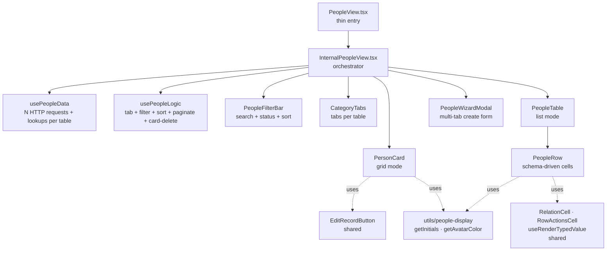
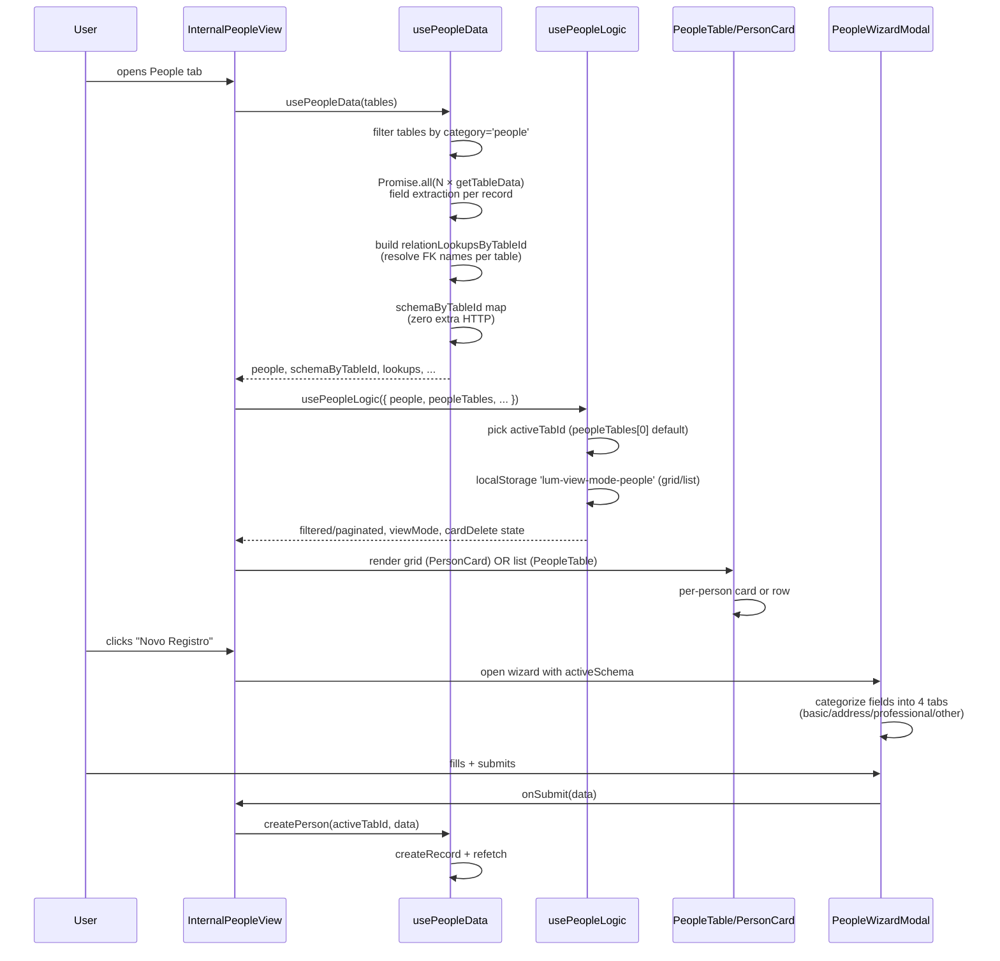

# PeopleView

> CRM-style view consolidando múltiplas tabelas de pessoas (clientes, funcionários, fornecedores) em abas. Dual rendering: grid de cards + tabela densa.

**Status:** ✅ Production-ready · Gold Standard reference implementation
**Variant:** B (Multi-Table) com **tabbed sub-views** — per [`category-view-standard`](../../../../../.claude/skills/category-view-standard) skill, Section 2
**Domain:** CRM / People Management

---

## 1. Overview

A PeopleView é a **implementação mais sofisticada de Variant B** no codebase. Onde ProductsView agrega 3 tabelas correlatas (products + inventory + units) em uma única tabela com sub-rows, a PeopleView **agrega N tabelas heterogêneas** (todas com `category === 'people'` — tipicamente customers, employees, suppliers) e expõe cada uma como **tab independente**.

Diferenças sutis vs Products/Services que definem a arquitetura:

- **N tabelas dinâmicas, descobertas em runtime:** Não há número fixo. Se um preset adicionar uma tabela `partners` com category `people`, ela aparece automaticamente como nova tab.
- **Relation lookups escopados por `tableId`:** Cada tabela tem seu próprio mapa `Record<fieldName, Map<id, label>>`. A view passa apenas o slice do tab ativo para `PeopleTable`. Ver skill §2.
- **Dual rendering mode (grid + list):** Usuário escolhe entre cards CRM-style (`PersonCard`) e tabela densa (`PeopleTable`). Persistido em localStorage.
- **Wizard modal multi-tab:** Criação de pessoa abre um wizard com tabs `Básicas / Endereço / Profissional / Outros`, alocando campos do schema automaticamente.
- **Field extraction multilíngue:** `extractName`, `extractEmail`, `extractPhone`, etc. lidam com aliases em pt-BR/en (`name | nome | fullName`, `phone | telefone | celular`). Permite consumir schemas legados sem renomear campos.

---

## 2. Architecture



**Responsibility separation:**

| Layer | File | Pode fazer | NÃO pode fazer |
|---|---|---|---|
| Shell | `PeopleView.tsx` | Encaminhar props | Buscar dados, montar estado |
| Orchestrator | `InternalPeopleView.tsx` | Compor hooks, montar UI tree, abrir wizard | HTTP, lógica de filtro/sort |
| Data | `hooks/usePeopleData.tsx` | HTTP (Promise.all em N tables), field extraction, relation lookups, mutations | Filtragem, paginação, UI state |
| Logic | `hooks/usePeopleLogic.tsx` | Tab + filter + sort + paginate + viewMode + cardDelete state | HTTP, mutations |
| Table | `components/PeopleTable.tsx` | Column system, sort UI, customize panel | Cell content (delega ao Row) |
| Row | `components/PeopleRow.tsx` | Cell rendering com avatar | HTTP (delega ao parent) |
| Card | `components/PersonCard.tsx` | CRM card rendering com hover actions | HTTP |
| Wizard | `components/PeopleWizardModal.tsx` | Form multi-tab com validação | Persistir (delega ao parent) |
| Display utils | `utils/people-display.ts` | Iniciais, cor de avatar (pure) | Side effects |

---

## 3. File Map

| File | LOC | Responsibility |
|---|---|---|
| `PeopleView.tsx` | ~22 | Entry point — wraps Internal |
| `InternalPeopleView.tsx` | ~330 | Orchestration: tabs, wizard state, sidebar, view mode |
| `hooks/usePeopleData.tsx` | ~250 | N-table aggregation, field extraction, relation lookups per table, CRUD |
| `hooks/usePeopleLogic.tsx` | ~220 | Tab + filter + sort + paginate + viewMode + card-delete state |
| `components/PeopleFilterBar.tsx` | ~115 | Search + status + sort + stats |
| `components/PeopleTable.tsx` | ~310 | Column system com STRUCTURAL multilíngue, customize panel |
| `components/PeopleRow.tsx` | ~190 | Switch-by-colId: name (avatar), contact, role, status, actions, default |
| `components/PersonCard.tsx` | ~160 | CRM card com avatar, hover actions (edit + delete) |
| `components/PeopleWizardModal.tsx` | ~320 | Wizard de 4 tabs com validação e schema-driven field rendering |
| `components/index.ts` | 6 | Barrel |
| `utils/people-display.ts` | ~38 | `getInitials`, `getAvatarColor` — pure utilities |

**Total: ~1960 LOC** — a maior das 3 views documentadas (Products ~1450, Services ~1015), justificável pela combinação multi-table + dual-render + wizard.

---

## 4. Data Flow



**Pontos-chave:**
- **N HTTP requests em paralelo** via `Promise.all` (1 por tabela people). Se você tem clientes + funcionários + fornecedores, são 3 requests.
- **Field extraction multilíngue:** `findField(data, keys)` itera aliases até encontrar valor não-vazio. Permite consumir schemas onde o campo "nome" pode ser `name`, `nome`, `fullName`, `customerName`, etc.
- **`refreshKey`** counter dispara re-fetch sem mudar a referência de deps (evita loop infinito).
- **Wizard auto-categoriza fields:** detecta campos por nome contra `BASIC_FIELDS`/`ADDRESS_FIELDS`/`PROF_FIELDS` constants. Restante vai pra tab "Outros".

---

## 5. Public API

```tsx
import { PeopleView } from '@/features/dashboard/category-views/people/PeopleView';

<PeopleView
  tables={allDynamicTables}     // IDynamicTable[]
  isWidgetMode={false}           // boolean
/>
```

**Props:**

| Prop | Type | Default | Description |
|---|---|---|---|
| `tables` | `IDynamicTable[]` | required | Lista completa de tabelas. Hook filtra por `category === 'people'` e cada uma vira uma tab. |
| `isWidgetMode` | `boolean` | `false` | Modo widget: limita a 5 records, esconde FilterBar e wizard, troca paginação por "Ver todos" link. |

**Exports do barrel `components/index.ts`:**

```typescript
export * from './PeopleRow';
export * from './PeopleTable';
export * from './PersonCard';
export * from './PeopleWizardModal';
export * from './PeopleFilterBar';
```

---

## 6. State Ownership

| State | Lives in | Mutated by | Persisted? |
|---|---|---|---|
| `activeTabId` | `usePeopleLogic` | `handleTabChange` | — |
| `query` (search) | `usePeopleLogic` | `setQuery` (handler) | — |
| `statusFilter` (active/inactive) | `usePeopleLogic` | `setStatusFilter` | — |
| `sortConfig` | `usePeopleLogic` | `setSortConfig` | — |
| `viewMode` (grid/list) | `usePeopleLogic` | `setViewMode` | localStorage `lum-view-mode-people` |
| `currentPage` | `usePeopleLogic` | `setCurrentPage` | — |
| `selectedRecord` (sidebar) | `usePeopleLogic` | `handleRecordClick` | — |
| `cardPersonToDelete` | `usePeopleLogic` | `handleCardDeleteClick` | — |
| `isCardDeleting / cardDeleteError` | `usePeopleLogic` | `confirmCardDelete` flow | — |
| `isFilterOpen` | `useFilterPersistence('people')` | toggle | localStorage |
| `columns/widths/order` | `useTableColumnControls` | localStorage | `lum-people-grid-${activeTableId}` |
| `personToDelete` (table mode) | `PeopleTable` | row delete | — |
| `isWizardOpen` | `InternalPeopleView` | wizard button | — |
| `formData/errors/activeTabIndex` (wizard) | `PeopleWizardModal` | wizard form | — |
| `aggregatedData/relationLookups/refreshKey` | `usePeopleData` | fetch effect | — |

**Decisão arquitetural — card delete encapsulado no logic hook:**

Diferentemente do PeopleTable (que tem seu próprio `personToDelete` state local), o card grid não tinha onde armazenar o estado de confirmação de delete. Em vez de criar mais um state local em `InternalPeopleView`, **toda essa lógica vive no `usePeopleLogic`**:

- `cardPersonToDelete`, `isCardDeleting`, `cardDeleteError` — state
- `handleCardDeleteClick`, `confirmCardDelete`, `clearCardDelete` — handlers

A view só conecta os handlers ao `<ConfirmDeleteModal>`. Isso mantém a view enxuta e testável.

**Por que NÃO unificar com o `personToDelete` do PeopleTable?** Porque o table mode já tem seu próprio modal interno (encapsulado). Hoistear seria pior — teria que passar handlers pra dentro da table só pra invocar um modal que ela já controla. Aceitamos a duplicação de 2 states por causa do isolamento melhor.

---

## 7. Gold Standard Patterns Applied

Referências cruzadas com o skill `category-view-standard`:

| Skill section | Aplicação | Onde |
|---|---|---|
| §2 Variant B com lookups scoped per tableId | `relationLookupsByTableId[activeTabId]` | `InternalPeopleView.tsx:272` |
| §3 Responsibility separation | Layers separados, zero HTTP em UI | `usePeopleData.tsx:222-230` (CRUD) |
| §4.1 STRUCTURAL + dataColumns | Set extenso com 24 aliases multilíngues | `PeopleTable.tsx:31-39` |
| §4.2 COL_TO_FIELD para sort | `contact → email`, `status → isActive` | `PeopleTable.tsx:45-50` |
| §4.2 NON_SORTABLE_TYPES | Boolean/json/actions nunca sortáveis | `PeopleTable.tsx:52` |
| §4.4 storageKey único por tab | `'lum-people-grid-${activeTableId}'` | `PeopleTable.tsx:166` |
| §4.4 CustomizeColumnsPanel via portal | Portal target `people-table-actions-portal` | `InternalPeopleView.tsx:156` + `PeopleTable.tsx:204-223` |
| §5 default: case schema-driven | Generic path para campos não-estruturais | `PeopleRow.tsx:159-183` |
| §6 RelationCell + RowActionsCell | Importados de `shared/components/` | `PeopleRow.tsx:15-16` |
| §7 useRenderTypedValue (não direto) | Currency/locale-aware | `PeopleRow.tsx:18, 64` |
| §8 Pagination reset via useCallback | 4 handlers com `setCurrentPage(1)` inline | `usePeopleLogic.tsx:83-102` |
| §9 isWidgetMode propagado | View → Internal → Table/Card → Row | Todos os layers |
| §10 Soft delete via ConfirmDeleteModal | HTTP em `usePeopleData.deletePerson` (table mode + card mode separados) | `PeopleTable.tsx:102-116` + `usePeopleLogic.tsx:110-123` |
| `useFilterPersistence` + `useTableColumnControls` | Hooks compartilhados | `InternalPeopleView.tsx:103` + `PeopleTable.tsx:166` |
| `isTableSchema()` guard antes de cast | Adicionado para schema lookup | `usePeopleData.tsx:106-108` |

**O que NÃO aplica aqui:**
- §11 Expandable rows — pessoas não têm sub-records (contato é renderizado inline na célula "contact")
- §12 Protected schema — todos os campos são editáveis pelo usuário

---

## 8. Design Decisions

### Por que aggregar via `Promise.all` em vez de `useTableData` por tabela?

Hooks não podem ser chamados em loop (Rules of Hooks). Para N tabelas (variável em runtime), a opção é:
1. **Imperative async no `useEffect`** ← escolha atual
2. Sub-hooks per table com `forEach` (ilegal)
3. Hoistear pra layer superior (criar um hook por tabela conhecida) — frágil

Escolhemos #1 com `cancelled` flag para evitar race conditions em unmount/re-render. O custo é não usar `useTableData`, então precisamos gerenciar `isLoading`/`error` manualmente.

### Por que extrair `name`/`email`/`phone` em vez de só renderizar `data.name`?

Schemas legados usam aliases (`nome`, `fullName`, `customerName`, etc.). A view CRM funciona melhor com **3 campos canônicos garantidos** (name + email + phone) do que com schemas heterogêneos. O `findField(data, keys)` faz a normalização uma vez por record na ingestão, simplificando todo o render downstream.

Trade-off: se o schema tem **outros** campos relevantes (ex: `secondaryEmail`), eles continuam acessíveis via `data[fieldName]` no `default:` case do Row. O sistema combina campos canônicos + campos dinâmicos.

### Por que tabs em vez de uma única tabela com filtro por categoria?

Duas razões:
1. **Schemas diferentes por tabela:** customers podem ter `creditLimit`, employees podem ter `salary`. Mostrar tudo na mesma tabela criaria colunas vazias para 80% dos rows.
2. **localStorage por tab:** `useTableColumnControls('lum-people-grid-${tableId}')` permite que o usuário customize colunas independentemente para cada tabela. Customers visualizados com colunas X, employees com colunas Y.

### Por que `viewMode` (grid/list) é state, não rota?

Decisão produto: usuário muda viewMode frequentemente (tarefa-específico). Rota dedicada (`/people/grid` vs `/people/list`) adicionaria fricção de navegação. localStorage preserva preferência entre sessões — combinação que dá UX suave.

Risco aceito: o `viewMode` não é compartilhável via URL (você não consegue mandar "abre a lista de funcionários em grid mode" pra um colega). Aceito porque na prática raríssimo.

### Por que `PeopleWizardModal` não é genérico (compartilhado entre views)?

O wizard tem **categorização semântica de campos** (Básicas → Endereço → Profissional → Outros). Essa heurística (regex em nome de campo) é específica de People — em Products não faz sentido um campo "Endereço".

Generalizar exigiria que cada view passasse sua própria função de categorização → mais ruído que ganho. Aceitamos o componente People-specific.

### Por que `usePeopleData` constrói `relationLookups` manualmente em vez de usar `useTableRelationLookups`?

`useTableRelationLookups` opera sobre **uma única tabela**. People opera sobre N. Reusar exigiria chamar o hook em loop (ilegal).

A implementação aqui (`usePeopleData.tsx:158-188`) replica o padrão respeitando `defaultDisplayField` mas escopado por tableId. **Não é duplicação acidental** — é uma versão multi-table do mesmo padrão. Caso surja uma 3ª view com requisito similar, vale criar `useMultiTableRelationLookups` shared.

---

## 9. Extension Recipes

### "Adicionar uma nova categoria de pessoa (ex: 'partners')"

**Você não precisa fazer nada no código.** Crie a tabela no preset com `category: 'people'`. A view detecta automaticamente, cria a tab e usa o schema da tabela para renderizar.

### "Adicionar um campo customizado em uma tabela people"

1. Adicione o campo no schema da tabela no preset
2. Se o campo é **estrutural** (visual customizado tipo avatar/badge):
   - Adicione o `colId` em `STRUCTURAL` (`PeopleTable.tsx:31-39`) — escolha **todos os aliases possíveis** se for um conceito multilíngue
   - Adicione case no switch de `PeopleRow.tsx:87`
   - Adicione entry em `COL_TO_FIELD` se `colId !== fieldName`
3. Se o campo é **dinâmico**: nada a fazer — aparece automaticamente no `default:` case com tipagem correta via `useRenderTypedValue`.

### "Adicionar um filtro novo (ex: por categoria de empresa)"

1. `usePeopleLogic.tsx:48` — adicione `const [companyFilter, setCompanyFilter] = useState('')`
2. L83-102 — adicione handler `handleCompanyFilterChange` com `setCurrentPage(1)` inline
3. L132-157 — adicione filtro à pipeline `filteredPeople`
4. Retorne `companyFilter`, `setCompanyFilter` (com handler)
5. `InternalPeopleView.tsx:71-100` — destruture novos
6. `PeopleFilterBar.tsx` — adicione `<FilterGroup>` correspondente

### "Mudar campos detectados como 'basic' no wizard"

`PeopleWizardModal.tsx:21-23`:
```typescript
const BASIC_FIELDS = ['name', 'nome', 'email', 'phone', ...];
```
Adicione/remova aliases conforme necessário. Lembre que essas constantes são casadas via **lowercase comparison** e regex fallback (linha 73).

### "Suportar imagem de avatar real em vez de iniciais"

Já é suportado! `PersonCard.tsx:66-83` renderiza `` se `person.avatarUrl` existir, com fallback para iniciais via `getAvatarColor`. A extração em `usePeopleData.tsx:74-75` busca os campos `avatar | avatarUrl | photo | foto | image | imagem | profilePicture`.

Para suportar um campo customizado (ex: `headshot`), adicione ao alias em `extractAvatar`.

---

## 10. Known Limitations & Tech Debt

- **`PeopleWizardModal.tsx:274`** — `let FieldComponent: any` com `eslint-disable-next-line`. Dynamic field rendering é intencionalmente untyped (componentes têm signatures heterogêneas). Aceito.
- **`PeopleWizardModal.tsx:128-179`** — `handleFieldChange`, `validateAll`, `handleSubmit` não em `useCallback`. Em contexto de form, o pai re-renderiza a cada keystroke de qualquer campo — useCallback não preveniria re-renders. Aceito.
- **Duplicação de delete state (table + card)** — explicado em §6. Aceito por isolamento.
- **Re-categorização de campos no wizard é heurística** — `/name|email|phone|.../i` casa por regex. Schemas exóticos podem ter campos em "Outros" indevidamente. Mitigação: ajustar `BASIC_FIELDS`/`ADDRESS_FIELDS`/`PROF_FIELDS` constants.
- **`itemsPerPage = 25` inline** em vez de module-level constant — consistente com Products/Services, inconsistente com Sales/Expenses. Aceito por simetria com siblings.
- **`useEffect` deps com `eslint-disable` em `usePeopleData.tsx:200`** — `refreshKey` está nas deps intencionalmente para disparar refetch. Documentado.
- **Sem testes unitários** — `usePeopleLogic` (puro) é o candidato natural para coverage. Pendente.

---

## 11. Related

- **Skill:** [`category-view-standard`](../../../../../.claude/skills/category-view-standard) — padrões teóricos
- **Sibling Variant A:** [`services/`](../services/) — single-table
- **Sibling Variant B (3-table fixa):** [`products/`](../products/) — multi-table com expand/collapse
- **Domain pattern com flat-record:** [`../finance/views/ExpensesView.tsx`](../finance/views/ExpensesView.tsx) — variant A com tipo de domínio próprio
- **Master-detail pattern:** [`../finance/views/SalesView.tsx`](../finance/views/SalesView.tsx) — variant intencionalmente diferente
- **Shared hooks:** `useTableColumnControls`, `useRenderTypedValue`, `useFilterPersistence`
- **Shared components:** `RelationCell`, `RowActionsCell`, `CustomizeColumnsPanel`, `ConfirmDeleteModal`, `FilterBar`, `FilterGroup`, `SortSelect`, `StandardPagination`, `CategoryHeader`, `CategoryTabs`, `EditRecordButton`, `GenericDataSidebar`
- **Form fields (usados no Wizard):** `InputField`, `CurrencyField`, `WorkScheduleField`, `TextareaField`, `SelectField`, `CheckboxField`, `CepAddressField`, `RelationSelector`

---

_Última atualização: 2026-05-22 · Mantido junto com o código. Se alterar arquitetura, atualize este README na mesma PR._
