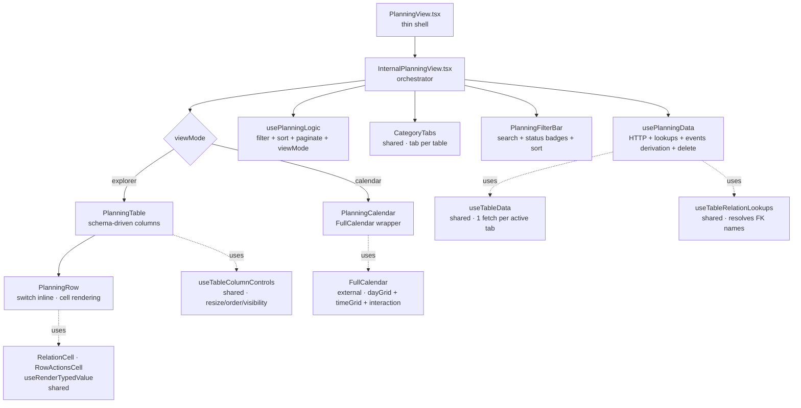
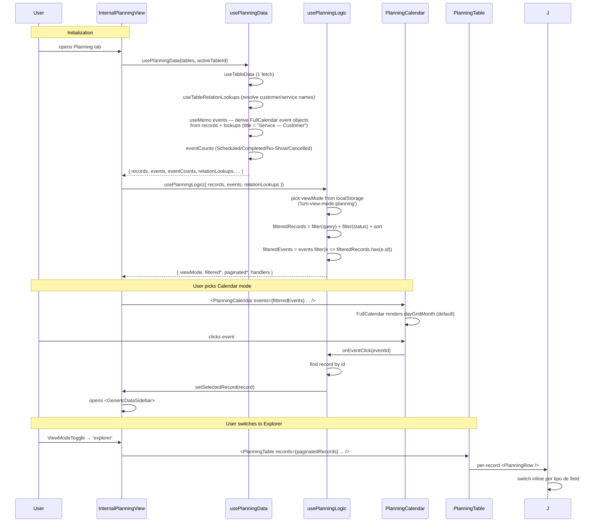

# PlanningView

> Agenda/planejamento de eventos com dual rendering: Calendar (FullCalendar) + Explorer (table). Multi-table view para qualquer categoria `planning` (appointments, tarefas, schedules, etc.).

**Status:** ✅ Production-ready · 100% Gold Standard (após Stage de hoje)
**Variant:** B (Multi-Table) com tabbed sub-views — per [`category-view-standard`](../../../../../.claude/skills/category-view-standard) skill
**Domain:** Scheduling / Appointments

---

## 1. Overview

A PlanningView é uma das duas views com **dual rendering mode** do codebase (a outra é People com grid/list). Onde People oferece cards CRM vs tabela, Planning oferece **Calendar vs Explorer**:

- **Calendar (default):** FullCalendar com vistas Month/Week/Day, navegação temporal, click-to-drill-into-day
- **Explorer:** Tabela densa schema-driven idêntica em padrão à ServicesTable/ExpensesTable

Decisões-chave que moldam tudo aqui:

- **Multi-table com tabs:** Cada tabela `category === 'planning'` vira uma tab independente. Schemas heterogêneos coexistem (uma tabela de `appointments` ao lado de `tasks`).
- **Eventos derivados de records, não fetched:** `usePlanningData` constrói o array de eventos do FullCalendar **fazendo `useMemo` em cima dos records**. Sem fetch separado. Resolução de title via relation lookups (cliente + serviço).
- **`filteredEvents` derivado de `filteredRecords`:** Brilhante. Quando o usuário filtra por status na FilterBar, **ambos** Calendar e Explorer mostram o subset coerente. Zero duplicação de filter logic.
- **Status como eixo central:** 4 valores fixos (`Scheduled / Completed / No-Show / Cancelled`) com cores próprias no calendar (dots), na tabela (badges), na FilterBar (`StatBadge` clicável). Status é simultaneamente filtro, indicador visual e dimensão de agregação.
- **FullCalendar com custom dark mode:** ~75 linhas de `<style jsx global>` para fazer o FullCalendar respeitar tema dark. Verboso, mas necessário (FullCalendar não tem dark mode nativo).

---

## 2. Architecture



**Responsibility separation:**

| Layer | File | Pode fazer | NÃO pode fazer |
|---|---|---|---|
| Shell | `PlanningView.tsx` | Forward props | UI · HTTP |
| Orchestrator | `InternalPlanningView.tsx` | Compor hooks, gerenciar tab state local, sidebar/modal state | HTTP, filter logic |
| Data | `hooks/usePlanningData.ts` | 1× useTableData, relation lookups, derive events array, deleteRecord | Filtragem, UI state |
| Logic | `hooks/usePlanningLogic.ts` | Filter/sort/paginate · viewMode persistence · selectedRecord state · handlers | HTTP, mutations |
| FilterBar | `components/PlanningFilterBar.tsx` | Search + sort + status `StatBadge` (clicável) | State (delegado) |
| Calendar | `components/PlanningCalendar.tsx` | FullCalendar config, render event content, handle date/event clicks | State (recebe via props) |
| Table | `components/PlanningTable.tsx` | Column system, sort headers, customize panel | Cell content |
| Row | `components/PlanningRow.tsx` | Inline switch por tipo + special cases (name/status) | HTTP |

---

## 3. File Map

| File | LOC | Responsibility |
|---|---|---|
| `PlanningView.tsx` | ~22 | Shell — wraps Internal |
| `InternalPlanningView.tsx` | ~295 | Orchestrator: tab state, viewMode switch, sidebar, ConfirmDeleteModal, handlers |
| `hooks/usePlanningData.ts` | ~99 | Single-table fetch, `useTableRelationLookups`, `eventCounts`, **events derivation** via useMemo, deleteRecord |
| `hooks/usePlanningLogic.ts` | ~130 | viewMode (localStorage) · 3 handlers com `useCallback` + pagination reset inline · `filteredRecords` · **`filteredEvents` derivado** · `handleEventClick`, `handleTabChange` |
| `components/PlanningCalendar.tsx` | ~214 | FullCalendar com plugins (dayGrid/timeGrid/interaction), 3 locales (pt/en/es), 75 LOC de CSS dark mode, `eventContent` renderer com status dot |
| `components/PlanningTable.tsx` | ~242 | Schema-driven columns (`STRUCTURAL`-less), `useTableColumnControls`, `handleColSort` em useCallback, sort headers |
| `components/PlanningRow.tsx` | ~180 | Inline switch · special cases para `name/title` (avatar MdEvent) e `status/select` (badge), demais por tipo |
| `components/PlanningFilterBar.tsx` | ~168 | Search + Sort + `StatBadge` clicável para 4 status + legend |

**Total: ~1350 LOC** — meio-termo entre People (~1960) e Generic (~1145).

---

## 4. Data Flow



**Pontos-chave:**

- **Events derivation acontece no data hook, não no logic.** O array de eventos é uma **transformação dos records** (mesmo dado, formato diferente). Mantê-lo no data hook garante que ambos os modes (Calendar e Explorer) vejam dados consistentes.
- **`filteredEvents` reusa `filteredRecords`:** O usuário filtra por status na FilterBar → `filteredRecords` shrinks → `filteredEvents` automaticamente shrinks (apenas events cujo ID está em `filteredRecords`). Zero duplicação de filter logic.
- **Status mapping em 3 lugares (todos module-level):**
  - `COLOR_BY_STATUS` em `usePlanningData.ts:8` — hex colors para FullCalendar background
  - `COLOR_BY_STATUS_DOT` em `PlanningCalendar.tsx:21` — Tailwind class para dot indicator
  - `STATUS_COLORS` em `PlanningRow.tsx:14` — Tailwind classes para table badge
- **Title de event resolve relations:** `usePlanningData.ts:65-73` constrói o título do evento concatenando service name + customer name (resolvidos via `relationLookups`). Funciona com `customerId` (FK) ou `simpleCustomerName` (texto livre).

---

## 5. Public API

```tsx
import PlanningView from '@/features/dashboard/category-views/planning/PlanningView';

<PlanningView
  tables={tablesForPlanningCategory}   // IDynamicTable[] — apenas tables onde category='planning'
  isWidgetMode={false}                  // boolean
/>
```

**Props:**

| Prop | Type | Default | Description |
|---|---|---|---|
| `tables` | `IDynamicTable[]` | required | Tabelas da categoria. Cada uma vira tab. **Spec não filtra por category internamente** — o caller passa apenas tables relevantes (tipicamente o roteador de categorias). |
| `isWidgetMode` | `boolean` | `false` | Modo widget: esconde header/filters, mostra "Abrir Planejamento" link |

**Schema esperado (recomendado, não obrigatório):**

| Field | Type | Uso |
|---|---|---|
| `name` ou `title` | `string` | Title do event (renderizado com ícone `MdEvent`) |
| `status` | `select` ou string | `Scheduled / Completed / No-Show / Cancelled` — drive colors em calendar e badges |
| `startAt` + `endAt` | `datetime` | Range temporal para calendar (preferred) |
| `date` | `date` | Fallback se `startAt/endAt` ausente (renderiza como all-day) |
| `customerId` | `relation` | Resolve para nome no title do event |
| `serviceId` | `relation` | Resolve para nome no title do event |
| `simpleCustomerName` | `string` | Fallback de customer texto livre |

Schemas sem esses campos ainda renderizam (apenas com less info no calendar).

---

## 6. State Ownership

| State | Lives in | Mutated by | Persisted? |
|---|---|---|---|
| `activeTableId` | `InternalPlanningView` | `handleTabChange` (delegated to logic) + useEffect | — |
| `viewMode` (calendar/explorer) | `usePlanningLogic` | `setViewMode` | localStorage `lum-view-mode-planning` |
| `query` (search) | `usePlanningLogic` | `setQuery` (handler) | — |
| `statusFilter` | `usePlanningLogic` | `setStatusFilter` | — |
| `sortConfig` | `usePlanningLogic` | `setSortConfig` (handler) | — |
| `currentPage` | `usePlanningLogic` | `setCurrentPage` | — |
| `selectedRecord` (sidebar) | `usePlanningLogic` | `handleRecordClick` / `setSelectedRecord` | — |
| `recordToDelete` | `InternalPlanningView` | `handleDeleteClick` | — |
| `isDeleting / deleteError` | `InternalPlanningView` | `handleDeleteConfirm` flow | — |
| `isFilterOpen` | `useFilterPersistence('planning')` | toggle | localStorage |
| `columns/widths/order` | `useTableColumnControls` | localStorage `lum-planning-table-${tableId}` | per-tab |
| Internal FullCalendar view (Month/Week/Day) | FullCalendar internal | toolbar buttons | — |

**Decisão arquitetural — `viewMode` em localStorage, FullCalendar internal view não:**

O usuário escolhe entre Calendar e Explorer (persistido). Dentro do Calendar, escolhe entre Month/Week/Day (não persistido — FullCalendar reseta para `dayGridMonth` ao remount). Razão: Calendar internal navigation é session-scoped por design — o usuário "navega" dentro do mês atual, não "configura" qual view é default.

---

## 7. Gold Standard Patterns Applied

Referências cruzadas com o skill `category-view-standard`:

| Skill section | Aplicação | Onde |
|---|---|---|
| §3 Responsibility separation | Layers separados, zero HTTP em UI | `usePlanningData.ts:82-85` (deleteRecord em useCallback) |
| §4.4 storageKey único por tab | `'lum-planning-table-${tableData?.id}'` | `PlanningTable.tsx:112` |
| §4.4 CustomizeColumnsPanel via portal | Portal target `planning-actions-portal` | `InternalPlanningView.tsx:151` + `PlanningTable.tsx:146-158` |
| §5 default: case schema-driven | Inline switch por tipo + special cases para name/status | `PlanningRow.tsx:74-167` (refactor de hoje) |
| §6 RelationCell + RowActionsCell | Importados de `shared/components/` | `PlanningRow.tsx:7-8` |
| §7 useRenderTypedValue (não direto) | Currency/locale-aware via numberFormat map | `PlanningRow.tsx:6, 59` |
| §8 Pagination reset via useCallback | 3 handlers com `setCurrentPage(1)` inline | `usePlanningLogic.ts:71-84` |
| §9 isWidgetMode propagado | View → Internal → Table/Calendar → Row | Toda a árvore |
| §10 Soft delete via ConfirmDeleteModal | HTTP em `usePlanningData.deleteRecord` | `InternalPlanningView.tsx:114-127, 270-281` |
| `useTableRelationLookups` shared | Resolve FK display names | `usePlanningData.ts:23` |
| `useTableColumnControls` shared | Resize/order/visibility | `PlanningTable.tsx:99-113` |
| Module-level constants | `COLOR_BY_STATUS`, `COLOR_BY_STATUS_DOT`, `STATUS_COLORS`, `NON_SORTABLE_TYPES`, `ITEMS_PER_PAGE` | Em 4 arquivos |
| `import type` consistente (após hoje) | 6 fixes aplicados | Verified |
| `catch (err: unknown)` + `instanceof Error` | Delete flow | `InternalPlanningView.tsx:121-122` |
| Canonical types (após hoje) | `ISchemaField`, `ITableSchema` importados em vez de re-declarados | `PlanningRow.tsx:7` (refactor) |
| Inline switch no JSX (após hoje) | `let content` + chain de `if/else if` no map callback (matches ExpensesRow) | `PlanningRow.tsx:74-167` (refactor) |
| `handleColSort` em useCallback (após hoje) | Alinha com Products/Expenses/Services | `PlanningTable.tsx:124-136` |
| Inline arrows extraídas (após hoje) | 4 handlers em useCallback | `InternalPlanningView.tsx:129-138` |

**Padrões intencionalmente diferentes:**

- **Não usa `STRUCTURAL` set:** Pattern simplificado (como ExpensesTable) — todos os campos do schema viram colunas, special cases ficam no Row via if-checks.
- **`<style jsx global>` para FullCalendar:** Necessário porque FullCalendar v6 não tem dark mode. ~75 LOC documentadas como exceção.
- **`(arg) => onEventClick(arg.event.id)` inline em FullCalendar:** Adapter para a API externa do FullCalendar — single-use, não justifica useCallback.

---

## 8. Design Decisions

### Por que dual rendering (Calendar + Explorer)?

Diferente domínios de uso:
- **Calendar** é visual e temporal — útil para "ver minha semana" ou "achar gap para encaixar appointment"
- **Explorer** é tabular e operacional — útil para "filtrar todos os No-Shows do mês" ou "exportar para reportagem"

Forçar um único view excluiria casos legítimos. Trade-off aceito: ambos os modes precisam ser mantidos em sync (resolvido elegantemente via `filteredEvents` derivado).

### Por que events são derivados, não fetched?

Eventos não são entidades separadas — são uma **projeção dos records**. Fetch separado seria:
- HTTP extra
- Duplicação backend (records + events endpoints)
- Risk de inconsistência (records atualizados mas events stale)

Derivar via `useMemo([records, tableData, relationLookups])`:
- Zero HTTP extra
- Sempre coerente
- Filter funciona automaticamente (mesma source of truth)

### Por que `usePlanningData` é mais "fat" que outros data hooks?

99 LOC vs ~30-50 em outros. Razão: hospeda a **lógica de derivação de events** (~40 LOC do useMemo). Poderia ser extraída para hook separado (`usePlanningEvents`), mas:
- Tem deps fortes em `records` + `tableData` + `relationLookups` (todos already aqui)
- Hook separado adicionaria boilerplate sem ganho
- Lógica é específica do domínio Planning (não reusable)

Aceito como exceção justificada.

### Por que status é hardcoded (4 valores) em vez de schema-driven?

`Scheduled / Completed / No-Show / Cancelled` são **convenção de planning ERPs**. Hardcoded em 3 lugares:
- `COLOR_BY_STATUS` (calendar background)
- `COLOR_BY_STATUS_DOT` (calendar dot)
- `STATUS_COLORS` (table badge)
- `eventCounts` (data hook)
- Status buttons na FilterBar

Trade-off aceito: schemas com status diferente (ex: `Approved / Rejected`) não recebem colors. Funciona, mas sem cor própria.

**Fix futuro:** se surgir necessidade, mover para `schema.fields.find(f => f.name === 'status').options` com cores em metadata. Aceito por ora — adicionar suporte custom prematuramente sem caso real.

### Por que `viewMode` é `'calendar' | 'explorer'` mas o valor padrão é `'solid'` no useState init?

Bug histórico — o initial state usa `'solid'` (label legacy) que cai no fallback `'grid'` no localStorage check. Funciona porque o usuário nunca verá `'solid'` (o reducer normaliza), mas é confuso.

**Fix futuro:** Renomear `'solid'` → `'calendar'` no initial state. Não é urgente porque não tem efeito de runtime, mas documentado como débito.

### Por que `useAppointmentSlots` foi deletado?

Era um hook completo (237 LOC) para calcular slots disponíveis de agendamento por funcionário — mas **não era importado por ninguém**. Provavelmente feature em desenvolvimento que foi abandonada ou que ainda não foi conectada.

Decisão: deletar. Se reactivar no futuro, recuperar via git history. Manter 237 LOC mortas atrapalha mais que ajuda.

### Por que `PlanningRow` usa "let content + if/else if chain" em vez de "switch returning td"?

ProductRow/ServiceRow usam switch onde cada case retorna `<td>` próprio. ExpensesRow (e agora PlanningRow após refactor) usa `let content` + chain + wraps em `<td>` no final. Ambos são Gold Standard.

A escolha aqui foi pragmática: o `<td>` de Planning sempre tem o mesmo `className="px-4 py-3 truncate"` + style `{width, minWidth, maxWidth}`. Centralizar o `<td>` evita duplicação. Casos especiais (status que precisa de center align, por exemplo) usam wrapper interno (`<div className="flex justify-center">`).

---

## 9. Extension Recipes

### "Adicionar um novo status (ex: 'Rescheduled')"

1. Backend: adicionar à enum da tabela de planning
2. `usePlanningData.ts:8-13` — adicionar entrada em `COLOR_BY_STATUS` com hex color
3. `PlanningCalendar.tsx:21-26` — adicionar entrada em `COLOR_BY_STATUS_DOT` com Tailwind class
4. `PlanningRow.tsx:14-19` — adicionar entrada em `STATUS_COLORS` com Tailwind classes
5. `usePlanningData.ts:26-37` — adicionar counter em `eventCounts`
6. `PlanningFilterBar.tsx:99-126` — adicionar `<StatBadge>` correspondente
7. Em todos os arquivos: garantir tradução em `database:options.Rescheduled`

### "Adicionar um campo novo ao schema"

**Você não precisa fazer nada.** O campo aparece automaticamente como coluna no Explorer (PlanningTable detecta via `schema.fields`). Casos especiais aplicam automaticamente:
- Field `type: 'relation'` → renderiza via `RelationCell`
- Field `type: 'number'` com `numberFormat: 'currency'` → moeda formatada
- Field `type: 'boolean'` → badge sim/não

No Calendar não aparece nada extra (Calendar mostra title + dot, não fields).

### "Suportar resource view (timeline por funcionário)"

FullCalendar premium tem timeline view. Para integrar:
1. Adicionar plugin `@fullcalendar/resource-timeline` (premium)
2. `PlanningCalendar.tsx:172-211` — adicionar plugin + resource config
3. `usePlanningData.ts` — derivar `resources` array (lista de funcionários únicos dos records)
4. Adicionar `'resourceTimelineDay'` ao `headerToolbar.right`

### "Suportar drag-to-reschedule"

FullCalendar suporta `editable={true}` + `eventDrop` handler. Para integrar:
1. `PlanningCalendar.tsx` — adicionar prop `onEventDrop`
2. Adicionar `editable={true}` ao FullCalendar
3. No handler: chamar `FinanceService` (ou criar `PlanningService`) com `updateRecord(tableId, { startAt: newStart })`
4. Refetch após sucesso

### "Suportar appointment slots picker"

`useAppointmentSlots.ts` foi deletado mas pode ser recuperado via git. Para reimplementar:
1. `git log --all --oneline -- planning/hooks/useAppointmentSlots.ts` para achar o commit
2. `git show <commit>:.../useAppointmentSlots.ts > useAppointmentSlots.ts` para recuperar
3. Importar onde precisar (provavelmente em uma SaleCreateModal ou form de booking)

---

## 10. Known Limitations & Tech Debt

- **`viewMode` initial state inconsistente** — `useState<'solid' | 'explorer'>(() => 'solid')` cai no fallback `'grid'` no read. Funciona mas é confuso. Aceito (não tem efeito runtime).
- **Status hardcoded em 4 valores** — explicado em §8. Schemas com enum custom não recebem cores próprias.
- **`<style jsx global>` em PlanningCalendar** — 75 LOC necessárias para FullCalendar dark mode. Verboso mas necessário.
- **No handling of recurring events** — FullCalendar suporta `rrule` plugin, mas Planning não implementa. Cada record é evento único.
- **Calendar busca todos os records, não apenas os do mês visível** — para tabelas com 10k+ events seria lento. Mitigação: paginação no backend ou virtual scrolling no FullCalendar. Aceito (escala atual).
- **FullCalendar premium features bloqueadas** — Timeline, Vertical Resource View, etc. requerem licença. Documentado em §9 caso necessário.
- **Sem testes unitários** — `usePlanningData.events` derivation e `usePlanningLogic.filteredEvents` são candidatos óbvios.

---

## 11. Related

- **Skill:** [`category-view-standard`](../../../../../.claude/skills/category-view-standard) — padrões teóricos
- **Sibling Variant A:** [`../services/`](../services/) — single-table
- **Sibling Variant B com 3-table fixa:** [`../products/`](../products/) — multi-table com expand/collapse
- **Sibling Variant B com tabbed N-tables:** [`../people/`](../people/) — também tem dual rendering (cards + table) mas paradigma diferente
- **Fallback genérico:** [`../shared/GENERIC_VIEW.md`](../shared/GENERIC_VIEW.md) — Generic View como base teórica
- **Domain pattern com flat-record:** [`../finance/EXPENSES.md`](../finance/EXPENSES.md) — pattern similar à Planning Explorer
- **External lib:** [FullCalendar v6 docs](https://fullcalendar.io/docs) — Calendar engine
- **Shared hooks:** `useTableRelationLookups`, `useTableColumnControls`, `useFilterPersistence`, `useRenderTypedValue`
- **Shared components:** `ViewModeToggle`, `RelationCell`, `RowActionsCell`, `CustomizeColumnsPanel`, `ConfirmDeleteModal`, `FilterBar`, `FilterGroup`, `SortSelect`, `StandardPagination`, `CategoryHeader`, `CategoryTabs`, `GenericDataSidebar`, `FloatingActionButton`

---

_Última atualização: 2026-05-22 · Mantido junto com o código. Se alterar a Calendar/Explorer split ou a events derivation, atualize este README na mesma PR._
