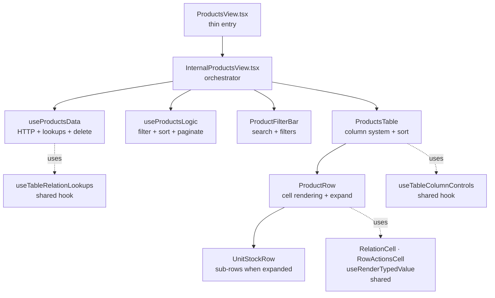
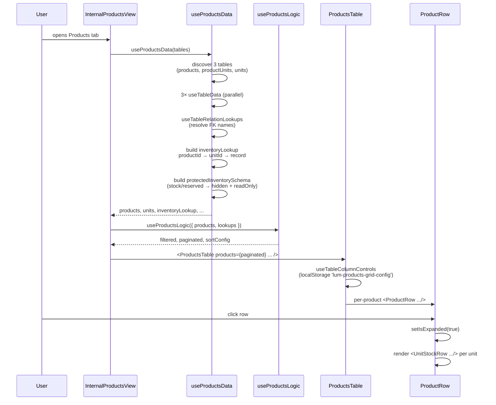

# ProductsView

> Catálogo de produtos com estoque por unidade de negócio. Multi-table view consolidando `products`, `productUnits` (inventory) e `units`.

**Status:** ✅ Production-ready · Gold Standard reference implementation
**Variant:** B (Multi-Table) — per [`category-view-standard`](../../../../../.claude/skills/category-view-standard) skill, Section 2
**Domain:** Inventory + Catalog

---

## 1. Overview

A ProductsView é uma das duas **implementações de referência** do padrão Category View (junto com Services). Diferentemente de Sales, que usa master-detail, e Expenses, que opera sobre uma única tabela, esta view **agrega 3 tabelas dinâmicas** em uma única tabela de alta densidade com sub-linhas expansíveis para mostrar estoque por unidade.

Decisões-chave que moldam tudo aqui:

- **Multi-tabela:** Produtos e estoque são entidades separadas. O usuário pensa em "produto", mas o sistema persiste `(produto × unidade) → stock`. A view reconcilia isso visualmente via expand/collapse.
- **Schema-driven:** Colunas são geradas a partir do `schema.fields` da tabela `products`. Adicionar um campo no preset adiciona uma coluna na UI automaticamente.
- **Protected fields:** Campos como `stock` e `reserved` são **bloqueados na UI de edição** porque são gerenciados pelo sistema (sale-driven). Isso é decidido na camada de dados, não na UI.

---

## 2. Architecture



**Responsibility separation (do não misture):**

| Layer | File | Pode fazer | NÃO pode fazer |
|---|---|---|---|
| Shell | `ProductsView.tsx` | Encaminhar props | Buscar dados, montar estado |
| Orchestrator | `InternalProductsView.tsx` | Compor hooks, montar UI tree | HTTP, lógica de negócio |
| Data | `hooks/useProductsData.ts` | HTTP, lookups, mutations, schema processing | Filtragem, paginação |
| Logic | `hooks/useProductsLogic.ts` | Pure: filter, sort, paginate, stats | HTTP, mutations |
| Table | `components/ProductsTable.tsx` | Column system, sort UI, customize panel | Cell content (delega ao Row) |
| Row | `components/ProductRow.tsx` | Cell rendering, expand state | HTTP (delega ao parent) |
| Sub-Row | `components/UnitStockRow.tsx` | Render per-unit stock cells | Tudo que não for célula |

---

## 3. File Map

| File | LOC | Responsibility |
|---|---|---|
| `ProductsView.tsx` | ~20 | Entry point — wraps Internal |
| `InternalProductsView.tsx` | ~230 | Orchestration: connects data + logic + table |
| `ProductFilterBar.tsx` | ~165 | Horizontal filter bar (search, category, brand, usage type) |
| `hooks/useProductsData.ts` | ~265 | Discovery of 3 tables, fetch, relation lookups, `inventoryLookup` map, `protectedInventorySchema`, `deleteProduct` |
| `hooks/useProductsLogic.ts` | ~90 | Filter + sort + paginate, 5 handlers with inline pagination reset |
| `hooks/index.ts` | 6 | Barrel |
| `components/ProductsTable.tsx` | ~275 | `STRUCTURAL` set, `COL_TO_FIELD` sort map, customize panel via portal, delete confirm modal |
| `components/ProductRow.tsx` | ~265 | Switch-by-colId rendering, expand toggle, `useRenderTypedValue` + `RelationCell` |
| `components/UnitStockRow.tsx` | ~125 | Per-unit stock cells (low-stock badge, currency-aware price), `RowActionsCell` with protected schema |
| `components/index.ts` | 7 | Barrel |

**Total: ~1450 LOC for the entire view.**

---

## 4. Data Flow



**Pontos-chave:**
- **3 HTTP requests** disparados em paralelo (uma por tabela) via `useTableData`.
- **`inventoryLookup`** é o coração da view: estrutura `{ [productId]: { [unitId]: invRecord } }` em O(1) per-cell.
- **`protectedInventorySchema`** é criado uma única vez no data hook e propagado read-only.
- **Expand state vive no Row** (não no orchestrator) — multiplas linhas podem estar abertas simultaneamente sem custo de re-render no parent.

---

## 5. Public API

```tsx
import ProductsView from '@/features/dashboard/category-views/products/ProductsView';

<ProductsView
  tables={allDynamicTables}     // IDynamicTable[] — todas as tabelas do tenant
  isWidgetMode={false}           // boolean — true esconde header/actions/pagination
/>
```

**Props:**

| Prop | Type | Default | Description |
|---|---|---|---|
| `tables` | `IDynamicTable[]` | required | Lista completa de tabelas. Hook descobre `products`, `productUnits`, `units` por `internalName`, depois `category`, depois `name`. |
| `isWidgetMode` | `boolean` | `false` | Modo widget: esconde FilterBar, esconde coluna `actions`, troca paginação por "Ver todos" link. |

**Não recebe:** `productTableId` direto, callbacks de mutação, schemas. Tudo é descoberto pela view.

---

## 6. State Ownership

| State | Lives in | Mutated by | Reset to page 1? |
|---|---|---|---|
| `query` (search) | `useProductsLogic` | `setQuery` (handler) | ✅ Sim |
| `categoryFilter` | `useProductsLogic` | `setCategoryFilter` | ✅ Sim |
| `brandFilter` | `useProductsLogic` | `setBrandFilter` | ✅ Sim |
| `usageTypeFilter` | `useProductsLogic` | `setUsageTypeFilter` | ✅ Sim |
| `sortConfig` | `useProductsLogic` | `setSortConfig` | ✅ Sim |
| `currentPage` | `useProductsLogic` | `setCurrentPage` | — |
| `isFilterOpen` | `useFilterPersistence('products')` | localStorage | — |
| `columns/widths/order` | `useTableColumnControls` | localStorage (`lum-products-grid-config`) | — |
| `isExpanded` (per row) | `ProductRow` | row click | — |
| `productToDelete` | `ProductsTable` | row delete click | — |
| `isMenuOpen` (customize) | `ProductsTable` | customize button | — |

**Decisão arquitetural:** filter/sort state vive no `useProductsLogic`, NÃO no orchestrator. Isso permite que o hook devolva handlers prontos (`setQuery: handleQueryChange`) que **resetam a paginação inline** — sem `useEffect` watchers acoplando estados.

---

## 7. Gold Standard Patterns Applied

Referências cruzadas com o skill `category-view-standard`:

| Skill section | Aplicação | Onde |
|---|---|---|
| §3 Responsibility separation | Layers separados, zero HTTP em UI | `ProductsTable.tsx:87-101` (delete via callback) |
| §4.1 STRUCTURAL + dataColumns | `STRUCTURAL = new Set(['name', 'productName', 'salePrice', 'stock', 'isActive'])` | `ProductsTable.tsx:32` |
| §4.1 Semantic alias | `id: f.name === 'usageType' ? 'type' : f.name` | `ProductsTable.tsx:106` |
| §4.2 COL_TO_FIELD para sort | Mapeia `product → name`, `type → usageType`, etc. | `ProductsTable.tsx:34-40` |
| §4.2 NON_SORTABLE_TYPES | Boolean/json/actions nunca sortáveis | `ProductsTable.tsx:42` |
| §4.4 storageKey único | `'lum-products-grid-config'` | `ProductsTable.tsx:128` |
| §4.4 CustomizeColumnsPanel via portal | Portal target `products-table-actions-portal` | `InternalProductsView.tsx:121` + `ProductsTable.tsx:163-182` |
| §5 default: case schema-driven | Generic path para sku/brand/category | `ProductRow.tsx:215-240` |
| §6 RelationCell + RowActionsCell | Importados de `shared/components/` | `ProductRow.tsx:17-18` |
| §7 useRenderTypedValue (não direto) | Currency/locale-aware | `ProductRow.tsx:19, 98` · `UnitStockRow.tsx:11, 34` |
| §8 Pagination reset via useCallback | 5 handlers com `setCurrentPage(1)` inline | `useProductsLogic.ts:53-57` |
| §9 isWidgetMode propagado | View → Internal → Table → Row → SubRow | Todos os layers |
| §10 Soft delete via ConfirmDeleteModal | HTTP em `useProductsData.deleteProduct` | `ProductsTable.tsx:87-101, 259-270` |
| §11 Expandable rows | `isExpanded` em Row, `UnitStockRow` reusa `orderedCols` | `ProductRow.tsx:99, 248-258` |
| §12 Protected schema pattern | `stock`/`reserved`/`productId`/`unitId` → readOnly + hidden | `useProductsData.ts:188-202` |

---

## 8. Design Decisions

### Por que multi-table variant B em vez de single table?

Estoque tem cardinalidade `produto × unidade`. Modelar tudo em uma tabela única exigiria desnormalização (uma row por par produto-unidade), o que quebra a relação 1:N entre produto e suas unidades. A view mantém o usuário pensando em produto e exibe estoque como detalhe expandível.

### Por que `inventoryLookup` é um objeto aninhado e não um Map?

Acesso é O(1) em ambos os casos. Objeto aninhado:
- Renderiza melhor no React DevTools (Map é opaco)
- `JSON.stringify` funciona para debugging
- Iteração com `Object.entries` é mais idiomática

A perda de memoização fina (Map preserva referência) é irrelevante porque o lookup é reconstruído via `useMemo` apenas quando `inventoryRecords` muda — ver `useProductsData.ts:174-185`.

### Por que `protectedInventorySchema` é criado no data hook?

Regras de negócio sobre **quais campos o usuário pode editar** pertencem à camada de dados, não à UI. Se amanhã o backend liberar edição de `reserved`, o ajuste é uma linha em `useProductsData.ts:192`, sem tocar em `UnitStockRow.tsx`. Ver §12 do skill.

### Por que `isExpanded` vive no Row, não no parent?

Cada produto pode estar aberto independentemente. Hoistear isso para o parent (`Map<productId, boolean>`) causaria re-render de todos os Rows quando qualquer um abre/fecha. Estado local elimina propagação desnecessária.

### Por que campos não-estruturais usam `default:` schema-driven em vez de cases dedicados?

Adicionar um campo novo no preset (`sku2`, `barcode`, etc.) **não deve exigir mudança no ProductRow**. O case `default:` (linha 215-240) renderiza qualquer campo do schema com `useRenderTypedValue` + `RelationCell` automaticamente. STRUCTURAL existe apenas para campos que têm tratamento visual customizado (badge, ícone, etc.).

---

## 9. Extension Recipes

### "Adicionar uma coluna nova vinda do schema"

**Você não precisa fazer nada no código.** Adicione o campo no schema da tabela `products` no preset — ele aparecerá automaticamente como uma coluna data-driven, visível por padrão (a menos que você queira filtrar via `defaultVisible: ['sku', 'usageType'].includes(f.name)` em `ProductsTable.tsx:108`).

### "Adicionar uma coluna estrutural com renderização customizada"

1. Adicione o `colId` em `ProductsTable.tsx:114-126` (initialColumns) — ex: `cols.push({ id: 'rating', label: '...', defaultWidth: 80, ... })`
2. Adicione o case no `switch(colId)` em `ProductRow.tsx:145-241`
3. Se o `colId` não bate com `fieldName`, adicione entrada em `COL_TO_FIELD` (linha 34) para sort funcionar
4. Se o campo correspondente do schema deve ser **excluído** das colunas dinâmicas, adicione em `STRUCTURAL` (linha 32)

### "Adicionar um filtro novo"

1. Em `useProductsData.ts:205-222`, adicione o set/array ao bloco `useMemo` que extrai categories/brands/usageTypes
2. Em `useProductsLogic.ts:13-19`, adicione um `useState` para o filter
3. Em `useProductsLogic.ts:53-57`, adicione um handler `useCallback` que reseta paginação
4. Em `useProductsLogic.ts:26-43`, adicione o filter à pipeline `filteredProducts`
5. Em `ProductFilterBar.tsx`, adicione o `<FilterGroup>` correspondente

### "Adicionar uma nova tabela auxiliar (ex: warehouses)"

1. Em `useProductsData.ts:108-133`, adicione o `useMemo` de descoberta seguindo o padrão das outras 3
2. Adicione o `useTableData(warehousesTableId || '')`
3. Adicione ao `UseProductsDataReturn` (linha 61-97)
4. Use no Row/Table conforme necessário

### "Mudar o número de itens por página"

`useProductsLogic.ts:23` — `const itemsPerPage = 25;`

Para variar dinamicamente, promova para state e exponha um setter no return.

---

## 10. Known Limitations & Tech Debt

- **`ProductRow.tsx:33`** — `SALE_USAGE_TYPES = ['Sale', 'For Sale']` é hardcoded. Idealmente viria de schema metadata (enum field options). Aceito porque expansão de tipos de uso é rara.
- **`UnitStockRow.tsx:106`** — `tableSchema={protectedSchema as unknown}` cast intencional para conformar com a prop boundary de `RowActionsCell`. Documentado.
- **`useProductsData.ts:67`** — `productSchema: ReturnType<typeof useTableData>['table']` infere o tipo via `ReturnType`. Funciona, mas se `useTableData` mudar a assinatura, este tipo silenciosamente acompanha. Aceito.
- **Inventário no widget mode** — `UnitStockRow` ainda renderiza `RowActionsCell` com `isWidgetMode: true`, que retorna `null`. Funciona, mas itera desnecessariamente. Otimização baixa-prioridade.
- **Sem testes unitários** — `useProductsLogic` (puro, sem HTTP) é o candidato natural para coverage. Pendente.

---

## 11. Related

- **Skill:** [`category-view-standard`](../../../../../.claude/skills/category-view-standard) — padrões teóricos
- **Sibling Variant A:** [`services/`](../services/) — Single-table view de referência
- **Multi-table peer:** [`people/`](../people/) — Variant B com tabbed sub-tables
- **Domain pattern with master-detail:** [`../category-views/finance/views/SalesView.tsx`](../finance/views/SalesView.tsx) — variant intencionalmente diferente para sales
- **Shared hooks:** `useTableRelationLookups`, `useTableColumnControls`, `useRenderTypedValue`, `useFilterPersistence`
- **Shared components:** `RelationCell`, `RowActionsCell`, `CustomizeColumnsPanel`, `ConfirmDeleteModal`, `FilterBar`, `FilterGroup`, `SortSelect`, `StandardPagination`, `CategoryHeader`, `FloatingActionButton`

---

_Última atualização: 2026-05-22 · Mantido junto com o código. Se alterar arquitetura, atualize este README na mesma PR._
