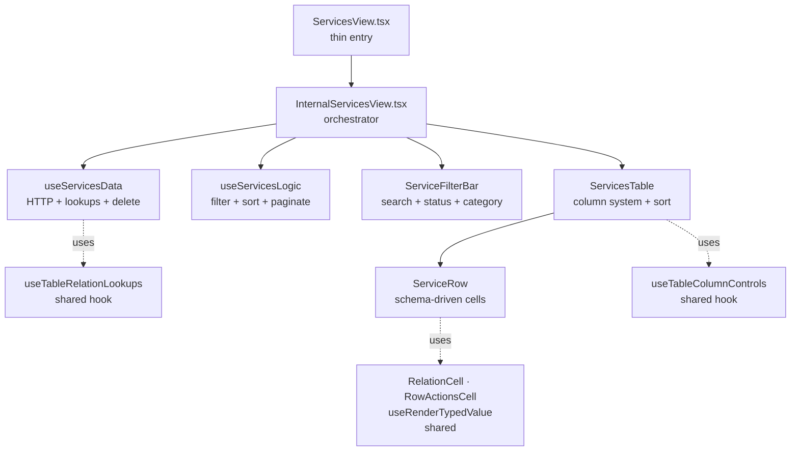
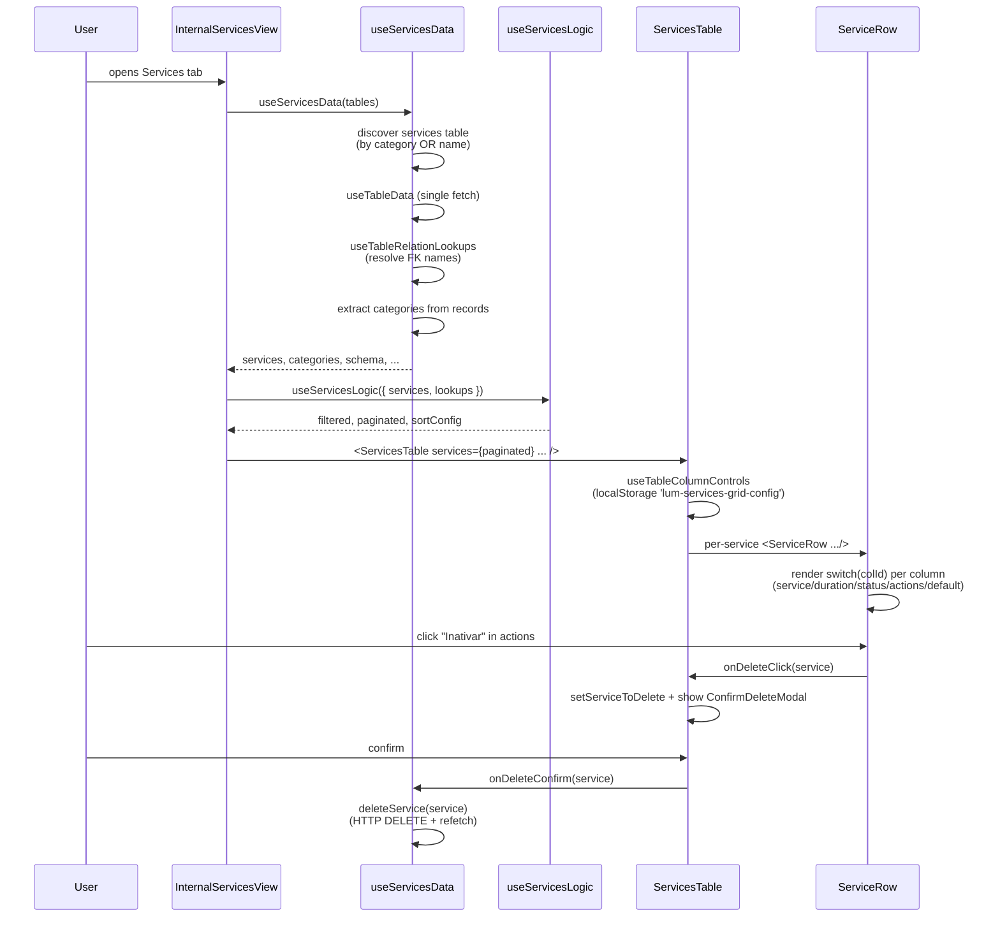

# ServicesView

> Catálogo de serviços oferecidos. Single-table view de alta densidade com colunas dinâmicas schema-driven.

**Status:** ✅ Production-ready · Gold Standard reference implementation
**Variant:** A (Single-Table) — per [`category-view-standard`](../../../../../.claude/skills/category-view-standard) skill, Section 2
**Domain:** Service Catalog

---

## 1. Overview

A ServicesView é a **implementação canônica de Variant A** (single-table) do padrão Category View. Onde ProductsView agrega 3 tabelas e expõe sub-linhas de estoque, a ServicesView trabalha sobre **uma única tabela** (`services`) e renderiza tudo de forma plana — é o caso mais simples e por isso a **referência teórica** para qualquer nova categoria que não precise de multi-table.

Decisões-chave que moldam tudo aqui:

- **Single-table, zero filhos:** Nenhuma sub-row, nenhum lookup cruzado. A view fetcha 1 tabela e renderiza. Toda complexidade vem do **schema dinâmico**.
- **`isActive` é cidadão de primeira:** Serviços têm um estado booleano explícito (ativo/inativo) que dirige tanto o filtro quanto o badge visual. Isso justifica `isActive` no `STRUCTURAL` set.
- **Schema-driven com mínima cerimônia:** O `default:` case do switch lida com tudo (`salePrice`, `costPrice`, `category`, `description`, qualquer campo futuro). Apenas 4 cases hardcoded: `service`, `duration`, `status`, `actions`.

---

## 2. Architecture



**Responsibility separation (igual à ProductsView — variant A é a mesma):**

| Layer | File | Pode fazer | NÃO pode fazer |
|---|---|---|---|
| Shell | `ServicesView.tsx` | Encaminhar props | Buscar dados, montar estado |
| Orchestrator | `InternalServicesView.tsx` | Compor hooks, montar UI tree | HTTP, lógica de negócio |
| Data | `hooks/useServicesData.tsx` | HTTP, lookups, mutations, schema | Filtragem, paginação |
| Logic | `hooks/useServicesLogic.tsx` | Pure: filter, sort, paginate, stats | HTTP, mutations |
| Table | `components/ServicesTable.tsx` | Column system, sort UI, customize panel | Cell content (delega ao Row) |
| Row | `components/ServiceRow.tsx` | Cell rendering | HTTP (delega ao parent) |

---

## 3. File Map

| File | LOC | Responsibility |
|---|---|---|
| `ServicesView.tsx` | ~20 | Entry point — wraps Internal |
| `InternalServicesView.tsx` | ~190 | Orchestration: connects data + logic + table |
| `ServiceFilterBar.tsx` | ~157 | Horizontal filter bar (search, sort, status, category) |
| `hooks/useServicesData.tsx` | ~145 | Single-table discovery, fetch, relation lookups, `deleteService` |
| `hooks/useServicesLogic.tsx` | ~90 | Filter + sort + paginate, 4 handlers with inline pagination reset |
| `hooks/index.ts` | 3 | Barrel — exporta types explicitamente |
| `components/ServicesTable.tsx` | ~235 | `STRUCTURAL` set, `COL_TO_FIELD`, customize panel via portal, delete confirm |
| `components/ServiceRow.tsx` | ~175 | Switch-by-colId: 4 cases especiais + 1 default schema-driven |
| `components/index.ts` | 2 | Barrel |

**Total: ~1015 LOC** — menor que ProductsView (~1450) porque não há multi-table nem expand/collapse.

---

## 4. Data Flow



**Pontos-chave:**
- **1 HTTP request** apenas (single-table). Multi-table de Products faz 3 em paralelo.
- **`categories`** são extraídos dos records, não vêm do schema. Isso permite filtrar por categorias **realmente em uso** em vez de mostrar opções fantasmas.
- **Delete flow:** Row → Table (state) → ConfirmModal → Data hook (HTTP). Zero atalho.

---

## 5. Public API

```tsx
import ServicesView from '@/features/dashboard/category-views/services/ServicesView';

<ServicesView
  tables={allDynamicTables}     // IDynamicTable[] — todas as tabelas do tenant
  isWidgetMode={false}           // boolean — true esconde header/actions/pagination
/>
```

**Props:**

| Prop | Type | Default | Description |
|---|---|---|---|
| `tables` | `IDynamicTable[]` | required | Lista completa de tabelas. Hook descobre a tabela de serviços por `category === 'services'` (preferência) ou `name === 'services'`. |
| `isWidgetMode` | `boolean` | `false` | Modo widget: esconde FilterBar e coluna `actions`, troca paginação por "Ver todos" link. |

**Exports do barrel `hooks/index.ts`:**

```typescript
export { useServicesData, useServicesLogic };
export type { ServiceData, ServiceRecord, ServiceStats };
```

---

## 6. State Ownership

| State | Lives in | Mutated by | Reset to page 1? |
|---|---|---|---|
| `query` (search) | `useServicesLogic` | `setQuery` (handler) | ✅ Sim |
| `categoryFilter` | `useServicesLogic` | `setCategoryFilter` | ✅ Sim |
| `statusFilter` (active/inactive) | `useServicesLogic` | `setStatusFilter` | ✅ Sim |
| `sortConfig` | `useServicesLogic` | `setSortConfig` | ✅ Sim |
| `currentPage` | `useServicesLogic` | `setCurrentPage` | — |
| `isFilterOpen` | `useFilterPersistence('services')` | localStorage | — |
| `columns/widths/order` | `useTableColumnControls` | localStorage (`lum-services-grid-config`) | — |
| `serviceToDelete` | `ServicesTable` | row delete click | — |
| `isDeleting / deleteError` | `ServicesTable` | confirm modal flow | — |
| `isMenuOpen` (customize) | `ServicesTable` | customize button | — |

**Decisão arquitetural:** Igual à ProductsView, o filter/sort state vive no `useServicesLogic` para permitir handlers com pagination reset inline. Esse padrão evita a clássica armadilha do `useEffect(() => setPage(1), [filters])` que causa re-renders extras.

---

## 7. Gold Standard Patterns Applied

Referências cruzadas com o skill `category-view-standard`:

| Skill section | Aplicação | Onde |
|---|---|---|
| §3 Responsibility separation | Layers separados, zero HTTP em UI | `useServicesData.tsx:116-120` (delete) |
| §4.1 STRUCTURAL + dataColumns | `STRUCTURAL = new Set(['name', 'serviceName', 'isActive'])` | `ServicesTable.tsx:19` |
| §4.2 COL_TO_FIELD para sort | `service → name`, `status → isActive`, etc. | `ServicesTable.tsx:25-32` |
| §4.2 NON_SORTABLE_TYPES | Boolean/json/actions nunca sortáveis | `ServicesTable.tsx:34` |
| §4.4 storageKey único | `'lum-services-grid-config'` | `ServicesTable.tsx:105` |
| §4.4 CustomizeColumnsPanel via portal | Portal target `services-table-actions-portal` | `InternalServicesView.tsx:97` + `ServicesTable.tsx:135-152` |
| §5 default: case schema-driven | Generic path para todos campos não-estruturais | `ServiceRow.tsx:134-167` |
| §6 RelationCell + RowActionsCell | Importados de `shared/components/` | `ServiceRow.tsx:19-20` |
| §7 useRenderTypedValue (não direto) | Currency/locale-aware | `ServiceRow.tsx:21, 63` |
| §8 Pagination reset via useCallback | 4 handlers com `setCurrentPage(1)` inline | `useServicesLogic.tsx:53-56` |
| §9 isWidgetMode propagado | View → Internal → Table → Row | Todos os layers |
| §10 Soft delete via ConfirmDeleteModal | HTTP em `useServicesData.deleteService` | `ServicesTable.tsx:65-79, 221-232` |

**O que NÃO aplica aqui (vs Products):**
- §11 Expandable rows — Services não tem sub-records
- §12 Protected schema — Services não tem campos system-managed

---

## 8. Design Decisions

### Por que Variant A (single-table) em vez de B (multi-table)?

Serviços não têm cardinalidade — um serviço é um serviço, não "serviço × unidade". A modelagem do dado é flat. Forçar Variant B introduziria abstração sem ganho (mais um nível de hook, mais um nível de lookup, sem dado correspondente).

### Por que `isActive` está no `STRUCTURAL` set se tem case dedicado?

Duas razões:
1. **Conflito de naming:** O schema field é `isActive` (boolean), mas a coluna na UI é chamada `status` (badge visual). Sem incluir `isActive` em STRUCTURAL, ele apareceria DUAS vezes — uma como `isActive` no `default:` case, outra como `status` no case dedicado.
2. **Sort funciona via alias:** `COL_TO_FIELD['status'] = 'isActive'` faz com que clicar no header "Status" ordene pelo campo `isActive`. Comportamento esperado pelo usuário.

### Por que `categories` é extraído dos records em vez do schema?

Schema declara opções **possíveis**, registros mostram opções **em uso**. Se o schema lista 50 categorias mas só 5 têm serviços, o filtro com 50 opções é ruído. Extrair dos records dá UX limpa com custo O(n) trivial (executado uma vez por refetch via `useMemo`).

Trade-off aceito: uma categoria recém-cadastrada (sem serviços ainda) **não aparece** no filtro até o primeiro serviço daquela categoria existir. Comportamento desejado neste domínio.

### Por que apenas 4 cases hardcoded no Row, e os outros campos vão pro `default:`?

Os 4 cases hardcoded (`service`, `duration`, `status`, `actions`) têm **layout visual customizado** — bold uppercase, ícone de relógio, badge colorido, botões. Os demais (preço, custo, descrição, categoria, etc.) são strings/números formatáveis genericamente pelo `useRenderTypedValue`. Sem ganho em customizar individualmente.

**Adicionar novo campo no preset = aparece automaticamente.** Esse é o ROI do padrão schema-driven.

### Por que `import type` em todos os identificadores type-only?

Next.js usa `isolatedModules: true`. Imports type-only:
- São apagados em tempo de transpilação (zero JS no bundle)
- Tornam claro ao leitor o que é runtime vs tipo
- Evitam ciclos de dependência implícitos

---

## 9. Extension Recipes

### "Adicionar um campo novo no catálogo"

**Você não precisa fazer nada no código.** Adicione o campo no schema da tabela `services` no preset — ele aparece automaticamente como coluna. Se for `type: 'number'` com `numberFormat: 'currency'`, será formatado como moeda. Se for `type: 'relation'`, vira badge via `RelationCell`.

### "Adicionar um campo com renderização visual customizada"

Ex: campo `availability` com badge verde/vermelho semelhante a `status`:

1. Adicione `'availability'` ao `STRUCTURAL` set em `ServicesTable.tsx:19`
2. Adicione case `'availability'` no switch de `ServiceRow.tsx:86`
3. Se quiser sort no header, adicione em `COL_TO_FIELD` (linha 25) — se `colId === fieldName`, **não precisa de entry** (fallback é direto)

### "Adicionar um filtro novo"

Ex: filtro de "duração" (curto/médio/longo):

1. `useServicesLogic.tsx:17` — adicione `const [durationFilter, setDurationFilter] = useState('')`
2. `useServicesLogic.tsx:53-56` — adicione handler `handleDurationChange` com `setCurrentPage(1)` inline
3. `useServicesLogic.tsx:25-43` — adicione filtro à pipeline `filteredRecords`
4. `useServicesLogic.tsx:69-88` — retorne `durationFilter`, `setDurationFilter`
5. `InternalServicesView.tsx:54-65` — destrutura novos
6. `InternalServicesView.tsx:118-134` — passe para `ServiceFilterBar`
7. `ServiceFilterBar.tsx` — adicione `<FilterGroup>` correspondente

### "Mudar paginação para 50 por página"

`useServicesLogic.tsx:22` — `const itemsPerPage = 25;`

Para permitir ao usuário escolher, promova para state e exponha setter no return.

### "Adicionar uma ação em massa (bulk delete, bulk activate)"

Padrão sugerido (não implementado hoje):

1. Adicione `selectedIds: Set<string>` em `useServicesLogic`
2. Adicione `handleToggleSelect(id)` e `handleSelectAll()`
3. Adicione coluna `'select'` em `STRUCTURAL` + case dedicado em `ServiceRow` com checkbox
4. Crie `<BulkActionBar>` em `InternalServicesView` que aparece quando `selectedIds.size > 0`
5. Crie `bulkDelete(ids)` em `useServicesData`

---

## 10. Known Limitations & Tech Debt

- **Stats `active`/`inactive`** — `useServicesLogic.tsx:59-67` itera o array completo de services apenas para contar. Para 10.000+ serviços poderia migrar para reducer no data hook (não relevante na escala atual).
- **Sort no campo `status`** — Ordena por `isActive` (boolean: false antes de true em ASC). Comportamento é correto, mas o usuário pode esperar "Ativos primeiro". Considerar inverter direção default para esse campo específico se UX feedback indicar.
- **Sem testes unitários** — `useServicesLogic` é puro (sem HTTP), candidato natural para coverage. Pendente.
- **Filter persistence é só `isOpen`** — Não persiste os valores dos filtros entre sessões. Aceito (filter state é session-scoped por design).

---

## 11. Related

- **Skill:** [`category-view-standard`](../../../../../.claude/skills/category-view-standard) — padrões teóricos
- **Sibling Variant B:** [`products/`](../products/) — Multi-table com expand/collapse
- **Multi-table peer:** [`people/`](../people/) — Variant B com tabbed sub-tables
- **Domain pattern with master-detail:** [`../finance/views/SalesView.tsx`](../finance/views/SalesView.tsx)
- **Single-table with custom flat-record:** [`../finance/views/ExpensesView.tsx`](../finance/views/ExpensesView.tsx) — variant A com tipo de domínio próprio
- **Shared hooks:** `useTableRelationLookups`, `useTableColumnControls`, `useRenderTypedValue`, `useFilterPersistence`
- **Shared components:** `RelationCell`, `RowActionsCell`, `CustomizeColumnsPanel`, `ConfirmDeleteModal`, `FilterBar`, `FilterGroup`, `SortSelect`, `StandardPagination`, `CategoryHeader`, `FloatingActionButton`

---

_Última atualização: 2026-05-22 · Mantido junto com o código. Se alterar arquitetura, atualize este README na mesma PR._
