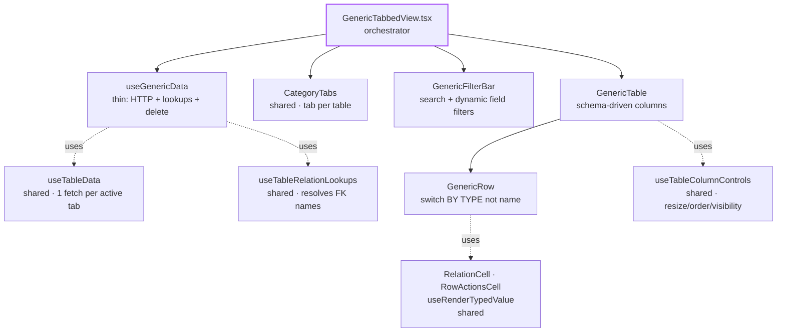
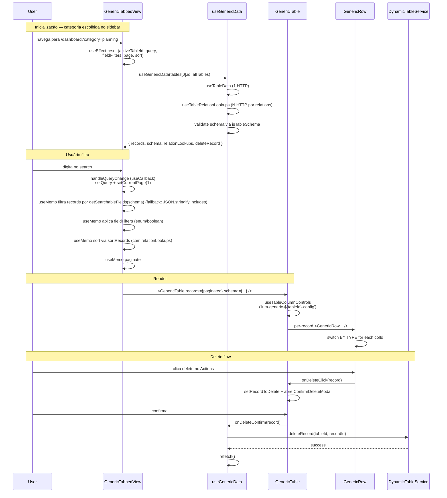

# GenericTabbedView

> Fallback universal de category-view. Renderiza qualquer categoria de tabelas dinâmicas sem view dedicada — schema-driven puro com customização de colunas, sort, filter, soft-delete.

**Status:** ✅ Production-ready · 100% Gold Standard (após Stage de hoje)
**Variant:** B (Multi-Table) com **tabbed sub-views** — per [`category-view-standard`](../../../../../.claude/skills/category-view-standard) skill
**Domain:** Universal fallback (qualquer categoria)

> **Nota de escopo:** Este documento cobre os **6 arquivos da Generic View** (entry point + tabela + row + filterbar + data hook + actions cell). Outros arquivos em `category-views/shared/` (`CategoryHeader`, `FilterBar`, `useTableColumnControls`, `SortSelect`, etc.) são **infraestrutura cross-view** usada por TODAS as category-views — não fazem parte da Generic View propriamente dita.

---

## 1. Overview

A `GenericTabbedView` é o **fallback** quando o usuário acessa uma categoria que **não tem view dedicada** (não é products/services/people/finance/etc.). Ela:

- Recebe um array de `IDynamicTable[]` (todas as tabelas daquela categoria)
- Cria uma **tab por tabela**
- Renderiza schema-driven — zero hardcode de domínio
- Suporta todos os recursos das views dedicadas: filter bar, sort, column customization, soft-delete, paginação

**Decisões-chave que moldam a arquitetura:**

- **Variant B (multi-table) com tabs:** Cada categoria pode ter N tabelas. O usuário troca entre elas via `CategoryTabs`. Similar à People, mas mais genérica (não filtra por field name multilíngue — usa direto `category === X`).
- **Schema-driven 100%:** Sem `STRUCTURAL` set. Sem `COL_TO_FIELD`. Sem cases especiais. Toda coluna vem do schema, todo cell rendering usa o switch por **tipo de field** (não por nome). Adicionar um campo no preset adiciona uma coluna automaticamente.
- **Maior blast radius do sistema:** Se a Generic View tem um bug, **todas as categorias sem view dedicada** o herdam (Planning, Reports, etc.). Por isso ela tem padrões mais conservadores e auditoria rigorosa.
- **Empty state contextual:** Distingue 3 modos vazios — categoria sem tabelas, tabela sem schema, schema sem registros (com filtros aplicados ou não). Cada um tem mensagem própria.

---

## 2. Architecture



**Responsibility separation:**

| Layer | File | Pode fazer | NÃO pode fazer |
|---|---|---|---|
| Orchestrator | `GenericTabbedView.tsx` | Tab + filter state, layout tree, useEffect resets | HTTP, cell rendering |
| Data | `hooks/useGenericData.tsx` | `useTableData`, `useTableRelationLookups`, `deleteRecord` | Filtragem, UI state |
| FilterBar | `components/GenericFilterBar.tsx` | Search input + dynamic field filters (enum/boolean) | Sort (delegado ao Table) |
| Table | `components/GenericTable.tsx` | Column system, sort headers, customize panel, delete modal | Cell content |
| Row | `components/GenericRow.tsx` | Cell rendering via switch(fieldType) | HTTP |
| Actions | `components/RowActionsCell.tsx` (shared) | Edit + delete buttons padronizados | Lógica de domínio |

---

## 3. File Map

| File | LOC | Responsibility |
|---|---|---|
| `GenericTabbedView.tsx` | ~295 | Orchestrator: tabs, filters, useGenericData → GenericTable; reset state on category change |
| `hooks/useGenericData.tsx` | ~88 | Thin: 1× useTableData + 1× useTableRelationLookups + deleteRecord em useCallback |
| `components/GenericTable.tsx` | ~321 | Schema-driven columns (todas), `useTableColumnControls` com `lum-generic-${tableId}-config`, sort, ConfirmDeleteModal |
| `components/GenericRow.tsx` | ~228 | Switch dispatch **por TIPO de field** (não por nome): actions/json/relation/boolean/number/date/enum/object/default |
| `components/GenericFilterBar.tsx` | ~110 | Search + dynamic FilterGroup por field type (enum select, boolean select) |
| `components/RowActionsCell.tsx` | ~101 | **Shared** com 6 callers (Products/Services/People/Expenses/UnitStock/Generic). Listado aqui por relevância ao plano original |

**Total: ~1145 LOC** — meio-termo entre Services (~1015) e Products (~1450).

---

## 4. Data Flow



**Pontos-chave:**

- **Switch por TIPO, não por NOME:** `GenericRow.tsx` despacha rendering por `fieldType` (relation/boolean/number/date/enum/object/json). Isso é o **oposto** das views dedicadas (que dispatcham por colId). Significa: Generic não precisa conhecer nomes de campos — só tipos.
- **`useEffect` reseta TUDO em category change:** Inclui `fieldFilters` (bug recente corrigido). Garante UX limpa quando o usuário navega entre categorias com schemas diferentes.
- **Relation lookups via shared hook:** `useTableRelationLookups` resolve FK display names usando `defaultDisplayField` do target schema (zero HTTP extra graças ao `allTables`).
- **`displayField` é destacado no Row:** `schema.defaultDisplayField || 'name'` recebe formatação especial (bold uppercase). O resto fica em estilo neutro.

---

## 5. Public API

```tsx
import GenericTabbedView from '@/features/dashboard/category-views/shared/GenericTabbedView';

<GenericTabbedView
  tables={tablesForThisCategory}            // IDynamicTable[]
  title={t('database:categories.planning')}  // string
  description={'...'}                        // string
  addButtonLabel={'Novo Item'}               // string?
  isWidgetMode={false}                       // boolean?
  categoryKey={'planning'}                   // string? — usado em "Ver todos" link
/>
```

**Props:**

| Prop | Type | Default | Description |
|---|---|---|---|
| `tables` | `IDynamicTable[]` | required | Lista de tabelas da categoria. Cada uma vira uma tab. |
| `title` | `string` | required | Título do `CategoryHeader` |
| `description` | `string` | required | Subtítulo (atualmente não exibido — preservado para compat) |
| `addButtonLabel` | `string` | `t('common:new_record')` | Label do FAB de criação |
| `isWidgetMode` | `boolean` | `false` | Modo widget — hide header/filters/pagination |
| `categoryKey` | `string` | — | Usado no link "Ver todos" do widget mode |

**Onde é instanciada:** Tipicamente no roteador de categorias (`/dashboard?category=X`) — quando a categoria `X` não tem view dedicada, o roteador renderiza `GenericTabbedView` com as tables apropriadas.

---

## 6. State Ownership

| State | Lives in | Mutated by | Reset on category change? |
|---|---|---|---|
| `activeTableId` | `GenericTabbedView` | `handleTabChange` · useEffect | ✅ (via useEffect) |
| `query` (search) | `GenericTabbedView` | `handleQueryChange` (useCallback) | ✅ |
| `fieldFilters` | `GenericTabbedView` | `handleFieldFiltersChange` (useCallback) | ✅ (fix recente) |
| `currentPage` | `GenericTabbedView` | inline + handlers | ✅ |
| `sortConfig` | `GenericTabbedView` | `setSortConfig` | ✅ |
| `isFilterOpen` | `useFilterPersistence('generic-tabbed')` | localStorage | — |
| `columns/widths/order` | `useTableColumnControls` | localStorage (`lum-generic-${tableId}-config`) | — (per-tab persistence) |
| `recordToDelete` | `GenericTable` | row delete click | — |
| `isDeleting / deleteError` | `GenericTable` | confirm modal flow | — |
| `isMenuOpen` (customize) | `GenericTable` | customize button | — |

**Decisão arquitetural — `useEffect` reseta `fieldFilters`:**

Antes do fix recente, navegar entre categorias preservava `fieldFilters`. Resultado: filtros fantasmas de uma categoria persistiam em outra com schema diferente, produzindo "0 results" inexplicável. O fix adicionou `setFieldFilters({})` ao `useEffect([tables])` para paridade com `handleTabChange`.

**Por que duas formas de reset:** `useEffect` dispara em **mudança de categoria** (tables array muda), `handleTabChange` dispara em **mudança de tab dentro da mesma categoria**. Ambos resetam — mas são triggered por eventos diferentes.

---

## 7. Gold Standard Patterns Applied

Referências cruzadas com o skill `category-view-standard`:

| Skill section | Aplicação | Onde |
|---|---|---|
| §3 Responsibility separation | Layers separados, zero HTTP em UI | `useGenericData.tsx:66-73` (delete em useCallback) |
| §4.1 dataColumns 100% schema-driven (sem STRUCTURAL) | Todos os fields viram colunas, sem cases especiais | `GenericTable.tsx:93-114` |
| §4.4 storageKey único por tab | `'lum-generic-${tableId}-config'` | `GenericTable.tsx:127` |
| §4.4 CustomizeColumnsPanel via portal | Portal target `generic-table-actions-portal` | `GenericTabbedView.tsx:169` + `GenericTable.tsx:170-194` |
| §5 default: case schema-driven | Switch **por TIPO** (não por nome) — pattern único na Generic | `GenericRow.tsx:78-220` |
| §6 RelationCell + RowActionsCell | Importados de `shared/components/` | `GenericRow.tsx:26-27` |
| §7 useRenderTypedValue (não direto) | Currency/locale-aware para number/date | `GenericRow.tsx:28, 65` |
| §8 Pagination reset via useCallback | `handleQueryChange`, `handleFieldFiltersChange`, `handleTabChange` | `GenericTabbedView.tsx:97-119` |
| §9 isWidgetMode propagado | View → Table → Row → ActionsCell (return null automático) | Toda a árvore |
| §10 Soft delete via ConfirmDeleteModal | HTTP em `useGenericData.deleteRecord` | `GenericTable.tsx:150-165, 301-315` |
| `useTableRelationLookups` shared | Reusa o hook canonical com `defaultDisplayField` | `useGenericData.tsx:63` |
| `isTableSchema` guard | Antes de acessar `schema.fields` | `useGenericData.tsx:60` |
| `catch (err: unknown)` + `instanceof Error` | Delete flow | `GenericTable.tsx:157-164` |
| Zero `any` (após fix de hoje) | `RowActionsCell` agora `ITableSchema \| unknown` + `IDynamicTableData` | `RowActionsCell.tsx:30-32` |
| Module-level constants | `ITEMS_PER_PAGE`, `SORTABLE_TYPES` | `GenericTabbedView.tsx:47` + `GenericTable.tsx:36` |
| `import type` consistente | Todos os identificadores type-only separados | Verificado |

---

## 8. Design Decisions

### Por que dispatch por TIPO em vez de por NOME no Row?

Generic View **não conhece** os campos. Ela é renderizada para qualquer categoria — Planning, Reports, ou qualquer preset futuro. Dispatch por nome de campo seria:

```typescript
// ❌ Não funciona — Generic não sabe o que vai vir
switch (col.id) {
    case 'name': return ...
    case 'priority': return ...
    case 'dueDate': return ...
}
```

Dispatch por **tipo** é universal:

```typescript
// ✅ Funciona para qualquer schema
if (fieldType === 'relation') return <RelationCell ... />
if (fieldType === 'boolean') return <BooleanBadge ... />
if (fieldType === 'number') return <NumericValue ... />
// ...
```

Trade-off: perde customização visual fina. Mas o ganho é **suporte universal**. Views dedicadas (Products/Services) usam dispatch por nome justamente para custom visuals; Generic não precisa.

### Por que reset de `fieldFilters` é tão importante?

Imagine o cenário:
1. Usuário entra na categoria "Planning"
2. Filtra `status = "In Progress"` (campo enum)
3. Navega para categoria "Reports" (mesmo cargo "shared" → renderiza outra Generic)
4. `tables` muda, mas `fieldFilters = { status: "In Progress" }` persiste
5. Tabela de Reports não tem field `status` → filtro retorna 0 records
6. Usuário vê "Nenhum registro" sem entender por quê

O bug foi descoberto na auditoria de hoje (estava lá há tempos, mas era difícil reproduzir). Fix simples: adicionar `setFieldFilters({})` ao `useEffect`.

### Por que `RowActionsCell` aceita `tableSchema: ITableSchema | unknown` em vez de só `ITableSchema`?

`RowActionsCell` é **shared entre 6 callers** com tipagens diferentes:
- ProductRow passa `productSchema?.schema` (tipo `unknown`)
- ExpensesRow passa `tableSchema?: unknown`
- Outros passam `ITableSchema | null | undefined`

Tipar como `ITableSchema` estrito forçaria todos os callers a fazer narrowing ou cast. Tipar como `unknown` puro removeria a documentação de "deveria ser ITableSchema".

A union `ITableSchema | unknown` simplifica para `unknown` em runtime, mas serve como **documentação no editor** — DX mostra que o caller pode passar tipado quando souber, ou passar `unknown` quando vier de fonte heterogênea. EditRecordButton faz o cast interno.

**Crucialmente: nenhum eslint-disable mais.** O `any` antigo era débito documentado; agora é tipo válido.

### Por que `useGenericData` é tão fino (~88 LOC)?

Generic não tem lógica de domínio. Não tem analytics, não tem campos especiais, não tem mutations customizadas. O hook é literalmente:
- `useTableData(activeTableId)`
- `useTableRelationLookups(table, allTables)`
- `deleteRecord` em `useCallback`

Toda complexidade está nos **shared hooks** (useTableData, useTableRelationLookups). Generic apenas compõe. Esse é o ideal para qualquer view: **não reescrever infraestrutura compartilhada**.

### Por que filtro de schema fields só suporta `enum` e `boolean`?

`GenericFilterBar.tsx:57-98` ignora outros tipos (string, number, date, etc.). Razões:
1. **String:** já coberto pelo search global (`getSearchableFields(schema)` — campos opt-out via `searchable: false`; fallback para `JSON.stringify` quando não há set definido)
2. **Number/date:** range filters precisam de UI complexa (slider, datepicker) — overhead para fallback view
3. **Relation:** poderia ser select dinâmico, mas a cardinalidade pode ser alta (1000+ opções) — UX ruim

Trade-off aceito: o usuário usa search para fields texto/número. Para relations, ordena pelos lookups (`sortRecords` resolve labels). Se precisar de range filter, view dedicada.

### Por que JSON é renderizado como `{ … }` em vez do conteúdo?

Generic não sabe a estrutura do JSON. Renderizar bruto polui a célula (linhas quebradas, conteúdo enorme). O placeholder `{ … }` indica "tem dado, mas vá ao detail panel para ver". Aceito porque:
- Detail panel (futuro) pode renderizar key-value list
- Para campos JSON específicos importantes, view dedicada faz sentido

---

## 9. Extension Recipes

### "Renderizar uma categoria nova sem view dedicada"

**Você não precisa fazer nada na Generic View.** O roteador de categorias detecta que `X` não tem view dedicada e renderiza `<GenericTabbedView tables={categoryTables} ... />` automaticamente. A view consome o schema dinâmico e renderiza tudo.

### "Adicionar um novo tipo de campo (ex: 'geo')"

1. Backend declara `type: 'geo'` no schema
2. `GenericRow.tsx:78-220` — adicionar branch antes do `default`:
```typescript
if (fieldType === 'geo') {
    return (
        <td key={`col-${colId}`} className="px-2 py-3 text-xs">
            <GeoCell value={val} />
        </td>
    );
}
```
3. `useRenderTypedValue` ou criar componente `GeoCell` em `shared/components/`

### "Adicionar suporte a filtro de relation no GenericFilterBar"

1. `GenericFilterBar.tsx` — adicionar branch após boolean:
```typescript
if (field.type === 'relation' && relationLookups?.[field.name]) {
    return (
        <FilterGroup key={field.name} label={...}>
            <select ... >
                <option value="">Todos</option>
                {Array.from(relationLookups[field.name].entries()).map(([id, label]) => (
                    <option key={id} value={id}>{label}</option>
                ))}
            </select>
        </FilterGroup>
    );
}
```
2. Passar `relationLookups` para o FilterBar via `GenericTabbedView`

### "Promover Generic View para uma category-view dedicada"

Quando uma categoria fica "complexa demais para a Generic":
1. Criar nova pasta `category-views/X/`
2. Copiar `GenericTabbedView.tsx` → `XView.tsx` como ponto de partida
3. Adicionar `STRUCTURAL` set, `COL_TO_FIELD`, cases especiais
4. Atualizar roteador para usar a nova view quando `category === 'X'`
5. Migrar localStorage keys (de `lum-generic-${tableId}-config` para `lum-x-grid-config` ou similar)

### "Sincronizar `fieldFilters` com URL params"

Hoje fieldFilters é só client state. Para deep-linking:
1. Adicionar `useSearchParams` (Next.js)
2. No mount: ler params iniciais, popular `fieldFilters`
3. No handler: além de setar state, fazer `router.replace(...)` com novos params
4. Cuidado com history flood — debounce updates

---

## 10. Known Limitations & Tech Debt

- **Search usa `getSearchableFields(schema)`** (campos opt-out via `searchable: false`), com fallback
  para `JSON.stringify(record.data).toLowerCase()` quando o schema não define um set. Ainda assim:
  - O(n) per record per keystroke
  - Não destaca match no resultado
  - Aceito (Generic é fallback, não search engine)
- **FilterBar só suporta enum/boolean filters** — explicado em §8. Range/relation filters exigem view dedicada.
- **`description` prop não é exibida** — Mantida na interface por backwards compat. Aceito; remoção em breaking PR no futuro.
- **`FloatingActionButton tableSchema as any`** — Componente externo ainda aceita só `any`. Eslint-disable documentado. Pendente refactor do próprio FAB.
- **Sort não persiste entre tabs** — Trocar de tab limpa o `sortConfig`. Aceito (UX consistente — cada tab é fresh state).
- **Sem testes unitários** — `useGenericData` (thin wrapper) e `GenericRow` (switch puro) são candidatos óbvios. Pendente.

---

## 11. Related

- **Skill:** [`category-view-standard`](../../../../../.claude/skills/category-view-standard) — padrões teóricos
- **Reference category-views:** [`../products/`](../products/) · [`../services/`](../services/) · [`../people/`](../people/) — todas têm `README.md`
- **Finance:** [`../finance/README.md`](../finance/README.md) — hub-and-spoke para módulo maior
- **Plano histórico (já aplicado):** `~/.claude/plans/resilient-snacking-planet.md` — 8 de 9 fixes aplicados anteriormente; o 9º (RowActionsCell) aplicado hoje
- **Shared infrastructure** (NÃO faz parte da Generic View, mas é usado por ela):
  - `hooks/useTableColumnControls.ts` — resize/order/visibility com localStorage
  - `hooks/useFilterPersistence.ts` — filter bar open/close
  - `hooks/useColumnSort.ts` — sort utility
  - `SortSelect.tsx` + `utils/sortUtils.ts` — sort UI e logic
  - `components/CategoryHeader.tsx` — header padronizado
  - `components/CategoryTabs.tsx` — tab bar
  - `components/FilterBar.tsx` + `FilterGroup.tsx` — filter primitives
  - `components/FilterToggleButton.tsx` — toggle do filter bar
  - `components/RelationCell.tsx` — badge + popover para relation fields
  - `ViewModeToggle.tsx` — segmented icon-only toggle, genérico via `options` (usado por Planning: solid/explorer, e People: grid/list)
- **Shared components fora deste folder:**
  - `CustomizeColumnsPanel` (dashboard/shared/components/)
  - `ConfirmDeleteModal` (dashboard/shared/components/)
  - `useRenderTypedValue` (dashboard/shared/hooks/)
  - `useTableRelationLookups` (dashboard/shared/hooks/)

---

_Última atualização: 2026-05-22 · Mantido junto com o código. Se alterar a Generic View — especialmente o switch por tipo no `GenericRow` — atualize este documento na mesma PR. Lembre-se: blast radius é alto._
